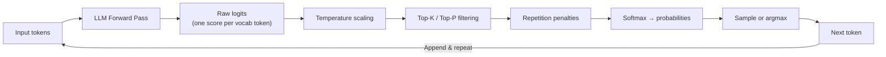
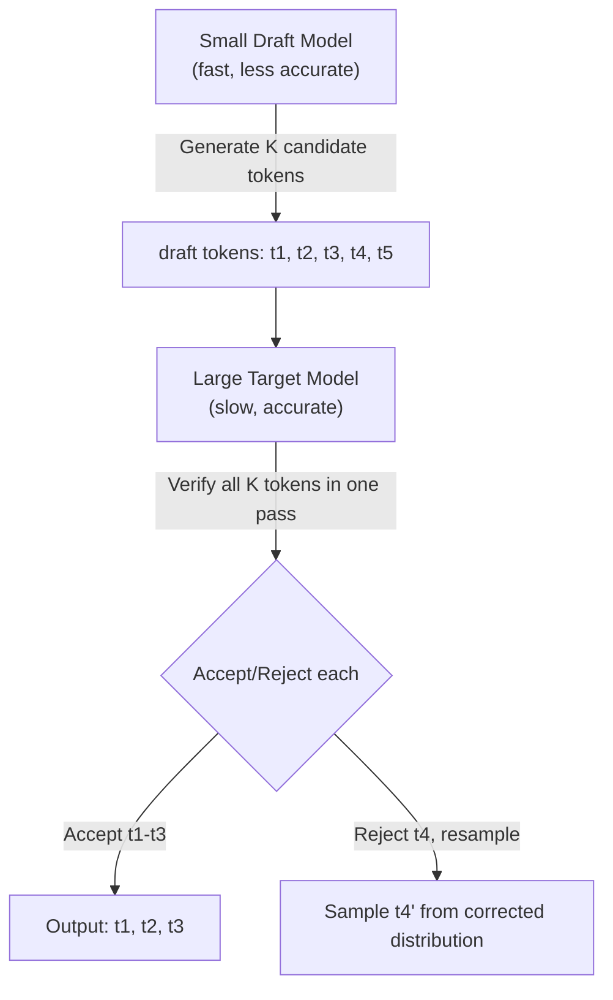

# Sampling Strategies

How LLMs generate text one token at a time — decoding algorithms, temperature, and controlling output quality.

---

## The Big Picture

**What is sampling, in plain English?**

When an LLM generates text, it doesn't write the whole response at once. It predicts one token at a time, over and over, until the response is complete. At each step, the model produces a ranked list of all possible next tokens — like a list of suggestions. **Sampling strategies** control how the model picks from that list.

**Real-world analogy:** Imagine an incredibly well-read author is helping you finish a sentence. They have thousands of possible next words in mind, ranked from "most likely" to "least likely". Should they always pick the top suggestion? That's safe but boring. Should they pick randomly? That's diverse but may produce nonsense.

- **Temperature** is like telling the author "how adventurous should you be today?" — low temperature means stick to the obvious word; high temperature means take risks and surprise me.
- **Top-P / Top-K** are like telling the author "only consider your top 10 suggestions, ignore the rest" — they cut off the worst options before picking.

**Why do sampling parameters matter in practice?**

- **Code generation** needs low temperature (0.0–0.2) — there's a correct answer, be predictable
- **Creative writing** needs high temperature (0.7–1.0) — variety and surprise are valuable
- **Factual Q&A** needs temperature 0 (greedy) — always give the most likely factual answer
- Wrong settings can cause repetitive loops, nonsensical output, or boring text

---

## The Generation Process

LLMs are **autoregressive** — they generate text one token at a time, each token conditioned on all previous tokens. At each step the model outputs a probability distribution over its entire vocabulary (32K-128K+ tokens), and the **decoding strategy** determines which token to actually select.

> **Plain English:** "Autoregressive" just means the model always looks back at everything it's written so far before deciding what to write next — like how a human writer reads what they've written before continuing. The model doesn't plan ahead; it picks the best next word given everything before it, then repeats.



The raw model outputs are **logits** — unbounded scores for each token. These are transformed into probabilities via softmax, but the decoding strategy can manipulate them before and after softmax to control the quality, diversity, and predictability of the output.

### The Logit Pipeline in Detail

```python
import torch
import torch.nn.functional as F

def full_decoding_pipeline(
    logits: torch.Tensor,          # Raw model output: [vocab_size]
    temperature: float = 1.0,
    top_k: int = 0,                # 0 = disabled
    top_p: float = 1.0,            # 1.0 = disabled
    min_p: float = 0.0,            # 0.0 = disabled
    frequency_penalty: float = 0.0,
    presence_penalty: float = 0.0,
    repetition_penalty: float = 1.0,
    generated_ids: list[int] = None,
) -> int:
    """Full token selection pipeline used in production inference."""

    # Step 1: Apply repetition penalty (multiplicative, before temperature)
    if repetition_penalty != 1.0 and generated_ids:
        for token_id in set(generated_ids):
            if logits[token_id] > 0:
                logits[token_id] /= repetition_penalty
            else:
                logits[token_id] *= repetition_penalty

    # Step 2: Apply frequency and presence penalties
    if generated_ids and (frequency_penalty > 0 or presence_penalty > 0):
        for token_id in set(generated_ids):
            count = generated_ids.count(token_id)
            logits[token_id] -= frequency_penalty * count
            logits[token_id] -= presence_penalty

    # Step 3: Temperature scaling
    if temperature == 0:
        return torch.argmax(logits).item()
    logits = logits / temperature

    # Step 4: Top-K filtering
    if top_k > 0:
        top_k_logits, top_k_indices = torch.topk(logits, min(top_k, logits.size(-1)))
        logits = torch.full_like(logits, float('-inf'))
        logits.scatter_(-1, top_k_indices, top_k_logits)

    # Step 5: Top-P (nucleus) filtering
    if top_p < 1.0:
        sorted_logits, sorted_indices = torch.sort(logits, descending=True)
        cumulative_probs = torch.cumsum(F.softmax(sorted_logits, dim=-1), dim=-1)
        mask = cumulative_probs - F.softmax(sorted_logits, dim=-1) >= top_p
        sorted_logits[mask] = float('-inf')
        logits = torch.zeros_like(logits).scatter_(-1, sorted_indices, sorted_logits)

    # Step 6: Min-P filtering
    if min_p > 0:
        probs = F.softmax(logits, dim=-1)
        max_prob = probs.max()
        logits[probs < min_p * max_prob] = float('-inf')

    # Step 7: Sample from filtered distribution
    probs = F.softmax(logits, dim=-1)
    return torch.multinomial(probs, num_samples=1).item()
```

---

## Decoding Strategies

### Greedy Decoding

Always pick the token with the highest probability. Simple and deterministic but often produces repetitive, dull text.

```python
def greedy_decode(logits):
    """Always pick the highest probability token."""
    return torch.argmax(logits, dim=-1)
```

**Problem:** Greedy decoding makes locally optimal choices but can miss globally better sequences. The sentence "The cat sat on the..." might greedily continue with "mat" when "the comfortable velvet chair" would be a better completion.

**When greedy works well:** Factual extraction, classification, code completion (where there's a clearly correct next token), and any task where you want deterministic, reproducible output.

### Beam Search

Track the **K most likely sequences** (beams) at each step, expanding all of them and keeping the top K overall. This explores a wider search space than greedy decoding.

```python
def beam_search(model, input_ids, beam_width=5, max_length=50):
    """Simplified beam search."""
    # Each beam: (sequence, cumulative log-probability)
    beams = [(input_ids, 0.0)]

    for _ in range(max_length):
        all_candidates = []
        for seq, score in beams:
            logits = model(seq)  # Get next-token logits
            log_probs = torch.log_softmax(logits[:, -1, :], dim=-1)
            top_k_probs, top_k_ids = torch.topk(log_probs, beam_width)

            for i in range(beam_width):
                new_seq = torch.cat([seq, top_k_ids[:, i:i+1]], dim=-1)
                new_score = score + top_k_probs[:, i].item()
                all_candidates.append((new_seq, new_score))

        # Keep top beam_width candidates (length-normalized)
        beams = sorted(all_candidates, key=lambda x: x[1], reverse=True)[:beam_width]

    return beams[0][0]  # Return best sequence
```

**Length normalization:** Raw beam search favors shorter sequences (more tokens = lower cumulative log-probability). Length normalization divides the score by $\text{length}^\alpha$ where $\alpha \in [0.5, 1.0]$:

$$\text{score}_{normalized} = \frac{\log P(\text{sequence})}{|\text{sequence}|^\alpha}$$

**Diverse beam search:** Standard beam search often produces very similar beams. Diverse beam search adds a penalty for beams that are too similar to each other, encouraging exploration of different continuations.

Beam search produces higher-quality output than greedy decoding but is still prone to repetition and tends to favor short, generic sequences. It's common in translation but rarely used for open-ended generation.

### Random Sampling

Sample from the full probability distribution. Produces diverse output but can generate nonsensical tokens since even very low-probability tokens have a chance.

```python
def random_sample(logits, temperature=1.0):
    """Sample from the full distribution."""
    probs = torch.softmax(logits / temperature, dim=-1)
    return torch.multinomial(probs, num_samples=1)
```

### Top-K Sampling

Only consider the **K most probable** tokens, redistribute probability among them, and sample.

```python
def top_k_sample(logits, k=50, temperature=1.0):
    """Sample from the top K tokens only."""
    scaled_logits = logits / temperature
    top_k_logits, top_k_indices = torch.topk(scaled_logits, k)
    probs = torch.softmax(top_k_logits, dim=-1)
    sampled_index = torch.multinomial(probs, num_samples=1)
    return top_k_indices.gather(-1, sampled_index)
```

**Limitation:** A fixed K doesn't adapt to the distribution shape. When the model is confident (one token has 95% probability), K=50 includes many bad options. When the model is uncertain (flat distribution), K=50 might cut off good options.

```
Distribution A (confident):
  "Paris" = 0.95, "Lyon" = 0.03, "France" = 0.01, ... (47 more near-zero)
  → K=50 includes 47 near-zero tokens: adds noise, wastes compute

Distribution B (uncertain):
  Top 50 tokens each at ~1-3%, but token #51-100 also at 0.5-1%
  → K=50 cuts off good options that should be considered
```

### Top-P (Nucleus) Sampling

Instead of a fixed count, take the **smallest set of tokens whose cumulative probability** exceeds threshold P. This adapts to the distribution shape.

```python
def top_p_sample(logits, p=0.9, temperature=1.0):
    """Nucleus sampling — adaptive number of tokens."""
    scaled_logits = logits / temperature
    sorted_logits, sorted_indices = torch.sort(scaled_logits, descending=True)
    cumulative_probs = torch.cumsum(torch.softmax(sorted_logits, dim=-1), dim=-1)

    # Remove tokens with cumulative probability above threshold
    sorted_indices_to_remove = cumulative_probs > p
    # Shift right to keep at least one token
    sorted_indices_to_remove[..., 1:] = sorted_indices_to_remove[..., :-1].clone()
    sorted_indices_to_remove[..., 0] = False

    sorted_logits[sorted_indices_to_remove] = float('-inf')
    probs = torch.softmax(sorted_logits, dim=-1)
    sampled_index = torch.multinomial(probs, num_samples=1)
    return sorted_indices.gather(-1, sampled_index)
```

**How it adapts:** If one token has probability 0.92, Top-P with P=0.9 returns just that one token (nearly deterministic). If the top 50 tokens each have ~2% probability, it includes all 50 (diverse).

```
Distribution A (confident, P=0.9):
  "Paris" = 0.95 → cumulative = 0.95 > 0.9 → Only "Paris" survives
  Effectively greedy — but only because the model is confident

Distribution B (uncertain, P=0.9):
  50+ tokens needed to reach cumulative 0.9
  Wide exploration — because the model is uncertain
```

### Min-P Sampling

A newer approach: keep all tokens with probability ≥ `min_p × max_probability`. This sets a minimum relative threshold rather than an absolute cumulative threshold.

```python
def min_p_sample(logits, min_p=0.05, temperature=1.0):
    """Min-P sampling — relative probability threshold."""
    scaled_logits = logits / temperature
    probs = torch.softmax(scaled_logits, dim=-1)
    max_prob = probs.max(dim=-1, keepdim=True).values

    # Keep tokens with prob >= min_p * max_prob
    threshold = min_p * max_prob
    filtered_logits = scaled_logits.masked_fill(probs < threshold, float('-inf'))

    filtered_probs = torch.softmax(filtered_logits, dim=-1)
    return torch.multinomial(filtered_probs, num_samples=1)
```

**Min-P vs Top-P:** Min-P tends to produce more consistent results because it defines inclusion relative to the best option. With Top-P=0.9, a token at the boundary of inclusion might be included or excluded based on the cumulative sum, even if its absolute probability is reasonable. Min-P avoids this by asking: "is this token at least X% as likely as the best option?"

### Tail-Free Sampling (TFS)

Another adaptive strategy: use the **second derivative** of the sorted probability distribution to find where probabilities start dropping off ("the tail"), and cut there.

```python
def tail_free_sample(logits, z=0.95, temperature=1.0):
    """Tail-free sampling — cut at the distribution's tail."""
    scaled_logits = logits / temperature
    sorted_logits, sorted_indices = torch.sort(scaled_logits, descending=True)
    probs = torch.softmax(sorted_logits, dim=-1)

    # Compute second derivative (curvature)
    d1 = probs[..., 1:] - probs[..., :-1]   # First derivative
    d2 = d1[..., 1:] - d1[..., :-1]         # Second derivative
    d2_normalized = d2.abs() / d2.abs().sum(dim=-1, keepdim=True)

    # Cumulative sum of normalized second derivative
    cum_d2 = torch.cumsum(d2_normalized, dim=-1)

    # Find cutoff point where cumulative d2 exceeds z
    mask = cum_d2 > z
    # ... apply mask to remove tail tokens

    return sampled_token
```

### Mirostat

A sampling method that dynamically adjusts temperature/top-k to maintain a **target surprise level** (perplexity). Instead of fixed parameters, Mirostat adapts on-the-fly:

- If the model generates a token that's too surprising → tighten the distribution (lower temperature equivalent)
- If the model generates a boring/predictable token → loosen the distribution (higher temperature equivalent)

```
# Mirostat maintains target perplexity τ:
# τ = 3  → moderately surprising output
# τ = 5  → more diverse, creative
# τ = 8  → very diverse, potentially incoherent

# Available in llama.cpp:
./llama-cli -m model.gguf --mirostat 2 --mirostat-tau 5.0
```

### Strategy Comparison

| Strategy | Adaptive? | Parameters | Quality | Diversity | Best For |
|----------|-----------|-----------|---------|-----------|----------|
| **Greedy** | No | None | Consistent but repetitive | None (deterministic) | Factual Q&A, extraction |
| **Beam search** | No | beam_width | Higher global quality | Low | Translation, summarization |
| **Top-K** | No (fixed K) | K | Good | Moderate | General use, simple config |
| **Top-P** | Yes (cumulative) | P | Good | Adaptive | General use (most popular) |
| **Min-P** | Yes (relative) | min_p | Good | Adaptive | Better tail cutting |
| **TFS** | Yes (curvature) | z | Good | Adaptive | Smooth distribution cutoff |
| **Mirostat** | Yes (surprise) | τ | Good | Target surprise | Consistent quality across prompts |

---

## Temperature

Temperature is the most important sampling parameter. It **scales the logits** before softmax, controlling the sharpness of the probability distribution.

> **Plain English:** Temperature is a single number (usually between 0 and 2) that controls how "creative" or "random" the model is. Think of it like a dial:
> - Turn it to 0: the model always picks the single most likely next word. Completely deterministic — same input always gives same output. Great for factual tasks.
> - Turn it to 1: the model picks according to its natural learned probabilities. Balanced.
> - Turn it above 1: the model treats unlikely words as more equally valid, producing more unexpected/creative outputs — but also more likely to go off the rails.

$$P(token_i) = \frac{e^{z_i / T}}{\sum_j e^{z_j / T}}$$

Where $z_i$ is the raw logit and $T$ is temperature.

| Temperature | Effect | Distribution | Use Case |
|-------------|--------|-------------|----------|
| T = 0 | Greedy (deterministic) | All mass on top token | Factual Q&A, extraction |
| T < 1 (e.g., 0.3) | Sharpens distribution | Peaks become sharper | Code generation, math |
| T = 1 | No change (default) | Original distribution | Balanced generation |
| T > 1 (e.g., 1.5) | Flattens distribution | More uniform | Creative writing, brainstorming |

**Intuition:** Low temperature makes the model more "confident" by amplifying differences between logits. High temperature makes it more "random" by smoothing out the differences.

```python
import torch

logits = torch.tensor([5.0, 3.0, 1.0, 0.5])

for temp in [0.1, 0.5, 1.0, 2.0]:
    probs = torch.softmax(logits / temp, dim=-1)
    print(f"T={temp}: {probs.numpy().round(3)}")

# T=0.1: [1.000, 0.000, 0.000, 0.000]  — nearly deterministic
# T=0.5: [0.978, 0.018, 0.003, 0.002]  — strongly peaked
# T=1.0: [0.836, 0.114, 0.015, 0.009]  — moderate spread
# T=2.0: [0.582, 0.213, 0.078, 0.048]  — flattened
```

### Temperature vs Top-P Interaction

Temperature and Top-P interact in subtle ways:

```python
# Low temperature + Top-P 0.9:
#   Temperature first sharpens the distribution
#   Then Top-P picks the now-smaller set of tokens above the 90% cumulative threshold
#   Result: very focused, nearly deterministic

# High temperature + Top-P 0.9:
#   Temperature first flattens the distribution
#   Top-P then needs more tokens to reach 90% cumulative probability
#   Result: very diverse output

# Common practical configs:
FACTUAL = {"temperature": 0.0}                              # Greedy
CODE_GEN = {"temperature": 0.2, "top_p": 0.95}             # Focused
BALANCED = {"temperature": 0.7, "top_p": 0.9}              # General use
CREATIVE = {"temperature": 1.0, "top_p": 0.95}             # Diverse
BRAINSTORM = {"temperature": 1.2, "top_p": 0.95}           # High diversity
```

### Dynamic Temperature

Some systems vary temperature based on context:

```python
def dynamic_temperature(position: int, total_length: int, base_temp: float = 0.7):
    """Start more deterministic, end more creative."""
    # Useful for story generation: focused start, creative middle
    progress = position / total_length
    return base_temp * (1 + 0.3 * progress)

def confidence_based_temperature(logits, base_temp: float = 0.7):
    """Lower temperature when model is confident, higher when uncertain."""
    probs = torch.softmax(logits, dim=-1)
    entropy = -(probs * probs.log()).sum()
    max_entropy = torch.log(torch.tensor(float(probs.shape[-1])))
    normalized_entropy = entropy / max_entropy  # 0=certain, 1=uniform

    # Low entropy (confident) → lower temp; high entropy (uncertain) → higher temp
    return base_temp * (0.5 + 1.0 * normalized_entropy)
```

---

## Advanced Controls

### Frequency and Presence Penalties

Both reduce repetition but work differently:

| Parameter | Mechanism | Effect |
|-----------|-----------|--------|
| **Frequency penalty** | Subtract `penalty × count(token)` from logit | Penalizes *proportional to* how often token appeared — repeated tokens get increasingly suppressed |
| **Presence penalty** | Subtract `penalty` from logit if token appeared at all | Binary penalty — encourages new topics, doesn't scale with count |
| **Repetition penalty** | Divide logit by `penalty` if token appeared | Multiplicative suppression — common in open-source models (llama.cpp) |

```python
def apply_penalties(logits, generated_ids, freq_penalty=0.0, pres_penalty=0.0):
    """Apply frequency and presence penalties to logits."""
    for token_id in set(generated_ids):
        count = generated_ids.count(token_id)
        logits[token_id] -= freq_penalty * count      # Frequency penalty
        logits[token_id] -= pres_penalty               # Presence penalty (binary)
    return logits

def apply_repetition_penalty(logits, generated_ids, penalty=1.1):
    """Multiplicative repetition penalty (used in llama.cpp, HF)."""
    for token_id in set(generated_ids):
        if logits[token_id] > 0:
            logits[token_id] /= penalty
        else:
            logits[token_id] *= penalty
    return logits
```

**Practical guidance:**
- `frequency_penalty=0.3`: Light repetition reduction
- `frequency_penalty=0.5-0.7`: Strong anti-repetition
- `presence_penalty=0.3-0.5`: Encourage vocabulary diversity
- `repetition_penalty=1.1-1.3`: Moderate suppression (HF/llama.cpp)
- Don't combine all three — they can interact unpredictably

### Stop Sequences and Max Tokens

- **Stop sequences** — halt generation when a specific string/token appears (e.g., `"\n\n"`, `"```"`, `"</answer>"`)
- **Max tokens** — hard limit on output length; prevents runaway generation
- **End-of-sequence token** — model's natural stopping point, learned during training
- **Min tokens** — minimum output length (some APIs support this)

```python
# Stop sequence usage
response = client.chat.completions.create(
    model="gpt-4o",
    messages=[{"role": "user", "content": "List 3 items:"}],
    stop=["\n\n", "4."],    # Stop at double newline or item 4
    max_tokens=200,          # Hard limit
)
```

### Logit Bias

Manually boost or suppress specific tokens by adding to their logits before softmax:

```python
import tiktoken

enc = tiktoken.encoding_for_model("gpt-4o")

# Boost "Python" token, suppress "Java" token
logit_bias = {
    enc.encode("Python")[0]: 5.0,   # Strongly prefer
    enc.encode("Java")[0]: -100.0,  # Effectively ban
}

response = client.chat.completions.create(
    model="gpt-4o",
    messages=[{"role": "user", "content": "What language should I learn?"}],
    logit_bias=logit_bias,
)
```

**Use cases for logit bias:**
- Ban specific words or phrases (set to -100)
- Ensure output starts with specific tokens (boost them for the first token)
- Steer classification outputs toward specific labels
- Prevent the model from saying competitors' names

Useful for steering output without changing the prompt, but use sparingly — it bypasses the model's learned distribution.

### Seed (Reproducibility)

```python
# Set seed for reproducible outputs with the same parameters
response = client.chat.completions.create(
    model="gpt-4o",
    messages=[{"role": "user", "content": "Tell me a joke"}],
    seed=42,          # Same seed = same output (in theory)
    temperature=0.5,
)
# Note: Results may still vary due to server-side non-determinism
# system_fingerprint in the response helps detect when the model version changes
```

---

## Speculative Decoding

A technique to speed up inference without changing output quality. It uses a **small draft model** to generate candidate tokens quickly, then the **large target model** verifies them in parallel.



**Why it works:**
1. The draft model generates K tokens autoregressively (K forward passes, but fast because model is small)
2. The target model verifies all K tokens in a **single** forward pass (batch parallelism)
3. Accepted tokens are guaranteed to have the **same distribution** as if generated by the target model alone
4. Typical acceptance rate: 60-80%, yielding 2-3× speedups

**Key property:** The output distribution is **mathematically identical** to the target model — this is not an approximation. Rejected tokens are resampled from a corrected distribution that accounts for the draft model's predictions.

### The Verification Math

For each draft token, compare the draft model's probability $q(x)$ with the target model's probability $p(x)$:

$$\text{accept if } r < \min\left(1, \frac{p(x)}{q(x)}\right)$$

Where $r \sim \text{Uniform}(0, 1)$. If rejected, resample from the **residual distribution**:

$$p'(x) = \frac{\max(0, p(x) - q(x))}{\sum_x \max(0, p(x) - q(x))}$$

This ensures the overall token distribution is exactly $p(x)$.

### Draft Model Selection

| Approach | Draft Model | Example | Acceptance Rate |
|----------|------------|---------|-----------------|
| **Smaller version** | Same family, fewer params | LLaMA-3 8B → LLaMA-3 1B | 60-80% |
| **Pruned model** | Pruned target | Distilled version | 65-80% |
| **N-gram model** | Simple statistical model | Bigram/trigram | 30-50% |
| **Self-speculative** | Skip layers in target | Middle layers skipped | 50-70% |
| **Medusa** | Multiple prediction heads | Extra heads on target | 60-75% |

### Medusa and Multi-Token Prediction

Instead of a separate draft model, **Medusa** adds extra prediction heads to the target model itself:

```
Standard LLM: predicts token t+1
Medusa heads: predict t+1, t+2, t+3, t+4 simultaneously

Tree-based verification:
  - Multiple candidate continuations form a tree
  - Target model verifies the tree in one pass
  - Select the longest valid path
  - Typical speedup: 2-3×
```

---

## Structured Decoding

Constrain the token generation to only produce valid output according to a grammar or schema.

| Method | How | Library | Overhead |
|--------|-----|---------|----------|
| **JSON mode** | Only allow tokens that produce valid JSON | OpenAI, Anthropic APIs | Minimal |
| **Grammar-guided** | CFG or regex constraints on token selection | llama.cpp, Outlines | Low |
| **Schema-constrained** | JSON Schema defines valid structures | Outlines, Instructor, OpenAI | Low |
| **Finite state machine** | Token selection guided by FSM states | Outlines, XGrammar | Low |

```python
# Using Outlines for structured generation
from outlines import models, generate
from pydantic import BaseModel

class Answer(BaseModel):
    reasoning: str
    answer: str
    confidence: float

model = models.transformers("mistralai/Mistral-7B-v0.1")
generator = generate.json(model, Answer)
result = generator("What is the capital of France?")
# Guaranteed to be a valid Answer object
```

Structured decoding works by masking out tokens at each step that would produce invalid output. At every generation step, the system checks which tokens are legal given the current partial output and the target grammar, then sets all illegal tokens' logits to $-\infty$. See [structured-output.md](structured-output.md) for full coverage.

---

## Practical API Configuration

### OpenAI

```python
from openai import OpenAI
client = OpenAI()

response = client.chat.completions.create(
    model="gpt-4o",
    messages=[{"role": "user", "content": "Write a haiku about coding."}],
    temperature=0.8,
    top_p=0.95,
    frequency_penalty=0.3,
    presence_penalty=0.1,
    max_tokens=100,
    stop=["\n\n"],
    seed=42,
    n=3,                     # Generate 3 completions
)
```

### Anthropic (Claude)

```python
import anthropic
client = anthropic.Anthropic()

response = client.messages.create(
    model="claude-3-5-sonnet-20241022",
    max_tokens=1024,
    temperature=0.7,
    top_p=0.9,
    top_k=50,                # Anthropic supports top_k
    stop_sequences=["\n\n"],
    messages=[{"role": "user", "content": "Explain quantum computing."}],
)
# Note: Claude doesn't support frequency/presence penalties
# Use prompt instructions instead for anti-repetition
```

### Hugging Face / Local

```python
from transformers import AutoModelForCausalLM, AutoTokenizer

model = AutoModelForCausalLM.from_pretrained("meta-llama/Llama-3-8B-Instruct")
tokenizer = AutoTokenizer.from_pretrained("meta-llama/Llama-3-8B-Instruct")

inputs = tokenizer("Write a story:", return_tensors="pt")
output = model.generate(
    **inputs,
    max_new_tokens=200,
    temperature=0.8,
    top_p=0.9,
    top_k=50,
    do_sample=True,           # Required for non-greedy
    repetition_penalty=1.1,
    no_repeat_ngram_size=3,   # Prevent 3-gram repetition
    num_beams=1,              # 1 = no beam search (sampling)
)
```

---

## Sampling Configuration Recipes

| Task | Temperature | Top-P | Freq Penalty | Other |
|------|------------|-------|-------------|-------|
| **Factual Q&A** | 0.0 | 1.0 | 0.0 | Greedy decoding |
| **Code generation** | 0.0-0.2 | 0.95 | 0.0 | Low temp, no penalties |
| **Code review** | 0.3 | 0.95 | 0.0 | Slight creativity |
| **General chat** | 0.7 | 0.9 | 0.3 | Balanced |
| **Creative writing** | 0.9-1.0 | 0.95 | 0.5 | High diversity |
| **Brainstorming** | 1.2 | 0.95 | 0.7 | Maximum diversity |
| **Translation** | 0.0-0.3 | 0.9 | 0.0 | Mostly deterministic |
| **Summarization** | 0.3 | 0.9 | 0.0 | Faithful to source |
| **Data extraction** | 0.0 | 1.0 | 0.0 | Deterministic |
| **Classification** | 0.0 | 1.0 | 0.0 | Deterministic |

---

## Common Interview Questions

**1. Top-K vs Top-P — what's the difference and when to prefer each?**

Top-K always considers exactly K tokens regardless of the probability distribution. If the model is very confident (one token at 95%), K=50 still includes 49 near-zero-probability tokens, adding noise. If the model is uncertain (flat distribution), K=50 might cut off good options. Top-P (nucleus sampling) adapts: it takes the smallest set of tokens whose cumulative probability exceeds P. When the model is confident, this might be 1-2 tokens; when uncertain, it might be 100+. Prefer Top-P for general-purpose generation because it adapts to the model's confidence. Top-K is simpler and adequate when you don't need adaptive behavior. Min-P is newer and avoids some Top-P edge cases by using a relative threshold instead of cumulative probability.

**2. How does temperature affect generation? What's the math?**

Temperature divides logits by T before softmax: $P(i) = \text{softmax}(z_i / T)$. At T→0, the distribution collapses to the argmax (greedy/deterministic). At T=1, you get the model's original distribution. At T>1, the distribution flattens — differences between logits shrink, making unlikely tokens more probable. Mathematically, for two tokens with logits $z_1 > z_2$, the ratio $P(z_1)/P(z_2) = e^{(z_1-z_2)/T}$. As T decreases, this ratio grows exponentially, concentrating mass on the top token. This is why T=0.1-0.3 is used for factual tasks (strong preference for model's top picks) and T=0.7-1.0 for creative tasks (more exploration).

**3. What is speculative decoding and how does it speed up inference?**

Speculative decoding uses a small, fast "draft" model to generate K candidate tokens autoregressively, then the large target model verifies all K tokens in a single forward pass. The key insight is that transformer inference is **memory-bandwidth-bound**, not compute-bound — processing K tokens in parallel costs nearly the same as processing 1. If the draft model's guesses are accepted (typically 60-80% acceptance rate), you effectively get K tokens for the cost of 1 target model forward pass. Crucially, the output distribution is **mathematically identical** to the target model — rejected tokens are resampled from a corrected distribution $p'(x) = \max(0, p(x) - q(x)) / Z$. This gives 2-3× speedups with zero quality loss.

**4. How do frequency and presence penalties differ?**

Frequency penalty is proportional — it subtracts `penalty × count` from a token's logit, so a token used 5 times gets 5× the penalty. This specifically targets repetition of individual tokens. Presence penalty is binary — it subtracts a flat penalty from any token that appeared at all, regardless of how many times. This encourages topic diversity (use new words) rather than specifically fighting repetition. Repetition penalty (used in HF/llama.cpp) is multiplicative — divides logits by the penalty value, which works differently on positive vs negative logits. In practice: use frequency penalty to prevent the model from repeating the same phrase; use presence penalty to encourage the model to explore new topics and vocabulary. Don't stack all three.

**5. How would you configure sampling for a code generation task vs creative writing?**

For **code generation**: Temperature 0.0-0.3 (code has clear correct answers), Top-P 0.9-0.95, no frequency/presence penalties (legitimate code repeats variable names), stop sequences at function/class boundaries. Determinism matters — you want the most probable, syntactically correct token. For **creative writing**: Temperature 0.7-1.0, Top-P 0.9-0.95, moderate frequency penalty (0.3-0.5) to avoid repetitive phrasing, slight presence penalty (0.1-0.3) to encourage vocabulary diversity, higher max_tokens for longer output. The goal is exploration and novelty, so you want the model to take more risks.

**6. What is Mirostat and how does it differ from fixed sampling parameters?**

Mirostat dynamically adjusts the sampling distribution to maintain a target **surprise level** (perplexity). Instead of fixed temperature/top-k, it adapts on every token: if the model generates a too-surprising token, it tightens the distribution for the next token; if it generates a too-predictable token, it loosens it. The target surprise level τ controls the balance. This produces more consistent quality across different prompt types — fixed parameters might work well for one prompt but poorly for another, while Mirostat adapts. It's particularly useful for open-ended generation where the "right" sampling parameters vary throughout the text.

**7. Explain the full logit processing pipeline from raw model output to sampled token.**

The pipeline: (1) **Raw logits** from the model's final linear layer (one score per vocabulary token). (2) **Repetition penalty** — multiplicatively penalize tokens that already appeared. (3) **Frequency/presence penalties** — subtract from logits of previously generated tokens. (4) **Temperature scaling** — divide logits by T to sharpen or flatten the distribution. (5) **Top-K filtering** — zero out all but the K highest logits. (6) **Top-P filtering** — zero out tokens outside the nucleus (cumulative probability threshold). (7) **Min-P filtering** — zero out tokens below the relative threshold. (8) **Softmax** — convert filtered logits to probabilities. (9) **Sampling** — draw a token from the probability distribution (or argmax for T=0). The order matters: penalties before temperature before filtering before softmax.

**8. How does beam search work and when would you prefer it over sampling?**

Beam search maintains K candidate sequences ("beams") and at each step expands all beams by the top tokens, keeping the K best overall (by cumulative log-probability, often length-normalized). It's a middle ground between greedy (K=1) and exhaustive search (all sequences). Prefer beam search for tasks with "correct" outputs: machine translation (BLEU benefits from finding the most probable sequence), summarization (faithful to source), and structured prediction. Avoid for open-ended generation — beam search tends to produce repetitive, generic text because high-probability sequences are often boring. Sampling (top-p, temperature) is better for chat, creative writing, and any task where diversity matters. In modern LLM applications, beam search is rarely used because sampling with good parameters produces more natural, engaging text.
