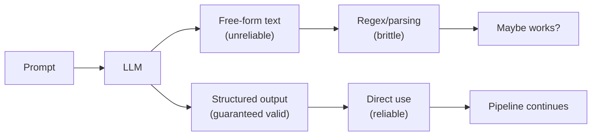
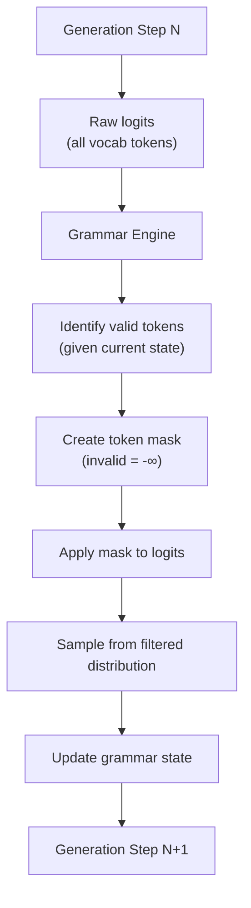

# Structured Output

Forcing LLMs to produce machine-parseable output — JSON, XML, function calls, and schema-constrained generation.

---

## Why Structured Output

LLMs naturally produce free-form text, but production applications need **deterministically parseable output**. When an LLM response feeds into a pipeline — saving to a database, triggering API calls, updating a UI — you need guaranteed structure, not a string that "usually looks like JSON."



**The reliability spectrum:**

| Approach | Reliability | Latency Overhead | Cost |
|----------|------------|-----------------|------|
| Prompt-only ("respond in JSON") | 70-90% | None | None |
| JSON mode (provider flag) | 95-99% | Minimal | None |
| Function calling / tool use | 99%+ | Minimal | None |
| Schema-constrained (Structured Outputs) | 100% | Minimal | None |
| Grammar-guided (Outlines/llama.cpp) | 100% | Low | None |
| Retry with validation | 95-99% (eventual) | High (retries) | 2-3× |

---

## Provider-Native Solutions

### OpenAI Structured Outputs

OpenAI's Structured Outputs guarantees JSON that conforms exactly to a provided JSON Schema — enforced at the token generation level.

```python
from openai import OpenAI
from pydantic import BaseModel

client = OpenAI()

class CalendarEvent(BaseModel):
    name: str
    date: str
    participants: list[str]
    location: str | None = None
    is_recurring: bool = False

response = client.beta.chat.completions.parse(
    model="gpt-4o-2024-08-06",
    messages=[
        {"role": "system", "content": "Extract calendar events from text."},
        {"role": "user", "content": "Let's meet with Alice and Bob at the office on Friday for the quarterly review."},
    ],
    response_format=CalendarEvent,
)

event = response.choices[0].message.parsed
print(event.name)          # "Quarterly Review"
print(event.participants)  # ["Alice", "Bob"]
print(type(event))         # <class 'CalendarEvent'>
```

**How it works internally:** OpenAI converts the JSON Schema into a **context-free grammar (CFG)**, then constrains token generation to only allow tokens that are valid according to the grammar at each step. This is why it's 100% reliable — invalid tokens are literally impossible.

**Limitations of OpenAI Structured Outputs:**
- Schema must be fully specified (no `additionalProperties`)
- All fields are required by default (use `Optional` for nullable)
- Limited to certain JSON Schema features (no `patternProperties`, `if/then/else`)
- First request with a new schema has extra latency (schema compilation)
- Recursive schemas supported but must have a finite maximum depth

### OpenAI JSON Mode (Simpler)

```python
# JSON mode: guarantees valid JSON, but doesn't enforce a schema
response = client.chat.completions.create(
    model="gpt-4o",
    messages=[
        {"role": "system", "content": "Respond in JSON with fields: name, age, city"},
        {"role": "user", "content": "Tell me about Alice who is 30 and lives in NYC."},
    ],
    response_format={"type": "json_object"},
)
# Returns valid JSON, but the structure might not match your expectations
# Always include the expected format in the system prompt
```

### Anthropic Tool Use

Anthropic achieves structured output through **tool use** — you define a "tool" with an input schema, and Claude fills in the schema when it "calls" the tool.

```python
import anthropic

client = anthropic.Anthropic()

response = client.messages.create(
    model="claude-3-5-sonnet-20241022",
    max_tokens=1024,
    tools=[
        {
            "name": "extract_event",
            "description": "Extract a calendar event from text",
            "input_schema": {
                "type": "object",
                "properties": {
                    "name": {"type": "string", "description": "Event name"},
                    "date": {"type": "string", "description": "Event date in ISO format"},
                    "participants": {
                        "type": "array",
                        "items": {"type": "string"},
                        "description": "List of participant names",
                    },
                    "location": {"type": "string", "description": "Event location"},
                },
                "required": ["name", "date", "participants"],
            },
        }
    ],
    tool_choice={"type": "tool", "name": "extract_event"},  # Force this specific tool
    messages=[
        {"role": "user", "content": "Let's meet with Alice and Bob at the office on Friday."},
    ],
)

# Extract the tool call result
tool_use = next(block for block in response.content if block.type == "tool_use")
print(tool_use.input)
# {"name": "Meeting", "date": "2024-01-12", "participants": ["Alice", "Bob"], "location": "office"}
```

### Google Gemini

```python
import google.generativeai as genai
from pydantic import BaseModel

class Recipe(BaseModel):
    name: str
    ingredients: list[str]
    steps: list[str]
    prep_time_minutes: int

model = genai.GenerativeModel(
    "gemini-1.5-pro",
    generation_config=genai.GenerationConfig(
        response_mime_type="application/json",
        response_schema=Recipe,
    ),
)

response = model.generate_content("Give me a recipe for chocolate cake")
recipe = Recipe.model_validate_json(response.text)
```

---

## Instructor Library

[Instructor](https://github.com/jxnl/instructor) wraps any LLM API and adds Pydantic-based structured output with automatic validation and retries.

```python
import instructor
from openai import OpenAI
from pydantic import BaseModel, Field, field_validator

# Patch the client
client = instructor.from_openai(OpenAI())

class UserProfile(BaseModel):
    """Extract user profile information."""
    name: str = Field(description="Full name of the user")
    age: int = Field(ge=0, le=150, description="Age in years")
    email: str = Field(description="Email address")
    interests: list[str] = Field(min_length=1, description="List of interests")

    @field_validator("email")
    @classmethod
    def validate_email(cls, v):
        if "@" not in v:
            raise ValueError("Invalid email format")
        return v

profile = client.chat.completions.create(
    model="gpt-4o",
    response_model=UserProfile,
    max_retries=3,               # Auto-retry on validation failure
    messages=[
        {"role": "user", "content": "I'm Alice Smith, 30 years old. I love hiking and cooking. Email: alice@example.com"}
    ],
)
# profile.name = "Alice Smith"
# profile.age = 30
# profile.email = "alice@example.com"
# profile.interests = ["hiking", "cooking"]
```

### Instructor with Multiple Providers

```python
import instructor
from anthropic import Anthropic
from openai import OpenAI

# Works with any provider
openai_client = instructor.from_openai(OpenAI())
anthropic_client = instructor.from_anthropic(Anthropic())

# Same Pydantic model, different providers
result_openai = openai_client.chat.completions.create(
    model="gpt-4o",
    response_model=UserProfile,
    messages=[{"role": "user", "content": text}],
)

result_anthropic = anthropic_client.messages.create(
    model="claude-3-5-sonnet-20241022",
    max_tokens=1024,
    response_model=UserProfile,
    messages=[{"role": "user", "content": text}],
)
```

### Advanced Instructor Patterns

```python
from pydantic import BaseModel, Field
from typing import Literal
import instructor

# Pattern 1: Classification with chain-of-thought
class SentimentAnalysis(BaseModel):
    """Analyze the sentiment of the text, thinking step by step."""
    chain_of_thought: str = Field(description="Step-by-step reasoning about the sentiment")
    sentiment: Literal["positive", "negative", "neutral"]
    confidence: float = Field(ge=0.0, le=1.0)

# Pattern 2: Multi-extraction (list of objects)
class Entity(BaseModel):
    name: str
    entity_type: Literal["person", "organization", "location", "date"]
    context: str = Field(description="Surrounding context where entity appears")

class ExtractionResult(BaseModel):
    entities: list[Entity]

# Pattern 3: Recursive/nested structures
class TreeNode(BaseModel):
    label: str
    children: list["TreeNode"] = []

class TaxonomyResult(BaseModel):
    root: TreeNode

# Pattern 4: Streaming partial results
from instructor import Partial

profile_stream = client.chat.completions.create(
    model="gpt-4o",
    response_model=Partial[UserProfile],   # Stream partial Pydantic objects
    messages=[{"role": "user", "content": text}],
    stream=True,
)

for partial_profile in profile_stream:
    print(f"Partial: {partial_profile}")
    # First iteration: UserProfile(name="Alice", age=None, ...)
    # Later: UserProfile(name="Alice Smith", age=30, ...)
```

---

## Grammar-Guided Generation

For local models, constrain generation at the token level using formal grammars.

### Outlines

```python
from outlines import models, generate
from pydantic import BaseModel

# Load a local model
model = models.transformers("mistralai/Mistral-7B-Instruct-v0.3")

# Method 1: Pydantic schema
class Sentiment(BaseModel):
    text: str
    label: str
    score: float

generator = generate.json(model, Sentiment)
result = generator("Classify: 'I love this product!'")
# Guaranteed valid Sentiment object

# Method 2: Regex constraint
phone_generator = generate.regex(model, r"\(\d{3}\) \d{3}-\d{4}")
phone = phone_generator("Generate a US phone number:")
# Guaranteed to match the regex

# Method 3: Choice (enum-like)
choice_generator = generate.choice(model, ["positive", "negative", "neutral"])
label = choice_generator("Sentiment of 'great movie':")
# Will be exactly one of the three options

# Method 4: Context-free grammar (EBNF)
grammar = """
?start: expression
expression: term (("+"|"-") term)*
term: factor (("*"|"/") factor)*
factor: NUMBER | "(" expression ")"
NUMBER: /[0-9]+(\.[0-9]+)?/
"""
math_generator = generate.cfg(model, grammar)
expr = math_generator("Write a math expression:")
# Valid arithmetic expression: "3 + (4 * 5)"
```

### How Grammar-Guided Generation Works



**At each step:**
1. The model produces logits for all tokens
2. The grammar engine determines which tokens are valid given the current parse state
3. Invalid tokens get their logits set to $-\infty$ (zero probability after softmax)
4. The model samples from only the valid tokens
5. The grammar state advances based on the chosen token

**Performance:** Token masking adds ~5-10% overhead per step. The grammar automaton is compiled once and shared across requests.

### llama.cpp Grammar Mode

```bash
# llama.cpp supports GBNF (GGML BNF) grammar format
cat > json.gbnf << 'EOF'
root   ::= object
value  ::= object | array | string | number | "true" | "false" | "null"

object ::=
  "{" ws (
    string ":" ws value
    ("," ws string ":" ws value)*
  )? "}" ws

array  ::=
  "[" ws (
    value
    ("," ws value)*
  )? "]" ws

string ::= "\"" ([^"\\] | "\\" .)* "\"" ws
number ::= "-"? [0-9]+ ("." [0-9]+)? ws
ws     ::= [ \t\n]*
EOF

# Use with llama.cpp
./llama-cli -m model.gguf --grammar-file json.gbnf \
  -p "Generate a JSON object with name and age:"
```

---

## Retry and Validation Patterns

When you don't have constrained decoding, use validation + retries:

### Basic Retry Loop

```python
import json
from pydantic import BaseModel, ValidationError
from openai import OpenAI

client = OpenAI()

class ExtractedData(BaseModel):
    name: str
    age: int
    city: str

def extract_with_retries(text: str, max_retries: int = 3) -> ExtractedData:
    """Extract structured data with validation and retries."""
    errors = []

    for attempt in range(max_retries):
        messages = [
            {"role": "system", "content": "Extract information as JSON with fields: name (str), age (int), city (str)"},
            {"role": "user", "content": text},
        ]

        # Include previous errors for self-correction
        if errors:
            error_context = "\n".join(f"Attempt {i+1} error: {e}" for i, e in enumerate(errors))
            messages.append({
                "role": "user",
                "content": f"Previous attempts failed with these errors:\n{error_context}\nPlease fix and try again.",
            })

        response = client.chat.completions.create(
            model="gpt-4o",
            messages=messages,
            response_format={"type": "json_object"},
            temperature=0.0,
        )

        try:
            data = json.loads(response.choices[0].message.content)
            return ExtractedData(**data)
        except (json.JSONDecodeError, ValidationError) as e:
            errors.append(str(e))
            continue

    raise ValueError(f"Failed after {max_retries} attempts. Errors: {errors}")
```

### Guardrails Pattern

```python
from pydantic import BaseModel, Field, model_validator
from typing import Literal

class FinancialReport(BaseModel):
    """Structured financial report with business rule validation."""
    company: str
    revenue: float = Field(ge=0, description="Revenue in millions USD")
    expenses: float = Field(ge=0, description="Expenses in millions USD")
    profit: float = Field(description="Profit in millions USD")
    quarter: Literal["Q1", "Q2", "Q3", "Q4"]
    year: int = Field(ge=2000, le=2030)
    currency: Literal["USD", "EUR", "GBP"] = "USD"

    @model_validator(mode="after")
    def check_profit_calculation(self):
        expected_profit = self.revenue - self.expenses
        if abs(self.profit - expected_profit) > 0.01:
            raise ValueError(
                f"Profit ({self.profit}) doesn't match revenue - expenses "
                f"({self.revenue} - {self.expenses} = {expected_profit})"
            )
        return self
```

---

## Complex Schema Patterns

### Union Types and Discriminated Unions

```python
from pydantic import BaseModel, Field
from typing import Literal, Union

class TextMessage(BaseModel):
    type: Literal["text"] = "text"
    content: str

class ImageMessage(BaseModel):
    type: Literal["image"] = "image"
    url: str
    alt_text: str

class CodeMessage(BaseModel):
    type: Literal["code"] = "code"
    language: str
    code: str

# Discriminated union — the 'type' field determines which schema to use
class ConversationTurn(BaseModel):
    role: Literal["user", "assistant"]
    messages: list[Union[TextMessage, ImageMessage, CodeMessage]] = Field(
        discriminator="type"
    )

class Conversation(BaseModel):
    title: str
    turns: list[ConversationTurn]
```

### Extraction with Confidence Scores

```python
class ExtractedEntity(BaseModel):
    text: str = Field(description="The exact text span of the entity")
    label: Literal["PERSON", "ORG", "LOC", "DATE", "MONEY"]
    confidence: float = Field(ge=0.0, le=1.0, description="Extraction confidence")
    start_char: int = Field(ge=0, description="Start character offset in source")
    end_char: int = Field(ge=0, description="End character offset in source")

class NERResult(BaseModel):
    entities: list[ExtractedEntity]
    source_text: str
    total_entities: int

    @model_validator(mode="after")
    def validate_count(self):
        if self.total_entities != len(self.entities):
            raise ValueError(f"total_entities ({self.total_entities}) != len(entities) ({len(self.entities)})")
        return self
```

### Multi-Step Extraction with Chain-of-Thought

```python
class AnalysisStep(BaseModel):
    step_number: int
    description: str
    finding: str

class DocumentAnalysis(BaseModel):
    """Extract structured analysis from a document, thinking step by step."""
    # Chain-of-thought reasoning (improves accuracy)
    reasoning: list[AnalysisStep] = Field(
        description="Step-by-step analysis reasoning"
    )

    # Final structured output
    summary: str = Field(max_length=500)
    key_findings: list[str] = Field(min_length=1, max_length=10)
    sentiment: Literal["positive", "negative", "neutral", "mixed"]
    risk_level: Literal["low", "medium", "high"]
    recommended_actions: list[str]
```

---

## Streaming Structured Output

### Token-by-Token Streaming with Partial Parsing

```python
import json
from openai import OpenAI

client = OpenAI()

def stream_json(prompt: str):
    """Stream JSON and parse incrementally."""
    buffer = ""
    stream = client.chat.completions.create(
        model="gpt-4o",
        messages=[
            {"role": "system", "content": "Respond with a JSON object."},
            {"role": "user", "content": prompt},
        ],
        response_format={"type": "json_object"},
        stream=True,
    )

    for chunk in stream:
        delta = chunk.choices[0].delta.content
        if delta:
            buffer += delta

            # Try to parse partial JSON (for progress indication)
            try:
                partial = json.loads(buffer + "}")  # Attempt to close
                yield {"status": "partial", "data": partial}
            except json.JSONDecodeError:
                yield {"status": "streaming", "buffer_length": len(buffer)}

    # Final complete parse
    yield {"status": "complete", "data": json.loads(buffer)}
```

### Instructor Partial Streaming

```python
import instructor
from pydantic import BaseModel
from openai import OpenAI

client = instructor.from_openai(OpenAI())

class Article(BaseModel):
    title: str
    summary: str
    key_points: list[str]
    word_count: int

# Stream partial objects — great for UI updates
for partial in client.chat.completions.create_partial(
    model="gpt-4o",
    response_model=Article,
    messages=[{"role": "user", "content": "Write about quantum computing"}],
):
    # partial is incrementally populated
    if partial.title:
        print(f"Title: {partial.title}")
    if partial.key_points:
        print(f"Points so far: {len(partial.key_points)}")
```

---

## Structured Output Best Practices

### Schema Design

1. **Use descriptive field names** — the model uses them as hints
2. **Add descriptions** — `Field(description="...")` significantly improves accuracy
3. **Use enums/Literals** — constrain to valid values
4. **Add validators** — catch obviously wrong outputs
5. **Include chain-of-thought** — a `reasoning` field before the answer improves accuracy
6. **Keep schemas focused** — one schema per task, not one giant schema

### Prompt Design for Structured Output

```python
# BAD: Vague prompt, no examples
messages = [
    {"role": "user", "content": "Extract data from: John is 30 years old and lives in NYC"}
]

# GOOD: Clear schema description + example
messages = [
    {"role": "system", "content": """Extract user profiles from text.
Always extract name, age, and city. If information is missing, use null.

Example:
Input: "Alice, 25, from London"
Output: {"name": "Alice", "age": 25, "city": "London"}

Input: "Bob works in tech"
Output: {"name": "Bob", "age": null, "city": null}"""},
    {"role": "user", "content": "John is 30 years old and lives in NYC"},
]
```

### Error Handling Strategy

```python
from enum import Enum

class OutputStrategy(Enum):
    CONSTRAINED = "constrained"  # 100% reliable, use when available
    JSON_MODE = "json_mode"      # 95-99% reliable, validate result
    PROMPT_ONLY = "prompt_only"  # 70-90% reliable, retry on failure

def get_structured_output(prompt: str, schema: type[BaseModel], strategy: OutputStrategy):
    """Choose strategy based on provider and requirements."""

    if strategy == OutputStrategy.CONSTRAINED:
        # OpenAI Structured Outputs — guaranteed valid
        return client.beta.chat.completions.parse(
            model="gpt-4o-2024-08-06",
            response_format=schema,
            messages=[{"role": "user", "content": prompt}],
        ).choices[0].message.parsed

    elif strategy == OutputStrategy.JSON_MODE:
        # JSON mode + Pydantic validation
        response = client.chat.completions.create(
            model="gpt-4o",
            response_format={"type": "json_object"},
            messages=[
                {"role": "system", "content": f"Respond with JSON matching: {schema.model_json_schema()}"},
                {"role": "user", "content": prompt},
            ],
        )
        return schema.model_validate_json(response.choices[0].message.content)

    elif strategy == OutputStrategy.PROMPT_ONLY:
        # Prompt engineering + regex extraction + retries
        response = client.chat.completions.create(
            model="gpt-4o",
            messages=[
                {"role": "system", "content": f"Respond ONLY with valid JSON: {schema.model_json_schema()}"},
                {"role": "user", "content": prompt},
            ],
        )
        # Extract JSON from potentially wrapped response
        import re
        json_match = re.search(r'\{.*\}', response.choices[0].message.content, re.DOTALL)
        if json_match:
            return schema.model_validate_json(json_match.group())
        raise ValueError("No JSON found in response")
```

### Decision Matrix

| Factor | Structured Outputs | JSON Mode | Function Calling | Instructor | Outlines |
|--------|-------------------|-----------|-----------------|------------|----------|
| Reliability | 100% | 95-99% | 99%+ | 95-99%+ | 100% |
| Provider | OpenAI only | OpenAI, others | Most providers | Any provider | Local models |
| Complexity | Simple schemas | Any JSON | Tool schemas | Any Pydantic | Any grammar |
| Streaming | Yes | Yes | Yes | Partial objects | No |
| Schema validation | At generation | Post-hoc | At generation | Post-hoc + retry | At generation |
| Recursive schemas | Yes (depth limit) | No guarantee | No | Yes | Yes |
| Cost overhead | None | None | None | Retry cost | None |

---

## Common Interview Questions

**1. How do you get reliable structured output from an LLM? Compare approaches.**

There are several approaches on a reliability spectrum. **Prompt engineering** ("respond in JSON format") is simplest but least reliable (70-90%) — the model might add markdown, skip fields, or produce invalid JSON. **JSON mode** (provider flag) guarantees valid JSON but doesn't enforce a schema — you might get valid JSON with unexpected structure. **Function calling / tool use** gets 99%+ reliability by having the model fill in a predefined schema, but it's designed for tool invocations. **Structured Outputs** (OpenAI) provides 100% reliability by constraining token generation with a context-free grammar compiled from your JSON schema — invalid tokens literally cannot be generated. **Grammar-guided generation** (Outlines, llama.cpp) achieves the same 100% reliability for local models. **Instructor** provides a unified API across providers with Pydantic validation and automatic retries. Choose based on your reliability requirements and provider.

**2. How does constrained decoding work under the hood?**

Constrained decoding modifies the token generation process. At each step, before sampling, a **grammar engine** determines which tokens are valid given the current parse state and the target grammar. Invalid tokens have their logits set to $-\infty$ (zero probability after softmax), so they can never be selected. For JSON Schema, the schema is first compiled into a deterministic finite automaton (DFA) or pushdown automaton (PDA). At each generation step, the automaton's current state determines valid next characters, which maps to valid next tokens. This is done by pre-computing, for each automaton state, which vocabulary tokens would produce a valid transition. The overhead is ~5-10% per step, and the automaton is compiled once per schema and cached.

**3. What is Instructor and why would you use it over raw API calls?**

Instructor wraps LLM API clients to add Pydantic-based structured output with three key benefits: (1) **Type-safe responses** — define output as a Pydantic model and get back a validated Python object, not a string. (2) **Automatic retries** — if the LLM output fails Pydantic validation, Instructor automatically retries with the validation error included in the prompt, giving the model a chance to self-correct. (3) **Provider-agnostic** — same code works with OpenAI, Anthropic, Google, local models. Additional features include partial streaming (stream incomplete Pydantic objects for UI updates), support for complex schemas (nested models, discriminated unions, recursive structures), and hooks for custom validation logic. Use it when you need reliability higher than raw JSON mode but want simplicity and provider portability.

**4. How do you handle structured output failures in production?**

Defense in depth: (1) **Use the most reliable method available** — Structured Outputs or grammar-guided if possible. (2) **Pydantic validation** — catch schema mismatches, type errors, business rule violations. (3) **Retry with error context** — show the model its validation error and ask it to fix the output (typically 1-2 retries suffice). (4) **Fallback degradation** — if structured extraction fails, fall back to unstructured output with manual parsing, or return a default/error state. (5) **Monitoring** — track structured output success rates per model, schema, and prompt template. Alert on drops below threshold. (6) **Schema versioning** — when schemas change, test with existing prompts to ensure backward compatibility. The key insight: design your schemas with validation rules that catch common LLM mistakes (wrong types, out-of-range values, logical inconsistencies).

**5. Compare function calling for structured output vs Structured Outputs. When would you choose each?**

**Function calling** is designed for the model to invoke tools — it returns structured arguments for a function. Supported by OpenAI, Anthropic, Google, and most providers. Reliable (99%+) but not guaranteed valid. Good for when you genuinely want tool invocation semantics. **Structured Outputs** (OpenAI) is designed purely for structured data extraction — guarantees 100% schema compliance via constrained decoding. Only available on OpenAI (gpt-4o and later). Better for data extraction, classification, and any non-tool-calling structured output. Choose Structured Outputs when: (a) you need 100% reliability, (b) you're on OpenAI, (c) you're doing extraction/classification. Choose function calling when: (a) you need cross-provider compatibility, (b) you're actually invoking tools, (c) you need the model to decide which function to call.

**6. How would you design a schema for extracting complex, nested data from documents?**

Start with the output structure, then add validation: (1) **Flat first** — start with simple flat schemas and validate they work before adding nesting. (2) **Chain-of-thought** — include a `reasoning` field that forces the model to think before extracting, improving accuracy. (3) **Discriminated unions** — use a `type` field for polymorphic data (`TextBlock | ImageBlock | TableBlock`). (4) **Confidence scores** — add a `confidence: float` field to flag uncertain extractions. (5) **Source spans** — include `start_char`/`end_char` to anchor extractions to the source text (enables verification). (6) **Validators** — use Pydantic `@model_validator` for business rules (e.g., end_date > start_date, profit = revenue - expenses). (7) **Keep schemas focused** — better to call the LLM multiple times with focused schemas than once with a massive schema. Complex schemas degrade extraction quality.

**7. How do you handle streaming with structured output?**

Three approaches: (1) **Post-hoc parsing** — collect the full stream, then parse. Simple but loses the streaming benefit. (2) **Incremental JSON parsing** — attempt to parse after each chunk by trying to close open brackets. Works for JSON mode but fragile. (3) **Partial object streaming** (Instructor) — stream Pydantic objects with fields populated as they arrive. Best UX — you can show partial results (e.g., display the title while the body is still generating). For function calling, most providers stream the arguments token by token, and you can parse the delta stream to incrementally build the function arguments.

**8. What are the tradeoffs of grammar-guided generation (Outlines) vs API-based structured outputs?**

**Grammar-guided (Outlines/llama.cpp):** 100% reliable, works with any local model, supports arbitrary grammars (not just JSON — regex, CFG, custom formats), no API dependency. But requires hosting your own model, adds ~5-10% latency per step, and the grammar compilation can be complex for advanced schemas. **API-based (OpenAI/Anthropic):** No infrastructure needed, leverages the best models, simpler integration. But limited to what the provider supports (specific JSON Schema subset for OpenAI), dependency on external service, and cost per request. Choose Outlines for local deployment, custom formats, or when you need full control. Choose API-based for simplest integration, best models, and when you don't want to manage infrastructure. In practice, many teams use API-based Structured Outputs in production and Outlines for experimentation/local development.
