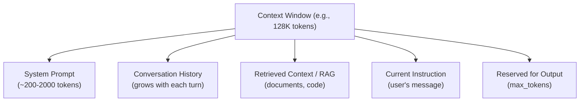
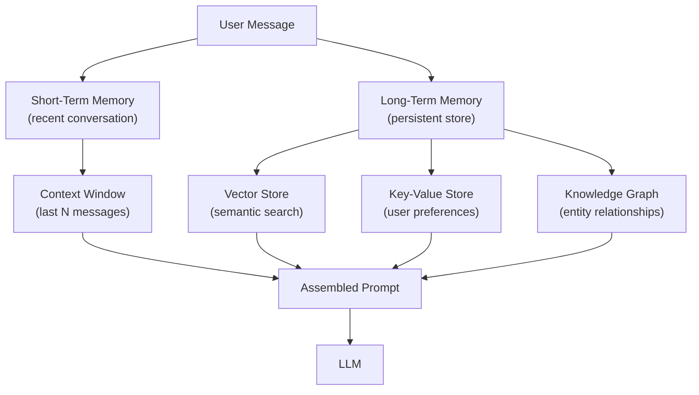

# Context Window Management

Strategies for working within and optimizing LLM context windows — chunking, summarization, compression, and memory architectures.

---

## The Big Picture

**What is a context window, in plain English?**

Every LLM has a hard limit on how much text it can process in one go — this is the **context window**. Everything the model "knows" during a conversation must fit inside this window: your instructions, the conversation history, any documents you've shared, and the response it's generating. Once you exceed the limit, the oldest content falls off — the model forgets it.

**Real-world analogy:** Imagine hiring a brilliant consultant with one unusual quirk: they can only hold 384 pages of information in their head at any given time. You have a 2,000-page technical manual they need to answer questions about. You can't hand them the whole thing — you need smart strategies to give them the right 384 pages for each question. That's context window management.

**The context window budget:**

Think of it as a fixed budget you must allocate across competing needs:

```
┌─────────────────────────────────────────┐
│ Total: 128,000 tokens                   │
├─────────────────────────────────────────┤
│ System prompt:          ~500 tokens     │
│ Conversation history:   ~2,000 tokens   │
│ Retrieved documents:    ~4,000 tokens   │
│ Current user message:   ~200 tokens     │
│ Reserved for output:    ~4,000 tokens   │
├─────────────────────────────────────────┤
│ Buffer/safety margin:   ~300 tokens     │
│ Total used:             ~11,000 tokens  │
│ Remaining available:    ~117,000 tokens │
└─────────────────────────────────────────┘
```

**Why this matters:**
- **Cost** — you pay per token, so every wasted token in the context costs money
- **Quality** — research shows models pay less attention to content buried in the middle of long contexts (the "lost-in-the-middle" problem)
- **Conversation length** — without management, long chat sessions eventually break
- **Document Q&A** — most real documents are longer than any context window

---

## Understanding Context Windows

The context window is the maximum number of tokens an LLM can process in a single forward pass. Everything the model "knows" during a conversation must fit within this window — there's no persistent memory between API calls.



| Model | Context Window | ~English Pages | Released |
|-------|---------------|---------------|---------|
| GPT-3.5 Turbo | 16K | ~48 | 2023 |
| GPT-4 Turbo | 128K | ~384 | 2023 |
| GPT-4o | 128K | ~384 | 2024 |
| Claude 3.5 Sonnet | 200K | ~600 | 2024 |
| Gemini 1.5 Pro | 2M | ~6,000 | 2024 |
| LLaMA 3.1 | 128K | ~384 | 2024 |
| Mistral Large | 128K | ~384 | 2024 |

**Important:** Context window = input + output. If you use 120K tokens of input with a 128K model, you can only generate ~8K output tokens.

---

## The Context Budget

Think of the context window as a **budget** you need to allocate:

```python
def calculate_context_budget(
    model_context_length: int,
    system_prompt_tokens: int,
    max_output_tokens: int,
    safety_margin: int = 100,
) -> dict:
    """Calculate available tokens for user content."""
    available = model_context_length - system_prompt_tokens - max_output_tokens - safety_margin
    return {
        "total_context": model_context_length,
        "system_prompt": system_prompt_tokens,
        "reserved_output": max_output_tokens,
        "safety_margin": safety_margin,
        "available_for_content": available,
        "available_pages": available // 250,  # ~250 tokens per page
    }

budget = calculate_context_budget(
    model_context_length=128000,
    system_prompt_tokens=500,
    max_output_tokens=4096,
)
print(f"Available for content: {budget['available_for_content']:,} tokens (~{budget['available_pages']} pages)")
# Available for content: 123,304 tokens (~493 pages)
```

---

## Chunking Strategies

When documents exceed the context window, you need to chunk them.

> **Plain English:** "Chunking" just means splitting a large document into smaller pieces. The key challenge is *how* to split — cutting in the wrong place can break a sentence mid-thought, losing meaning. The strategies below range from dumb-but-simple (fixed character count) to smart-and-complex (splitting at natural boundaries like paragraph breaks).

### Fixed-Size Chunking

```python
def fixed_size_chunk(text: str, chunk_size: int = 1000, overlap: int = 200) -> list[str]:
    """Split text into fixed-size chunks with overlap."""
    chunks = []
    start = 0
    while start < len(text):
        end = start + chunk_size
        chunk = text[start:end]
        chunks.append(chunk)
        start = end - overlap  # Overlap to preserve context across boundaries
    return chunks
```

**Overlap is critical:** Without overlap, information at chunk boundaries is lost. A sentence split across two chunks loses its meaning in both. Typical overlap: 10-20% of chunk size.

### Semantic Chunking

Split at natural boundaries (paragraphs, sections, sentences) rather than arbitrary character counts:

```python
import re

def semantic_chunk(text: str, max_chunk_tokens: int = 500) -> list[str]:
    """Split at semantic boundaries (paragraphs, sections)."""
    # Split by double newlines (paragraphs) first
    paragraphs = re.split(r'\n\n+', text)

    chunks = []
    current_chunk = []
    current_tokens = 0

    for para in paragraphs:
        para_tokens = len(para.split()) * 1.3  # Rough token estimate
        if current_tokens + para_tokens > max_chunk_tokens and current_chunk:
            chunks.append("\n\n".join(current_chunk))
            current_chunk = [para]
            current_tokens = para_tokens
        else:
            current_chunk.append(para)
            current_tokens += para_tokens

    if current_chunk:
        chunks.append("\n\n".join(current_chunk))

    return chunks
```

### Recursive Chunking

Try larger splits first, then recursively split if chunks are too large:

```python
def recursive_chunk(text: str, max_size: int = 1000, separators=None) -> list[str]:
    """Recursively split text using multiple separators."""
    if separators is None:
        separators = ["\n\n", "\n", ". ", " ", ""]

    if len(text) <= max_size:
        return [text]

    sep = separators[0]
    remaining_seps = separators[1:]

    parts = text.split(sep)
    chunks = []
    current = ""

    for part in parts:
        if len(current) + len(part) + len(sep) <= max_size:
            current += (sep if current else "") + part
        else:
            if current:
                chunks.append(current)
            if len(part) > max_size and remaining_seps:
                # Recursively split with next separator
                chunks.extend(recursive_chunk(part, max_size, remaining_seps))
            else:
                current = part

    if current:
        chunks.append(current)

    return chunks
```

### Chunking Comparison

| Strategy | Pros | Cons | Best For |
|----------|------|------|----------|
| **Fixed-size** | Simple, predictable | Breaks mid-sentence | Raw text, logs |
| **Semantic** | Preserves meaning | Variable chunk sizes | Documents, articles |
| **Recursive** | Adapts to structure | More complex | Structured documents |
| **Sentence-level** | Clean boundaries | Many small chunks | Dense text |
| **Document-aware** | Uses headers/sections | Requires parsing | Markdown, HTML, PDF |

---

## Summarization Chains

When content is too large even for chunking, use summarization to compress information.

### Map-Reduce Summary

```python
from openai import OpenAI

client = OpenAI()

def map_reduce_summary(chunks: list[str], final_prompt: str = "Combine these summaries into one coherent summary:") -> str:
    """Summarize each chunk, then combine summaries."""

    # Map: summarize each chunk individually
    chunk_summaries = []
    for i, chunk in enumerate(chunks):
        response = client.chat.completions.create(
            model="gpt-4o-mini",  # Use cheaper model for individual summaries
            messages=[
                {"role": "system", "content": "Summarize the key points concisely."},
                {"role": "user", "content": chunk},
            ],
            max_tokens=300,
        )
        chunk_summaries.append(response.choices[0].message.content)

    # Reduce: combine all summaries
    combined = "\n\n---\n\n".join(
        f"Section {i+1}:\n{s}" for i, s in enumerate(chunk_summaries)
    )

    response = client.chat.completions.create(
        model="gpt-4o",  # Use better model for final synthesis
        messages=[
            {"role": "system", "content": final_prompt},
            {"role": "user", "content": combined},
        ],
        max_tokens=1000,
    )
    return response.choices[0].message.content
```

### Refine Chain

Process chunks sequentially, refining the summary with each new chunk:

```python
def refine_summary(chunks: list[str]) -> str:
    """Iteratively refine summary with each new chunk."""
    summary = ""

    for i, chunk in enumerate(chunks):
        if i == 0:
            prompt = f"Summarize the following text:\n\n{chunk}"
        else:
            prompt = f"""Here is an existing summary:
{summary}

Here is new information:
{chunk}

Update the summary to incorporate the new information. Keep the summary concise and complete."""

        response = client.chat.completions.create(
            model="gpt-4o",
            messages=[{"role": "user", "content": prompt}],
            max_tokens=500,
        )
        summary = response.choices[0].message.content

    return summary
```

### Comparison

| Method | Quality | Speed | Cost | Order Sensitive |
|--------|---------|-------|------|----------------|
| **Map-Reduce** | Good | Fast (parallel) | Lower per-call | No |
| **Refine** | Better | Slow (sequential) | Higher (long context) | Yes |
| **Stuff** | Best | Fastest (1 call) | Varies | N/A (all at once) |

---

## Context Optimization Techniques

### Context Compression

Reduce token count while preserving information:

```python
# LLMLingua: compress context while maintaining LLM performance
# pip install llmlingua

from llmlingua import PromptCompressor

compressor = PromptCompressor(
    model_name="microsoft/llmlingua-2-bert-base-multilingual-cased-meetingbank",
    use_llmlingua2=True,
)

compressed = compressor.compress_prompt(
    context=["Long document text here..."],
    instruction="Summarize the key findings.",
    question="What are the main results?",
    rate=0.5,  # Compress to 50% of original length
)
print(f"Original: {compressed['origin_tokens']} tokens")
print(f"Compressed: {compressed['compressed_tokens']} tokens")
print(f"Ratio: {compressed['ratio']:.1f}x compression")
```

### Selective Context

Only include relevant parts of the context:

```python
def selective_context(
    query: str,
    documents: list[str],
    max_context_tokens: int = 4000,
) -> str:
    """Select most relevant document sections for the query."""
    from sentence_transformers import SentenceTransformer

    model = SentenceTransformer("all-MiniLM-L6-v2")

    # Embed query and documents
    query_embedding = model.encode([query])
    doc_embeddings = model.encode(documents)

    # Rank by similarity
    from sklearn.metrics.pairwise import cosine_similarity
    similarities = cosine_similarity(query_embedding, doc_embeddings)[0]

    # Select top documents within token budget
    ranked = sorted(
        zip(similarities, documents),
        key=lambda x: x[0],
        reverse=True,
    )

    selected = []
    total_tokens = 0
    for sim, doc in ranked:
        doc_tokens = len(doc.split()) * 1.3
        if total_tokens + doc_tokens <= max_context_tokens:
            selected.append(doc)
            total_tokens += doc_tokens
        else:
            break

    return "\n\n---\n\n".join(selected)
```

### Conversation History Management

```python
class ConversationManager:
    """Manage conversation history within context limits."""

    def __init__(self, max_history_tokens: int = 4000, system_prompt: str = ""):
        self.messages = []
        self.system_prompt = system_prompt
        self.max_history_tokens = max_history_tokens

    def add_message(self, role: str, content: str):
        self.messages.append({"role": role, "content": content})
        self._trim_history()

    def _trim_history(self):
        """Remove oldest messages to stay within token budget."""
        while self._token_count() > self.max_history_tokens and len(self.messages) > 2:
            # Keep the most recent messages, remove oldest
            self.messages.pop(0)

    def _token_count(self) -> int:
        return sum(len(m["content"].split()) * 1.3 for m in self.messages)

    def get_messages(self) -> list[dict]:
        messages = []
        if self.system_prompt:
            messages.append({"role": "system", "content": self.system_prompt})
        messages.extend(self.messages)
        return messages
```

### Sliding Window with Summarization

```python
class SlidingWindowMemory:
    """Keep recent messages + summarize older ones."""

    def __init__(self, window_size: int = 10, summary_interval: int = 5):
        self.messages = []
        self.summary = ""
        self.window_size = window_size
        self.summary_interval = summary_interval
        self._since_last_summary = 0

    def add_message(self, role: str, content: str):
        self.messages.append({"role": role, "content": content})
        self._since_last_summary += 1

        if len(self.messages) > self.window_size:
            self._summarize_old_messages()

    def _summarize_old_messages(self):
        """Summarize messages that fall outside the window."""
        old = self.messages[:-self.window_size]
        self.messages = self.messages[-self.window_size:]

        # Summarize old messages
        old_text = "\n".join(f"{m['role']}: {m['content']}" for m in old)
        new_summary = call_llm(
            f"Previous context summary: {self.summary}\n\n"
            f"New messages to incorporate:\n{old_text}\n\n"
            f"Update the summary to include the key points from these messages."
        )
        self.summary = new_summary

    def get_context(self) -> str:
        """Get summary + recent messages for the prompt."""
        context = ""
        if self.summary:
            context += f"[Conversation Summary: {self.summary}]\n\n"
        context += "\n".join(
            f"{m['role']}: {m['content']}" for m in self.messages
        )
        return context
```

---

## Memory Architectures

### Short-Term vs Long-Term Memory



### Implementing Persistent Memory

```python
class PersistentMemory:
    """Long-term memory using vector store + key-value store."""

    def __init__(self):
        self.facts = {}          # Key-value facts (user preferences)
        self.embeddings = []     # Semantic memory
        self.model = SentenceTransformer("all-MiniLM-L6-v2")

    def store_fact(self, key: str, value: str):
        """Store a specific fact (e.g., user preference)."""
        self.facts[key] = value

    def store_memory(self, text: str, metadata: dict = None):
        """Store a memory with semantic embedding."""
        embedding = self.model.encode([text])[0]
        self.embeddings.append({
            "text": text,
            "embedding": embedding,
            "metadata": metadata or {},
        })

    def recall(self, query: str, top_k: int = 5) -> list[str]:
        """Retrieve relevant memories."""
        query_emb = self.model.encode([query])[0]
        similarities = [
            (cosine_similarity([query_emb], [m["embedding"]])[0][0], m["text"])
            for m in self.embeddings
        ]
        similarities.sort(reverse=True)
        return [text for _, text in similarities[:top_k]]

    def get_context(self, query: str) -> str:
        """Build memory context for the prompt."""
        context_parts = []

        # Add relevant facts
        if self.facts:
            facts_str = "\n".join(f"- {k}: {v}" for k, v in self.facts.items())
            context_parts.append(f"Known facts:\n{facts_str}")

        # Add relevant memories
        memories = self.recall(query)
        if memories:
            mem_str = "\n".join(f"- {m}" for m in memories)
            context_parts.append(f"Relevant past context:\n{mem_str}")

        return "\n\n".join(context_parts)
```

---

## Lost-in-the-Middle Problem

Research shows LLMs struggle to use information in the **middle** of long contexts — they attend most to the beginning and end.

> **Plain English:** If you give a model a 50-page document and ask it a question, it pays the most attention to the first few pages and the last few pages. Information buried in the middle often gets ignored — even if it's the most relevant part. This is called the "lost-in-the-middle" problem, and it's been confirmed by multiple research papers. The fix is to be strategic about *where* you place important information in the prompt.

```
Prompt position:    [Beginning ........ Middle ........ End]
Model attention:    [HIGH ............ LOW ........... HIGH]
```

**Mitigation strategies:**
1. Put important information at the **beginning and end** of the context
2. Use explicit references: "As mentioned in Section 3 above..."
3. For RAG, put the most relevant documents first and last
4. Break long contexts into structured sections with clear headers
5. Use summarization to compress middle sections

```python
def position_aware_context(
    query: str,
    documents: list[str],
    query_doc: str = None,
) -> str:
    """Position documents to mitigate lost-in-the-middle."""
    # Most relevant docs at start and end, least relevant in middle
    ranked = rank_by_relevance(documents, query)

    if len(ranked) <= 2:
        return "\n\n".join(ranked)

    # Interleave: best at start, worst in middle, second-best at end
    reordered = []
    for i, doc in enumerate(ranked):
        if i % 2 == 0:
            reordered.insert(0, doc)  # Even indices → front
        else:
            reordered.append(doc)     # Odd indices → back

    return "\n\n---\n\n".join(reordered)
```

---

## Common Interview Questions

**1. How do you handle documents that exceed the context window?**

Three main strategies: (1) **Chunking + RAG** — split the document into chunks, embed them in a vector store, and retrieve only the relevant chunks. Best for question-answering over large document collections. (2) **Summarization chains** — map-reduce (summarize each chunk, then combine) or refine (iteratively update a running summary). Best when you need to process the entire document. (3) **Hierarchical processing** — create a summary index of the document, use it to identify relevant sections, then process those sections in detail. Choose based on whether you need the whole document (summarization) or specific parts (RAG/chunking).

**2. What chunking strategy would you choose and why?**

Depends on the content type. For structured documents (markdown, HTML), use document-aware chunking that respects headers and sections. For prose (articles, books), semantic chunking at paragraph boundaries with 10-20% overlap. For code, chunk at function/class boundaries. For conversations/logs, chunk by time window or topic. Key parameters: chunk size should match your embedding model's optimal input length (typically 256-512 tokens for most embedding models), overlap should be 10-20% to avoid losing cross-boundary information. Always test with your downstream task — the "best" chunking strategy is the one that produces the best retrieval quality for your use case.

**3. What is the lost-in-the-middle problem?**

LLMs process long contexts unevenly — they attend most strongly to tokens at the beginning and end of the context, with weaker attention to the middle. In retrieval-augmented generation, this means relevant documents placed in the middle of the context are often ignored, even by models with large context windows. Mitigation: place the most relevant information at the beginning and end; use explicit cross-references; break content into clearly labeled sections; or restructure prompts to put critical context near the instruction. This effect is model-specific — some architectures handle it better than others — but it's a general concern.

**4. Map-reduce vs refine summarization — when to use each?**

Map-reduce processes chunks independently (parallelizable, no order dependency, cheaper per call) then combines summaries in a final step. Best for large documents where order doesn't matter much. Refine processes chunks sequentially, updating a running summary — producing higher quality but taking longer and being more expensive (each call includes the growing summary). Use map-reduce for: speed, parallelism, cost efficiency. Use refine for: narrative coherence, order-dependent content, higher quality synthesis. For most practical cases, map-reduce is sufficient and much faster.

**5. How would you manage conversation history in a chatbot with limited context?**

Tiered approach: (1) **Keep recent messages** in full (sliding window of last N turns). (2) **Summarize older messages** — compress old conversation into a running summary. (3) **Persist key facts** in a key-value store (user name, preferences, decisions). (4) **Semantic memory** — embed important conversation turns and retrieve them by relevance when the topic resurfaces. Implementation: use a sliding window of 5-10 recent messages, summarize messages as they age out, store user preferences explicitly. Monitor context usage to ensure you stay within budget while preserving conversation coherence.

**6. How does context window size affect model architecture and inference cost?**

Context window affects: (1) **Attention cost** — standard attention is O(n²) in sequence length, so 128K context is 64× more expensive than 16K. Models use modifications like grouped-query attention, sliding window attention, or sparse attention to mitigate this. (2) **KV-cache memory** — grows linearly with context length. For long contexts, the KV-cache can exceed the model weights in memory. (3) **Positional encoding** — models need position information that generalizes to long sequences. RoPE with YaRN/NTK scaling extends context windows beyond training length. (4) **Inference latency** — prefill time (processing input) grows with context length; generation latency is less affected. Longer contexts = higher cost, more memory, more latency.

**7. What is context window compression and how does LLMLingua work?**

Context compression reduces token count while preserving information relevant to the task. LLMLingua uses a small language model to identify which tokens are "important" for the downstream task and removes the less important ones. It assigns importance scores to each token based on perplexity — tokens that the small model easily predicts are less informative and can be removed. LLMLingua-2 further improves this with a trained classifier. Typical results: 2-5× compression with minimal quality loss on downstream tasks. This is different from summarization — compression preserves exact phrases and details, while summarization paraphrases. Use compression when you need to preserve specific details but reduce token count.

**8. How would you design a memory system for a production AI assistant?**

Multi-tier architecture: (1) **Working memory** — current conversation context in the prompt (sliding window + summary). (2) **Episodic memory** — past conversation summaries stored in a vector database, retrieved by relevance. (3) **Semantic memory** — extracted facts, preferences, and knowledge stored in structured storage (key-value or graph). (4) **Procedural memory** — learned workflows and patterns (essentially fine-tuning or prompt templates). Implementation: each user turn triggers memory retrieval (query the vector store for relevant past context), memory storage (extract and store new facts/memories), and context assembly (combine system prompt + retrieved memories + conversation history + user message). Critical considerations: memory consistency (don't contradict stored facts), privacy (user data management), staleness (update outdated memories), and cost (embedding and storage overhead per user).
