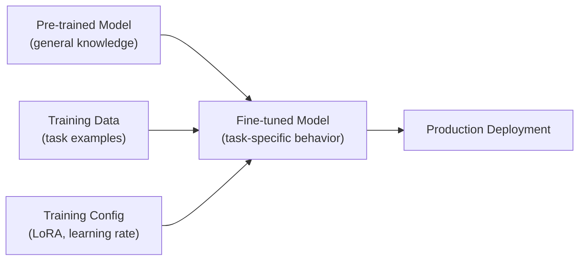

# Fine-Tuning

Adapting pre-trained LLMs to specific tasks and domains — techniques, data preparation, and production considerations.

---

## The Big Picture

**What is fine-tuning, in plain English?**

A pre-trained LLM (like GPT-4 or LLaMA) has learned from an enormous amount of general internet text. It knows a lot, but it doesn't know *your* domain deeply, and it might not follow *your* specific output format reliably. **Fine-tuning** is the process of taking that pre-trained model and training it further on your own specific examples — teaching it new behaviors, styles, or domain expertise.

**Real-world analogy:** Think of the pre-trained model as a brilliant new hire fresh out of university. They know general principles. Fine-tuning is like their on-the-job training: you give them examples of the work you do, in the format you need, with the vocabulary you use. After enough examples, they "get it" — they respond like a specialist, not a generalist.

**The crucial decision — Fine-tuning vs. RAG vs. Prompting:**

Most engineers reach for fine-tuning too early. Here's when each approach is actually right:

| Problem | Best solution | Why |
|---------|---------------|-----|
| Model doesn't know recent facts | RAG | Fine-tuning bakes in knowledge that goes stale |
| Model doesn't know company data | RAG | Real-time retrieval keeps it current |
| Model's output format is wrong | Prompting first, then fine-tuning | Try prompting examples first |
| Model uses wrong tone/style consistently | Fine-tuning | Style is behavior, not knowledge |
| Per-request cost is too high (too many few-shot examples) | Fine-tuning | Fine-tuned models need fewer prompt tokens |
| Model produces consistently wrong domain terminology | Fine-tuning + RAG | Need both behavior change and knowledge |

**The economics of fine-tuning:**
- **Cost to fine-tune:** One-time training cost ($5–$500 depending on model and data size)
- **Cost savings:** Fine-tuned models need shorter prompts (no in-context examples), reducing per-request token cost by 30–70%
- **Break-even:** If you make >10,000 requests, fine-tuning usually pays for itself

---

## Why Fine-Tune

Fine-tuning modifies a pre-trained model's weights to improve performance on a specific task — teaching the model **new behavior** rather than just new knowledge (which RAG handles better).

| Scenario | Approach |
|----------|----------|
| Need up-to-date knowledge | RAG (retrieval) |
| Need consistent output format | Fine-tuning |
| Need domain-specific terminology | Fine-tuning + RAG |
| Need to reduce API costs | Fine-tuning (fewer prompt tokens) |
| Rapid prototyping | Prompt engineering |
| Complex multi-step behavior | Fine-tuning |



---

## Fine-Tuning Methods

### Full Fine-Tuning

Update **all** model parameters. Maximum flexibility but extremely expensive:

```
LLaMA-3 8B full fine-tuning:
- GPU memory: ~60GB (model + optimizer + gradients)
- Hardware: 4× A100 80GB minimum
- Training time: hours to days
- Storage: 16GB per checkpoint
```

Rarely used for LLMs due to cost. Used mainly for pre-training and continued pre-training.

### LoRA (Low-Rank Adaptation)

The most popular fine-tuning method. Instead of updating all weights, LoRA adds small **low-rank matrices** that are trained while the original weights are frozen.

> **Plain English:** A 7B-parameter model has 7 billion numbers that define its behavior. Full fine-tuning would update all 7 billion — which requires enormous compute and memory. LoRA is a clever shortcut: instead of updating the full matrices, it trains tiny "adapter" matrices (typically 0.1–1% of the original size) that get added on top. The result: 90–95% of the quality of full fine-tuning at 1/100th the compute cost. It's like teaching someone new skills by adding notes in the margins of their existing knowledge, rather than rewriting their entire memory.

```
Original weight matrix W (4096 × 4096):
  16.7M parameters — frozen during training

LoRA decomposition:
  A (4096 × 16) + B (16 × 4096)  (rank r=16)
  131K parameters — only these are trained

Final: W' = W + A × B
  Less than 1% of original parameters trained
  Result quality: 90-95% of full fine-tuning
```

```python
from peft import LoraConfig, get_peft_model, TaskType
from transformers import AutoModelForCausalLM, AutoTokenizer, TrainingArguments
from trl import SFTTrainer

# Load base model
model = AutoModelForCausalLM.from_pretrained(
    "meta-llama/Llama-3-8B-Instruct",
    torch_dtype=torch.bfloat16,
    device_map="auto",
)
tokenizer = AutoTokenizer.from_pretrained("meta-llama/Llama-3-8B-Instruct")

# Configure LoRA
lora_config = LoraConfig(
    r=16,                          # Rank — higher = more capacity, more memory
    lora_alpha=32,                 # Scaling factor (usually 2× rank)
    target_modules=[               # Which layers to adapt
        "q_proj", "k_proj", "v_proj", "o_proj",  # Attention
        "gate_proj", "up_proj", "down_proj",       # MLP/FFN
    ],
    lora_dropout=0.05,
    bias="none",
    task_type=TaskType.CAUSAL_LM,
)

model = get_peft_model(model, lora_config)
model.print_trainable_parameters()
# trainable params: 13,631,488 || all params: 8,043,632,640 || trainable%: 0.1695
```

**Key LoRA hyperparameters:**

| Parameter | Typical Values | Effect |
|-----------|---------------|--------|
| `r` (rank) | 4-64 | Higher = more capacity but more memory. 16 is common. |
| `lora_alpha` | 2×r usually | Scaling factor. Higher = larger LoRA updates. |
| `target_modules` | QKV + FFN | Which layers to adapt. More = better but more memory. |
| `lora_dropout` | 0.0-0.1 | Regularization for small datasets. |

### QLoRA (Quantized LoRA)

Combine **4-bit quantization** of the base model with LoRA adapters trained in full precision. This enables fine-tuning a 70B model on a single 48GB GPU.

```python
from transformers import BitsAndBytesConfig
import torch

# 4-bit quantization config
bnb_config = BitsAndBytesConfig(
    load_in_4bit=True,
    bnb_4bit_quant_type="nf4",            # Normal Float 4 — optimal for normal distribution
    bnb_4bit_compute_dtype=torch.bfloat16, # Compute in BF16 for numerical stability
    bnb_4bit_use_double_quant=True,        # Quantize the quantization constants too
)

model = AutoModelForCausalLM.from_pretrained(
    "meta-llama/Llama-3-70B-Instruct",
    quantization_config=bnb_config,
    device_map="auto",
)

# Apply LoRA on top of quantized model
lora_config = LoraConfig(
    r=16,
    lora_alpha=32,
    target_modules=["q_proj", "k_proj", "v_proj", "o_proj",
                     "gate_proj", "up_proj", "down_proj"],
    lora_dropout=0.05,
    bias="none",
    task_type=TaskType.CAUSAL_LM,
)

model = get_peft_model(model, lora_config)
```

**QLoRA memory comparison:**

| Model | Full FT Memory | LoRA Memory | QLoRA Memory |
|-------|---------------|-------------|-------------|
| 7B | ~60GB | ~20GB | ~6GB |
| 13B | ~110GB | ~36GB | ~10GB |
| 70B | ~560GB | ~160GB | ~40GB |

### Comparison of Methods

| Method | Parameters Trained | Memory | Quality | Training Speed |
|--------|-------------------|--------|---------|---------------|
| **Full Fine-Tuning** | 100% | Very high | Best | Slow |
| **LoRA** | 0.1-1% | Moderate | Very good | Fast |
| **QLoRA** | 0.1-1% (quantized base) | Low | Good | Moderate |
| **Prefix Tuning** | Prepended embeddings | Low | Decent | Fast |
| **Adapter Layers** | Small added layers | Low | Good | Fast |

---

## Data Preparation

Data quality is the most critical factor in fine-tuning success. "Garbage in, garbage out" applies strongly.

> **Plain English:** Fine-tuning teaches the model by showing it many examples of "here's the input, here's the ideal output." The quality and relevance of those examples directly determines how good the fine-tuned model will be. A common mistake is gathering 10,000 mediocre examples when 500 excellent, carefully curated examples would produce a much better model. Think of it like teaching: a student learns more from 10 great worked examples than from 1,000 sloppy ones.

### Data Format

```python
# Instruction fine-tuning format (most common)
training_examples = [
    {
        "instruction": "Summarize the following legal document in plain English.",
        "input": "WHEREAS, the Party of the First Part hereby agrees...",
        "output": "This agreement states that the first party will..."
    },
    {
        "instruction": "Classify the sentiment of this customer review.",
        "input": "The product broke after two days. Terrible quality.",
        "output": "negative"
    },
]

# Chat format (for conversational fine-tuning)
chat_examples = [
    {
        "messages": [
            {"role": "system", "content": "You are a helpful coding assistant."},
            {"role": "user", "content": "Write a Python function to reverse a string."},
            {"role": "assistant", "content": "```python\ndef reverse_string(s: str) -> str:\n    return s[::-1]\n```"},
        ]
    },
]
```

### Data Quality Guidelines

| Aspect | Guideline |
|--------|-----------|
| **Volume** | 100-10K high-quality examples (more isn't always better) |
| **Diversity** | Cover edge cases, different phrasings, various difficulty levels |
| **Consistency** | Same task should have consistent formatting across examples |
| **Quality** | Each example should be a "gold standard" response |
| **Deduplication** | Remove near-duplicates to prevent memorization |
| **Balance** | Balanced across categories/classes |

### Data Generation with LLMs

```python
def generate_training_data(topic: str, n: int = 100) -> list[dict]:
    """Use a stronger model to generate training data for a weaker model."""
    examples = []
    for _ in range(n):
        response = client.chat.completions.create(
            model="gpt-4o",  # Use the best model to generate data
            messages=[{
                "role": "user",
                "content": f"""Generate a realistic training example for a {topic} task.

Format:
instruction: <the task instruction>
input: <the input text>
output: <the ideal output>

Be diverse and creative with the examples.""",
            }],
            temperature=0.9,
        )
        # Parse and add to examples
        examples.append(parse_example(response.choices[0].message.content))
    return examples
```

---

## Training

### Using SFTTrainer (trl)

```python
from trl import SFTTrainer
from transformers import TrainingArguments

training_args = TrainingArguments(
    output_dir="./output",
    num_train_epochs=3,
    per_device_train_batch_size=4,
    gradient_accumulation_steps=4,    # Effective batch size = 4 × 4 = 16
    learning_rate=2e-4,               # LoRA typically uses higher LR than full FT
    warmup_ratio=0.1,                 # 10% warmup
    lr_scheduler_type="cosine",
    logging_steps=10,
    save_strategy="steps",
    save_steps=100,
    evaluation_strategy="steps",
    eval_steps=100,
    bf16=True,                        # BF16 mixed precision
    gradient_checkpointing=True,      # Trade compute for memory
    max_grad_norm=0.3,
    optim="paged_adamw_8bit",         # 8-bit optimizer (QLoRA)
)

trainer = SFTTrainer(
    model=model,
    tokenizer=tokenizer,
    train_dataset=train_dataset,
    eval_dataset=eval_dataset,
    args=training_args,
    max_seq_length=2048,
    packing=True,                     # Pack short examples together
)

trainer.train()
trainer.save_model("./final_model")
```

### OpenAI Fine-Tuning API

```python
from openai import OpenAI
import json

client = OpenAI()

# Prepare data in JSONL format
training_data = [
    {"messages": [
        {"role": "system", "content": "You classify support tickets."},
        {"role": "user", "content": "I can't log into my account"},
        {"role": "assistant", "content": "account_access"},
    ]},
    # ... more examples
]

with open("training_data.jsonl", "w") as f:
    for example in training_data:
        f.write(json.dumps(example) + "\n")

# Upload training file
file = client.files.create(file=open("training_data.jsonl", "rb"), purpose="fine-tune")

# Create fine-tuning job
job = client.fine_tuning.jobs.create(
    training_file=file.id,
    model="gpt-4o-mini-2024-07-18",
    hyperparameters={
        "n_epochs": 3,
        "learning_rate_multiplier": 1.8,
        "batch_size": 16,
    },
)

# Monitor progress
while True:
    status = client.fine_tuning.jobs.retrieve(job.id)
    print(f"Status: {status.status}")
    if status.status in ["succeeded", "failed"]:
        break
    time.sleep(60)

# Use the fine-tuned model
response = client.chat.completions.create(
    model=status.fine_tuned_model,  # "ft:gpt-4o-mini:org:custom:id"
    messages=[{"role": "user", "content": "My payment was charged twice"}],
)
```

---

## Catastrophic Forgetting

The model loses general capabilities when fine-tuned too aggressively on a narrow task.

**Symptoms:**
- Model becomes excellent at the fine-tuned task but terrible at everything else
- Loses instruction-following ability
- Generates nonsensical outputs for out-of-domain queries

**Prevention strategies:**

| Strategy | How | Effectiveness |
|----------|-----|--------------|
| **LoRA/QLoRA** | Only modify small adapter weights | Inherently resistant — base model frozen |
| **Low learning rate** | 1e-5 to 5e-5 (full FT), 1e-4 to 3e-4 (LoRA) | Moderate |
| **Few epochs** | 1-3 epochs typically sufficient | High |
| **Mixed training data** | Include general-purpose examples alongside task data | High |
| **Regularization** | Weight decay, dropout | Moderate |
| **Early stopping** | Stop when validation loss plateaus | High |

---

## Evaluation

### During Training

```python
# Monitor these metrics during training
metrics_to_track = {
    "train_loss": "Should decrease steadily",
    "eval_loss": "Should decrease, then plateau (increase = overfitting)",
    "learning_rate": "Should follow schedule (warmup → decay)",
    "grad_norm": "Should be stable (spikes = instability)",
}
```

### Post-Training

```python
def evaluate_fine_tuned_model(model, eval_prompts: list[dict]) -> dict:
    """Evaluate the fine-tuned model against the base model."""
    results = {"task_accuracy": 0, "format_compliance": 0, "total": len(eval_prompts)}

    for prompt in eval_prompts:
        output = generate(model, prompt["input"])

        # Task-specific accuracy
        if matches_expected(output, prompt["expected"]):
            results["task_accuracy"] += 1

        # Format compliance
        if follows_format(output, prompt["expected_format"]):
            results["format_compliance"] += 1

    results["task_accuracy"] /= results["total"]
    results["format_compliance"] /= results["total"]
    return results
```

---

## Common Interview Questions

**1. LoRA vs full fine-tuning — when to use each?**

LoRA fine-tunes only 0.1-1% of parameters by adding small low-rank matrices (rank 4-64) to specific layers, while freezing the original weights. It achieves 90-95% of full fine-tuning quality at a fraction of the cost and memory. Use LoRA for: most fine-tuning scenarios, limited GPU budget, need to serve multiple fine-tuned variants (each LoRA adapter is only ~50MB, not a full 16GB model copy), and iterating quickly. Use full fine-tuning for: pre-training, continued pre-training on a new domain, maximizing quality when cost isn't a concern, or learning fundamentally new capabilities (new language, modality).

**2. How does QLoRA enable fine-tuning large models on consumer hardware?**

QLoRA combines three innovations: (1) NF4 quantization (4-bit, information-theoretically optimal for normally distributed weights) reduces base model memory by 4×, (2) LoRA adapters are kept in BF16 full precision so gradient flow is unaffected, (3) paged optimizers use CPU RAM for optimizer states when GPU runs out. This lets you fine-tune a 70B model on a single 48GB GPU (vs. ~560GB for full fine-tuning). The quality trade-off is small — QLoRA on LLaMA-65B matches full 16-bit fine-tuning on benchmarks.

**3. How much training data do you need for fine-tuning?**

Depends on the task complexity. For format learning (e.g., always respond in JSON): 50-200 examples. For classification: 100-1000 per class. For complex behavior (customer support agent): 1000-10,000 examples. For domain adaptation: 10K-100K domain examples. Quality matters more than quantity — 500 perfect examples beat 10,000 noisy ones. Signs of insufficient data: high variance across runs, poor generalization. Signs of too much data: diminishing returns, overfitting. Always hold out 10-20% for evaluation and use early stopping.

**4. What is catastrophic forgetting and how do you prevent it?**

Catastrophic forgetting occurs when fine-tuning on a narrow task causes the model to lose general capabilities. The model becomes a specialist that fails at everything else. Prevention: (1) LoRA/QLoRA inherently prevents it by keeping base weights frozen. (2) Mix task-specific training data with general-purpose examples (e.g., 70% task data, 30% general instruction data). (3) Keep learning rate low. (4) Train for few epochs (1-3). (5) Use early stopping based on validation loss. (6) Evaluate on general benchmarks (not just your task) to catch degradation. The right approach is usually LoRA + mixed data + few epochs.

**5. RAG vs fine-tuning vs prompting — decision framework?**

Start with **prompting** — fastest to iterate, no training needed. If quality is insufficient, add **RAG** for knowledge-grounding (dynamic content, citations, domain knowledge). If you need consistent behavior/format, **fine-tune** on examples of the desired behavior. Often the best result combines all three: fine-tune for behavior, RAG for knowledge, prompt engineering for per-request guidance. Cost comparison: prompting is cheapest per setup / most expensive per request (due to in-context examples). Fine-tuning is most expensive upfront / cheapest per request. RAG is moderate on both axes.

**6. How do you evaluate a fine-tuned model properly?**

Multi-dimensional evaluation: (1) **Task accuracy** — does it get the right answer on your specific task? Use a held-out test set. (2) **Format compliance** — does it consistently follow the expected output format? (3) **General capability** — run standard benchmarks (MMLU, HumanEval, etc.) to check for forgetting. (4) **A/B comparison** — compare fine-tuned vs base model on the same inputs, both quantitatively and qualitatively. (5) **Human evaluation** — have domain experts rate outputs, especially for subjective quality. (6) **Production monitoring** — track metrics after deployment (user satisfaction, error rates). Always compare against the base model to quantify the gain.

**7. What LoRA hyperparameters matter most and how do you tune them?**

The most impactful: (1) **Rank (r)** — controls adapter capacity. Start with r=16, try 8 and 32. Higher rank captures more complex adaptations but uses more memory. (2) **Target modules** — which layers to adapt. At minimum, attention layers (Q, K, V projections). Adding MLP/FFN layers improves quality. (3) **Learning rate** — typically 1e-4 to 3e-4 for LoRA (higher than full FT because fewer parameters need bigger updates). (4) **Alpha** — scaling factor, typically 2× rank. (5) **Epochs** — 1-3 usually. More epochs with small datasets = overfitting. Less impactful: dropout (0-0.1), bias (usually "none"). Tune systematically: fix one, vary another, evaluate on held-out data.

**8. How do you serve multiple LoRA adapters efficiently?**

LoRA's key deployment advantage: adapters are small (~50MB) and can be hot-swapped on a single base model. Techniques: (1) **LoRA merging** — merge the adapter into the base model weights (`model.merge_and_unload()`), producing a standalone model. Simple but can't swap adapters. (2) **Multi-LoRA serving** — vLLM and TGI support serving multiple LoRA adapters on one base model. Per-request routing selects the appropriate adapter. (3) **LoRA batching** — different requests in the same batch can use different adapters (vLLM supports this). This dramatically reduces GPU cost compared to hosting separate model instances per adapter. A single GPU serving the base model + 100 LoRA adapters costs the same as serving 1 model, not 100.
