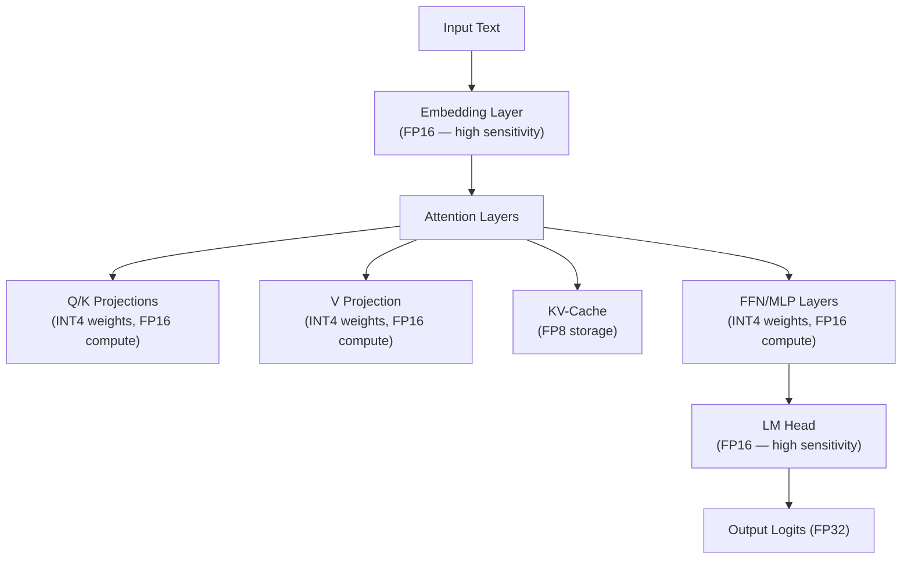

# Quantization

Reducing model precision to optimize inference speed, memory, and cost — run larger models on smaller hardware.

---

## The Big Picture

**What is quantization, in plain English?**

Every number in a neural network is stored with a certain level of precision. Full precision (FP32) stores each number with 32 bits — very accurate, very large. Quantization reduces how many bits are used to store each number: 16 bits (half as large), 8 bits (quarter), or even 4 bits (one-eighth). Less memory means you can run bigger models on smaller hardware — and it's often faster too.

**Real-world analogy:** Imagine a recipe that calls for 2.4376 cups of flour. That's 32-bit precision — very exact. But "2.5 cups" (8-bit, roughly) works fine in practice; the bread still tastes good. And "2 cups" (4-bit) might be slightly different, but still edible. Quantization asks: "How much rounding can we do before the model's outputs noticeably degrade?" The answer is: a lot more than you'd expect.

**The killer use case — running large models locally:**

Without quantization, a 70B-parameter model requires ~140GB of VRAM (two $10,000 A100 GPUs). With 4-bit quantization, it fits on a single $2,500 consumer GPU (RTX 4090). This has democratized access to powerful models.

**Memory savings at a glance:**

| Model Size | FP16 (no quantization) | INT8 (8-bit) | INT4 (4-bit) |
|------------|----------------------|--------------|--------------|
| 7B params  | ~14 GB               | ~7 GB        | ~3.5 GB      |
| 13B params | ~26 GB               | ~13 GB       | ~6.5 GB      |
| 70B params | ~140 GB              | ~70 GB       | ~35 GB       |

**Quality tradeoff:** 4-bit quantization typically loses less than 1-2% on standard benchmarks for models ≥7B. Smaller models are more sensitive to quantization precision loss.

---

## Why Quantize

LLMs are enormous. A 70B-parameter model in FP16 requires ~140GB of VRAM just to load the weights — that's two A100 80GB GPUs minimum, before accounting for KV-cache, activations, or batch processing. Quantization makes these models accessible.

| Model | FP16 Memory | INT8 Memory | INT4 Memory | Hardware Needed (INT4) |
|-------|-------------|-------------|-------------|----------------------|
| 7B | ~14 GB | ~7 GB | ~3.5 GB | Single consumer GPU (RTX 3090) |
| 13B | ~26 GB | ~13 GB | ~6.5 GB | Single consumer GPU (RTX 4090) |
| 70B | ~140 GB | ~70 GB | ~35 GB | Single A100 80GB or 2× RTX 4090 |
| 405B | ~810 GB | ~405 GB | ~203 GB | Still large — multiple A100s |

**The tradeoff:** Lower precision = less memory + faster compute, but some accuracy loss. The key question is always: *how much quality are you losing?*

---

## Precision Levels

### Number Formats

| Format | Bits | Range/Precision | Memory per Param | Use Case |
|--------|------|----------------|-----------------|----------|
| **FP32** | 32 | Full IEEE 754 float | 4 bytes | Training (baseline, scientific computing) |
| **BF16** | 16 | Same range as FP32, less precision | 2 bytes | Training (modern default on A100+) |
| **FP16** | 16 | Smaller range, decent precision | 2 bytes | Training / inference |
| **FP8 (E4M3)** | 8 | Moderate range, good precision | 1 byte | Inference on H100/Ada GPUs |
| **FP8 (E5M2)** | 8 | Wider range, lower precision | 1 byte | Training gradients |
| **INT8** | 8 | 256 discrete values | 1 byte | Inference (minimal quality loss) |
| **INT4** | 4 | 16 discrete values | 0.5 bytes | Inference (noticeable on small models) |
| **NF4** | 4 | Optimized for normal distribution | 0.5 bytes | QLoRA fine-tuning |

### FP16 vs BF16

```
FP16: 1 sign | 5 exponent | 10 mantissa  → Good precision, limited range (~65K max)
BF16: 1 sign | 8 exponent |  7 mantissa  → Less precision, same range as FP32

BF16 advantage: Same dynamic range as FP32 → no overflow during training
FP16 advantage: More precision for inference
```

**BF16 is the default for modern training** because it avoids the overflow issues that plague FP16 training, while halving memory compared to FP32. Requires Ampere+ GPUs (A100, H100, RTX 30xx+).

### FP8 (Hopper / Ada Lovelace)

FP8 is a native hardware format on NVIDIA H100 and Ada GPUs, providing **2× throughput** vs FP16:

| FP8 Variant | Bits | Exponent | Mantissa | Best For |
|-------------|------|----------|----------|----------|
| **E4M3** | 8 | 4 | 3 | Weights, activations, KV-cache |
| **E5M2** | 8 | 5 | 2 | Gradients during training |

```python
# FP8 inference with vLLM on H100
from vllm import LLM

llm = LLM(
    model="meta-llama/Llama-3-8B-Instruct",
    quantization="fp8",     # Native FP8 on H100
    dtype="float16",
    kv_cache_dtype="fp8",   # FP8 KV-cache too
)
# Result: ~2× throughput vs FP16, with < 0.1% quality loss
```

---

## The Math Behind Quantization

> **Plain English:** At the simplest level, quantization is just rounding. You have numbers like 2.4376, and you round them to 2.5 or 2 to save space. The math below formalizes this: how do you choose the best "grid" to round to, so you minimize the error introduced by rounding? The scale (Δ) controls how fine-grained the grid is.

### Uniform (Linear) Quantization

Maps a continuous range of floating-point values to a discrete set of integers:

$$q = \text{round}\left(\frac{x}{\Delta}\right) + z$$

Where:
- $x$ is the original FP value
- $\Delta = \frac{x_{max} - x_{min}}{2^b - 1}$ is the **scale** (step size)
- $z$ is the **zero-point** (maps floating-point zero to an integer)
- $b$ is the number of bits

**Dequantization** reverses the process:

$$\hat{x} = \Delta \cdot (q - z)$$

```python
import torch

def quantize_tensor(tensor: torch.Tensor, num_bits: int = 8):
    """Symmetric uniform quantization."""
    qmin = -(2 ** (num_bits - 1))
    qmax = 2 ** (num_bits - 1) - 1

    # Calculate scale
    abs_max = tensor.abs().max()
    scale = abs_max / qmax

    # Quantize
    quantized = torch.round(tensor / scale).clamp(qmin, qmax).to(torch.int8)

    return quantized, scale

def dequantize_tensor(quantized: torch.Tensor, scale: float):
    """Dequantize back to float."""
    return quantized.float() * scale

# Example
original = torch.randn(4, 4)
quantized, scale = quantize_tensor(original, num_bits=8)
recovered = dequantize_tensor(quantized, scale)
error = (original - recovered).abs().mean()
print(f"Mean absolute error: {error:.6f}")  # Very small for INT8
```

### Asymmetric vs Symmetric Quantization

| Type | How | Pros | Cons |
|------|-----|------|------|
| **Symmetric** | Maps `[-max, max]` to `[-127, 127]` (zero-point = 0) | Simpler, faster | Wasted range if values are skewed |
| **Asymmetric** | Maps `[min, max]` to `[0, 255]` (non-zero zero-point) | Better coverage of actual range | Slightly slower (extra subtraction) |

Most LLM quantization uses **symmetric** for weights (centered around zero) and **asymmetric** for activations (often positively skewed after ReLU/GELU).

### Group Quantization

Instead of one scale for the entire tensor, compute a separate scale per **group** of weights (e.g., groups of 32, 64, or 128). This dramatically improves quality because different weight groups can have very different value ranges.

```
Without grouping:  One scale for entire 4096×4096 matrix
                   → Outlier values stretch the scale, wasting precision

With group_size=128: Each group of 128 weights has its own scale
                     → Better resolution within each group
                     → Overhead: store one scale per group (~2 bytes each)
```

| Group Size | Quality | Overhead | Speed |
|-----------|---------|----------|-------|
| No grouping | Lowest | None | Fastest |
| 128 | Good (standard) | ~2% extra memory | Slight slowdown |
| 64 | Better | ~4% extra memory | Moderate slowdown |
| 32 | Best | ~8% extra memory | Noticeable slowdown |

---

## Quantization Methods

> **Plain English overview:** There are two main schools of thought for quantization: (1) Do it *after* training, without touching the training process (Post-Training Quantization / PTQ). (2) Build awareness of quantization *into* the training process (Quantization-Aware Training / QAT). PTQ is far more practical because you can apply it to any existing model without retraining.

### Post-Training Quantization (PTQ)

Quantize a pre-trained model **after** training with no retraining needed. This is the most common approach.

#### GPTQ (GPU-optimized)

One-shot weight quantization using a small calibration dataset. Uses the **inverse Hessian** to determine which weights are most important and quantizes them with minimal error.

> **Plain English:** GPTQ is smart rounding. Instead of just rounding every weight independently, it looks at how sensitive the model's outputs are to changes in each weight (using a bit of calculus called the Hessian). Weights the model is very sensitive to get rounded more carefully; less-important weights can be rounded more aggressively. The result: better quality at the same bit width compared to naive rounding. This takes 30 min to a few hours to run on a calibration dataset, but the resulting quantized model is ready to use.

**How GPTQ works:**
1. Select a small calibration dataset (128-256 samples)
2. For each layer, compute second-order information (Hessian) about weight sensitivity
3. Quantize weights one column at a time, using the Hessian to compensate remaining columns for the quantization error
4. This "error compensation" is why GPTQ outperforms naive round-to-nearest quantization

```python
from transformers import AutoModelForCausalLM, GPTQConfig

quantization_config = GPTQConfig(
    bits=4,
    dataset="c4",            # Calibration dataset
    group_size=128,           # Quantize in groups (improves quality)
    desc_act=True,            # Activation-order quantization
)

model = AutoModelForCausalLM.from_pretrained(
    "meta-llama/Llama-3-8B",
    quantization_config=quantization_config,
    device_map="auto",
)
```

**Characteristics:** GPU-optimized, fast inference with `auto-gptq` or `exllama`. Best for GPU serving.

#### AWQ (Activation-Aware Weight Quantization)

Observes that **not all weights are equally important** — some channels are critical for preserving model quality. AWQ identifies these "salient" weights via activation statistics and protects them during quantization.

**How AWQ works:**
1. Run calibration data through the model to collect activation statistics
2. Identify "salient" weight channels — those corresponding to large activation magnitudes
3. Apply per-channel scaling to protect salient channels: multiply weights by a scaling factor, divide activations by the same factor (mathematically equivalent)
4. After scaling, all weight channels are more uniformly distributed → easier to quantize

```python
from awq import AutoAWQForCausalLM
from transformers import AutoTokenizer

model = AutoAWQForCausalLM.from_pretrained("meta-llama/Llama-3-8B")
tokenizer = AutoTokenizer.from_pretrained("meta-llama/Llama-3-8B")

quant_config = {
    "zero_point": True,
    "q_group_size": 128,
    "w_bit": 4,
}

model.quantize(tokenizer, quant_config=quant_config)
model.save_quantized("llama3-8b-awq")
```

**Characteristics:** Generally better quality than GPTQ at the same bit-width. Supports INT4 GPU inference.

#### GGUF (llama.cpp Format)

The standard format for **CPU inference** and mixed CPU/GPU inference. GGUF files contain quantized weights in various precision levels with self-documenting metadata.

```bash
# Common GGUF quantization levels:
# Q2_K  — 2-bit, aggressive, noticeable quality loss
# Q3_K_S — 3-bit small
# Q3_K_M — 3-bit medium
# Q4_0   — 4-bit, legacy format
# Q4_K_S — 4-bit small, good balance
# Q4_K_M — 4-bit medium, good balance (most popular)
# Q5_K_S — 5-bit small
# Q5_K_M — 5-bit medium, higher quality
# Q6_K  — 6-bit, near-FP16 quality
# Q8_0  — 8-bit, minimal quality loss
# F16   — full FP16

# Convert HF model to GGUF
python convert_hf_to_gguf.py meta-llama/Llama-3-8B --outtype f16

# Quantize to different levels
./llama-quantize llama3-8b-f16.gguf llama3-8b-Q4_K_M.gguf Q4_K_M

# Run with llama.cpp
./llama-server -m llama3-8b.Q4_K_M.gguf -c 4096 -ngl 35
# -ngl 35: offload 35 layers to GPU (mixed CPU/GPU inference)
```

**K-Quant variants explained:** The `_K_` in GGUF names refers to **k-quant** — an improved quantization method that uses different bit-widths for different tensor types within each layer. `_S` (small) uses fewer bits on average, `_M` (medium) is balanced, `_L` (large) uses more bits.

**Characteristics:** CPU-optimized, Apple Silicon Metal support, supports mixed CPU/GPU offloading, self-contained files. The most popular format for local inference.

#### SmoothQuant

Balances quantization difficulty between **activations and weights** by migrating the magnitude from activations to weights using a mathematically equivalent scaling transform.

**Insight:** Activations have outlier channels (some channels have values 100× larger than others), making them hard to quantize. Weights are smoother. SmoothQuant:
1. Compute per-channel activation scaling factor: $s_j = \max(|X_j|)^\alpha / \max(|W_j|)^{(1-\alpha)}$
2. Divide activations by $s_j$, multiply weights by $s_j$ (mathematically equivalent)
3. Now both activations and weights are smoother → easier to quantize both to INT8
4. Hyperparameter $\alpha$ controls the migration strength (typically 0.5)

### Quantization-Aware Training (QAT)

Simulate quantization during training — the model learns to compensate for quantization noise.

```python
# Conceptual QAT forward pass
def qat_forward(x, weight, num_bits=4):
    # Simulate quantization during forward pass
    scale = weight.abs().max() / (2**(num_bits-1) - 1)
    weight_quantized = torch.round(weight / scale) * scale  # Quantize + dequantize
    return F.linear(x, weight_quantized)
    # Gradients flow through using straight-through estimator (STE)
```

**Straight-Through Estimator (STE):** The rounding operation has zero gradient almost everywhere. STE approximates the gradient of `round(x)` as 1 (identity), allowing gradients to flow through the quantization step during backpropagation. This is the key trick that makes QAT work.

**When to use QAT:** When PTQ quality is insufficient for your application (typically for very aggressive quantization like 2-bit, or when you need maximum quality at any given bit-width). QAT is much more expensive — it requires a full training run.

### Method Comparison

| Method | Type | Target Hardware | Quality (4-bit) | Calibration | Speed | Effort |
|--------|------|----------------|-----------------|-------------|-------|--------|
| **GPTQ** | PTQ | GPU | Good | 128-256 samples | Fast inference | Low (few hours) |
| **AWQ** | PTQ | GPU | Better than GPTQ | Activation statistics | Fast inference | Low |
| **GGUF** | PTQ | CPU / mixed | Good (varies) | None (conversion) | CPU-optimized | Very low |
| **SmoothQuant** | PTQ | GPU | Good (INT8) | Activation statistics | W8A8 (fast) | Low |
| **EXL2** | PTQ | GPU | Best PTQ (variable bits) | Calibration data | Fastest GPU | Moderate |
| **QAT** | Training | Any | Best | Full training data | Any | High |

---

## BitsAndBytes

The library powering **QLoRA** and easy quantization for Hugging Face models.

### LLM.int8()

INT8 quantization with a clever trick: **mixed-precision decomposition** for outlier features. Most weights are quantized to INT8, but feature dimensions with outlier activations (> 6σ) are kept in FP16.

```python
from transformers import AutoModelForCausalLM

model = AutoModelForCausalLM.from_pretrained(
    "meta-llama/Llama-3-8B",
    load_in_8bit=True,           # LLM.int8()
    device_map="auto",
)
# Memory: ~8GB instead of ~16GB, minimal quality loss
```

**How outlier detection works:**
1. During matrix multiplication, identify columns where the activation magnitude exceeds a threshold (default: 6.0)
2. Extract those columns and compute them in FP16 (typically < 1% of columns)
3. Compute the remaining columns in INT8
4. Combine the results
5. This preserves quality for the critical outlier dimensions while quantizing everything else

### NF4 (Normal Float 4)

A custom 4-bit data type specifically designed for normally distributed neural network weights. The 16 quantization levels are placed at the **quantiles** of the normal distribution, ensuring each level represents an equal fraction of the weight distribution — **information-theoretically optimal** for normally distributed data.

```python
from transformers import BitsAndBytesConfig
import torch

bnb_config = BitsAndBytesConfig(
    load_in_4bit=True,
    bnb_4bit_quant_type="nf4",            # NF4 instead of standard INT4
    bnb_4bit_compute_dtype=torch.bfloat16, # Compute in BF16 for stability
    bnb_4bit_use_double_quant=True,        # Quantize the quantization constants
)

model = AutoModelForCausalLM.from_pretrained(
    "meta-llama/Llama-3-8B",
    quantization_config=bnb_config,
    device_map="auto",
)
# Memory: ~5GB instead of ~16GB
```

**Why NF4 beats INT4:** Standard INT4 uses uniformly spaced quantization levels. But neural network weights are normally distributed — most values are near zero, few are large. NF4 places more quantization levels near zero (where most values are) and fewer levels at the extremes. This is like variable-length encoding — more bits for common values, fewer for rare ones.

```
INT4 levels: [-8, -7, -6, -5, -4, -3, -2, -1, 0, 1, 2, 3, 4, 5, 6, 7]
             Uniformly spaced — wastes precision at extremes

NF4 levels:  [-1.0, -0.69, -0.52, -0.39, -0.28, -0.18, -0.09, 0.0,
              0.08, 0.17, 0.27, 0.38, 0.51, 0.68, 0.95, 1.0]
             Quantile-spaced — denser near zero where most weights are
```

### Double Quantization

Quantize the **quantization constants** themselves. Each group of weights (e.g., 64 weights) has scaling factors — these scaling factors also take memory. Double quantization compresses these constants too, saving ~0.5GB for a 70B model.

```
Without double quantization:
  - 70B params / 64 per group = ~1.1B groups
  - Each group has a FP32 scale = 4 bytes
  - Overhead: 1.1B × 4 bytes = ~4.4GB

With double quantization:
  - Quantize the FP32 scales to FP8
  - Overhead: 1.1B × 1 byte ≈ ~1.1GB
  - Savings: ~3.3GB on a 70B model
```

---

## KV-Cache Quantization

The KV-cache (key-value cache storing past attention states) can consume **more memory than the model weights** for long sequences and large batch sizes. Quantizing the KV-cache reduces this:

```python
# KV-cache memory formula:
# KV_cache_size = 2 × num_layers × num_heads × head_dim × seq_len × batch_size × bytes_per_param
#
# For LLaMA-3 70B (80 layers, 64 KV heads, 128 head_dim):
# FP16: 2 × 80 × 64 × 128 × 128K × 1 × 2 bytes = ~40GB per batch element (!!!)
# INT8:  = ~20GB
# FP8:   = ~20GB
# INT4:  = ~10GB
```

| Component | Typical Memory (70B, 128K ctx) | After Quantization |
|-----------|-------------------------------|-------------------|
| Model weights (FP16) | 140GB | 35GB (INT4) |
| KV-cache per request (FP16) | ~40GB | ~10GB (INT4) |
| Activations | ~2-8GB | Not usually quantized |

**Key insight:** After weight quantization, the KV-cache often becomes the memory bottleneck. KV-cache quantization is essential for long-context serving.

```python
# vLLM with FP8 KV-cache
from vllm import LLM

llm = LLM(
    model="meta-llama/Llama-3-70B-Instruct",
    quantization="awq",           # INT4 weight quantization
    kv_cache_dtype="fp8",          # FP8 KV-cache quantization
    max_model_len=131072,          # 128K context
    tensor_parallel_size=4,        # 4 GPUs
    gpu_memory_utilization=0.92,
)
```

---

## Serving Infrastructure

### Serving Quantized Models

| Platform | Supported Formats | Best For | Key Features |
|----------|-------------------|----------|-------------|
| **vLLM** | AWQ, GPTQ, BitsAndBytes, FP8, Marlin | High-throughput GPU serving | PagedAttention, continuous batching, tensor parallelism |
| **TGI** | AWQ, GPTQ, BitsAndBytes | Production GPU serving | Docker-native, built-in metrics, streaming |
| **llama.cpp / Ollama** | GGUF | Local/edge, CPU/Mac | CPU-optimized, Apple Silicon Metal, simple API |
| **ExLlamaV2** | EXL2 (custom format) | Maximum GPU throughput | Custom CUDA kernels, variable bit-width per layer |
| **TensorRT-LLM** | FP8, INT8, INT4 | Maximum GPU performance (NVIDIA) | H100/A100 optimized, in-flight batching |

### vLLM Production Setup

```python
from vllm import LLM, SamplingParams

# Load AWQ quantized model for production
llm = LLM(
    model="TheBloke/Llama-3-70B-AWQ",
    quantization="awq",
    dtype="half",
    gpu_memory_utilization=0.92,     # Use 92% of GPU memory
    max_model_len=8192,
    tensor_parallel_size=2,           # 2 GPUs for tensor parallelism
    enforce_eager=False,              # Use CUDA graphs for speed
)

# Serve via OpenAI-compatible API:
# python -m vllm.entrypoints.openai.api_server \
#   --model TheBloke/Llama-3-70B-AWQ \
#   --quantization awq \
#   --tensor-parallel-size 2 \
#   --max-model-len 8192 \
#   --port 8000
```

### Ollama (Local Deployment)

```bash
# Pull a quantized model
ollama pull llama3:8b-instruct-q4_K_M   # 4-bit quantized, ~4.7GB

# Run interactively
ollama run llama3:8b-instruct-q4_K_M

# Serve via API (automatically runs on http://localhost:11434)
curl http://localhost:11434/api/generate -d '{
  "model": "llama3:8b-instruct-q4_K_M",
  "prompt": "What is quantum computing?",
  "stream": false
}'

# List available models
ollama list

# Custom model with specific quantization
# Create a Modelfile:
# FROM llama3:8b
# PARAMETER temperature 0.7
# SYSTEM "You are a helpful coding assistant."
ollama create my-coder -f Modelfile
```

### ExLlamaV2 (Maximum GPU Throughput)

ExLlamaV2 uses custom CUDA kernels and the EXL2 format with **variable bits per layer**:

```python
from exllamav2 import ExLlamaV2, ExLlamaV2Config, ExLlamaV2Tokenizer
from exllamav2.generator import ExLlamaV2DynamicGenerator

config = ExLlamaV2Config("LoneStriker/Llama-3-8B-Instruct-4.0bpw-exl2")
model = ExLlamaV2(config)
model.load()

tokenizer = ExLlamaV2Tokenizer(config)
generator = ExLlamaV2DynamicGenerator(model=model, tokenizer=tokenizer)

output = generator.generate(
    prompt="Explain quantum computing",
    max_new_tokens=200,
    temperature=0.7,
)
```

**Why EXL2 is special:** Unlike uniform quantization (every layer gets the same bits), EXL2 measures each layer's sensitivity and allocates bits accordingly. Sensitive layers (first, last, attention) get 5-6 bits; insensitive layers get 3 bits. Hitting the same average bitwidth (e.g., 4.0 bpw) with better quality.

---

## Mixed-Precision Inference

Production systems often use **different precision for different components**:



**Key principle:** Quantize weights aggressively (INT4), but keep computation in higher precision (FP16/BF16). The weight is loaded and dequantized on-the-fly before matrix multiplication. This is called **weight-only quantization** and is the most common production approach.

### Layer-Sensitive Quantization

Not all layers are equally sensitive to quantization:

| Layer | Sensitivity | Recommendation |
|-------|------------|----------------|
| Embedding layer | Very high | Keep FP16 |
| First 2-3 transformer layers | High | Higher precision (5-6 bit or INT8) |
| Middle transformer layers | Low | Aggressive quantization (INT4 or INT3) |
| Last 2-3 transformer layers | Medium-high | Higher precision |
| LM head (output layer) | Very high | Keep FP16 |
| Attention QKV projections | Medium | INT4 usually fine |
| FFN/MLP layers | Low-medium | INT4, even INT3 for large models |

---

## Production Deployment Patterns

### Edge Deployment

Running models on user devices (phones, laptops) requires aggressive quantization:

| Device | Available Memory | Max Model | Recommended Format |
|--------|-----------------|-----------|-------------------|
| iPhone 15 Pro | ~6GB for ML | 3B-7B | CoreML (INT4) |
| MacBook Air M2 (16GB) | ~10GB for ML | 7B-13B | GGUF Q4_K_M |
| MacBook Pro M3 Max (36GB) | ~28GB for ML | 30B-70B | GGUF Q4_K_M |
| Gaming PC (RTX 4090 24GB) | 24GB VRAM | 13B-30B | AWQ or EXL2 |
| Server (A100 80GB) | 80GB VRAM | 70B | AWQ / FP8 |
| Server (H100 80GB) | 80GB VRAM | 70B | FP8 (native) |

### Model Selection Decision Tree

```
What's your hardware?
├── CPU only / Apple Silicon Mac
│   └── GGUF (Q4_K_M default, Q5_K_M if quality matters)
├── Consumer NVIDIA GPU (8-24GB VRAM)
│   └── AWQ or EXL2 (4-bit, best quality/speed per bit)
├── Data center GPU (A100)
│   └── AWQ INT4 or INT8 (depends on quality needs)
├── Data center GPU (H100)
│   └── FP8 (native hardware support, best quality/speed combo)
└── Cloud API (serverless)
    └── Use provider's quantization (don't self-host)
```

### Cost Analysis

```
Example: Serving LLaMA-3 70B to 100 concurrent users

FP16 (no quantization):
  - 4× A100 80GB GPUs needed
  - Cloud cost: ~$16/hr × 4 = $64/hr → $46K/month

AWQ INT4:
  - 1× A100 80GB GPU + limited batch size
  - Cloud cost: ~$16/hr → $11.5K/month
  - Quality: ~2% MMLU drop

GGUF Q4_K_M on CPU:
  - 1× high-memory CPU server (256GB RAM)
  - Cloud cost: ~$4/hr → $2.9K/month
  - Speed: ~5-10× slower per request
  - Suitable for low-throughput scenarios

Savings from INT4: 75% cost reduction with minimal quality impact
```

---

## Evaluation

### Quality Assessment

```python
import lm_eval

# Compare full vs quantized model on benchmarks
for model_path in ["meta-llama/Llama-3-8B", "llama3-8b-Q4_K_M.gguf"]:
    results = lm_eval.simple_evaluate(
        model="hf",
        model_args=f"pretrained={model_path}",
        tasks=["mmlu", "hellaswag", "truthfulqa_mc"],
    )
    print(f"{model_path}: MMLU={results['mmlu']:.2f}, HellaSwag={results['hellaswag']:.2f}")
```

### Expected Quality Loss

| Quantization Level | Typical Perplexity Increase | MMLU Drop | Recommended For |
|--------------------|-----------------------------|-----------|----------------|
| FP8 (E4M3) | < 0.05% | < 0.2% | H100/Ada — best quality/speed ratio |
| INT8 / Q8_0 | < 0.1% | < 0.5% | Any application (nearly lossless) |
| INT4 / Q4_K_M | 0.5-2% | 1-3% | Most applications |
| Q4_K_S | 1-3% | 2-5% | Memory-constrained |
| Q3_K_M | 3-5% | 5-10% | Aggressive compression |
| Q2_K | 5-15%+ | 10-20%+ | Only when necessary |

**Rule of thumb:** FP8 and INT8 are essentially free for quality. INT4 on 13B+ models is usually fine. INT4 on 7B models may show noticeable degradation. Below 4-bit, quality drops significantly unless the model is very large (70B+).

### Comprehensive Benchmarking

```python
import time
import torch

def benchmark_quantized_model(model, tokenizer, test_prompts: list[str]):
    """Benchmark throughput, latency, and memory for a quantized model."""
    results = {
        "peak_vram_gb": torch.cuda.max_memory_allocated() / 1e9,
        "ttft_ms": [],
        "tokens_per_second": [],
        "total_tokens": 0,
    }

    for prompt in test_prompts:
        inputs = tokenizer(prompt, return_tensors="pt").to(model.device)

        # Time-to-first-token
        start = time.perf_counter()
        with torch.no_grad():
            output = model.generate(
                **inputs, max_new_tokens=1, do_sample=False
            )
        ttft = (time.perf_counter() - start) * 1000
        results["ttft_ms"].append(ttft)

        # Full generation throughput
        start = time.perf_counter()
        with torch.no_grad():
            output = model.generate(
                **inputs, max_new_tokens=256, do_sample=False
            )
        elapsed = time.perf_counter() - start
        num_tokens = output.shape[1] - inputs["input_ids"].shape[1]
        results["tokens_per_second"].append(num_tokens / elapsed)
        results["total_tokens"] += num_tokens

    results["avg_ttft_ms"] = sum(results["ttft_ms"]) / len(results["ttft_ms"])
    results["avg_tps"] = sum(results["tokens_per_second"]) / len(results["tokens_per_second"])
    return results
```

### Performance Metrics to Measure

| Metric | Tool | What It Tells You |
|--------|------|------------------|
| Tokens/second (TPS) | llama.cpp bench, vLLM | Inference speed |
| Peak VRAM | nvidia-smi | Memory requirements |
| Time-to-first-token (TTFT) | Custom timing | Latency for first response |
| Inter-token latency (ITL) | Custom timing | Streaming smoothness |
| Perplexity | lm-eval harness | Language modeling quality |
| Task-specific accuracy | Custom eval | Real-world performance |
| Throughput (req/sec) | Load testing | Serving capacity at given batch size |

---

## Common Interview Questions

**1. GPTQ vs AWQ vs GGUF — when to use each?**

**GPTQ** — GPU-optimized quantization using inverse Hessian for error minimization. Fast inference on NVIDIA GPUs via exllama/auto-gptq. Good for GPU serving workloads with established tooling. **AWQ** — also GPU-optimized but better quality at the same bit-width by identifying and protecting salient weight channels via activation statistics. Preferred over GPTQ for new deployments. **GGUF** — CPU-optimized format for llama.cpp. Supports mixed CPU/GPU inference via layer offloading, works great on Apple Silicon Macs with Metal acceleration, and is the standard for local/edge deployment. Has a unique k-quant system with variable bits per tensor type. Choose based on hardware: GGUF for CPU/Mac/local, AWQ for GPU serving, GPTQ for GPU serving with existing infrastructure. For H100, consider FP8 which is native and nearly lossless.

**2. How does quantization affect model quality? At what point does it degrade?**

Quality impact depends on model size and quantization level. FP8 and INT8 are essentially lossless for all model sizes (< 0.5% perplexity increase). INT4 is near-lossless for large models (30B+) but shows noticeable degradation on small models (7B). Below 4-bit, quality drops significantly regardless of model size. Larger models are more resilient to quantization because they have more redundant parameters — the information can be compressed more aggressively. The degradation pattern: first you lose nuance in reasoning, then instruction-following breaks down, then factual accuracy drops, and at extreme quantization (2-bit) the model becomes incoherent. Always benchmark on your specific task — perplexity correlates but doesn't perfectly predict task performance. A model might maintain low perplexity but fail at specific reasoning tasks.

**3. What is QLoRA and how does NF4 quantization work?**

QLoRA combines 4-bit NF4 quantization of the base model with LoRA fine-tuning of small adapter layers in full precision. NF4 is a custom 4-bit data type designed for normally distributed weights: its 16 quantization levels are placed at the quantiles of the standard normal distribution, ensuring each level represents an equal probability mass — this is information-theoretically optimal for normally distributed data. Unlike uniform INT4 which spaces levels evenly, NF4 places more levels near zero where most weights cluster. Combined with double quantization (quantizing the scaling constants from FP32 to FP8, saving ~3GB on 70B) and paged optimizers (using CPU RAM for optimizer states when GPU runs out), QLoRA enables fine-tuning a 70B model on a single 48GB GPU. The LoRA adapters are kept in BF16 during training, so gradient flow is unaffected by the base model's quantization.

**4. How would you decide the right quantization level for a production model?**

Systematic decision process: (1) **Hardware audit** — what GPU/CPU memory is available? This sets the maximum model size at each precision level. (2) **Quality evaluation** — create a task-specific test suite, run it at FP16 (baseline), INT8, and INT4. Compare accuracy, not just perplexity. (3) **Latency profiling** — measure TTFT and ITL at each level. Lower precision usually means faster inference due to reduced memory bandwidth. (4) **Cost modeling** — calculate GPU-hours per million tokens at each precision level. (5) **A/B testing** — if possible, serve both versions to users and compare satisfaction metrics. The practical process: start from INT4 (cheapest), evaluate quality on your task. If it passes your acceptance threshold (e.g., < 3% accuracy drop), you're done. If not, try INT8, then FP16. For H100 deployments, always start with FP8.

**5. PTQ vs QAT — tradeoffs?**

Post-Training Quantization (PTQ) is applied after training — no retraining needed, fast to apply (hours), works with any pre-trained model. Quality is good at INT8 and excellent at INT4 for large models. Methods like GPTQ, AWQ, and GGUF are all PTQ. Quantization-Aware Training (QAT) simulates quantization during training using the Straight-Through Estimator (STE) to approximate gradients through the rounding operation. It produces higher quality at the same bit-width, especially for aggressive quantization (3-bit, 2-bit) because the model learns weight configurations that are robust to quantization noise. But QAT requires a full training run (expensive), access to training data, and training infrastructure. Use PTQ first — it's sufficient for 95%+ of applications. Use QAT only when: (a) PTQ quality is insufficient, (b) you need extreme compression (2-3 bit), or (c) you're training a model from scratch and can include QAT from the start.

**6. Explain the math behind quantization — what is scale, zero-point, and group quantization?**

Quantization maps continuous floats to discrete integers. The **scale** $\Delta = (x_{max} - x_{min}) / (2^b - 1)$ defines the step size between adjacent quantization levels — a large scale means coarse quantization. The **zero-point** $z$ ensures floating-point zero maps exactly to an integer value, preserving the zero element (important for sparse computations). Symmetric quantization sets $z = 0$ and uses $\Delta = x_{max} / (2^{b-1} - 1)$, simplifying computation but wasting range if values are asymmetric. **Group quantization** is the key innovation for LLMs: instead of one scale for the entire weight matrix (where outliers stretch the scale, wasting precision for normal values), each group of $g$ weights (e.g., 128) has its own scale. This limits outlier damage to a small group. The tradeoff is storing extra scale values — for group_size=128 with FP16 scales, overhead is $2 / 128 = 1.6\%$ extra memory. Smaller groups = better quality but more overhead.

**7. What is KV-cache quantization and why does it matter for long contexts?**

The KV-cache stores past key/value states for all attention layers, growing as $O(L \times H \times D \times S)$ where $L$ = layers, $H$ = heads, $D$ = head dimension, $S$ = sequence length. For LLaMA-3 70B at 128K context in FP16, this is ~40GB — often **exceeding** the quantized model weights themselves (35GB at INT4). KV-cache quantization to INT8 or FP8 halves this to ~20GB with minimal quality impact because attention patterns are robust to moderate precision reduction. This is critical for: (a) fitting longer contexts, (b) serving more concurrent users (each user's KV-cache consumes memory), (c) enabling larger batch sizes for higher throughput. Frameworks like vLLM, TGI, and TensorRT-LLM support KV-cache quantization. Without it, the KV-cache is the binding constraint on batch size and context length in production.

**8. How do you deploy a quantized model to production? Walk through the full stack.**

Full production stack: (1) **Model selection + quantization** — choose model size based on task quality requirements; quantize with AWQ (GPU) or GGUF (CPU). Benchmark quality on your task-specific eval suite. (2) **Serving framework** — vLLM for highest throughput (PagedAttention, continuous batching, tensor parallelism), TGI for Docker-native deployment, Ollama for simple local/prototyping. (3) **Configuration** — set `max_model_len` based on expected context (smaller = more memory for batching), `gpu_memory_utilization` (0.85-0.95), tensor parallelism for multi-GPU. Enable KV-cache quantization for long-context workloads. (4) **API layer** — serve via OpenAI-compatible API (vLLM has built-in support), add API gateway for auth, rate limiting, request routing. (5) **Monitoring** — track TPS, TTFT, ITL, p50/p95/p99 latency, GPU utilization, memory usage, error rate, queue depth. (6) **Scaling** — multiple replicas behind a load balancer, auto-scaling based on queue depth or latency threshold. (7) **Testing** — load test at expected peak traffic before launch; measure throughput at target batch size, not single-request latency.
