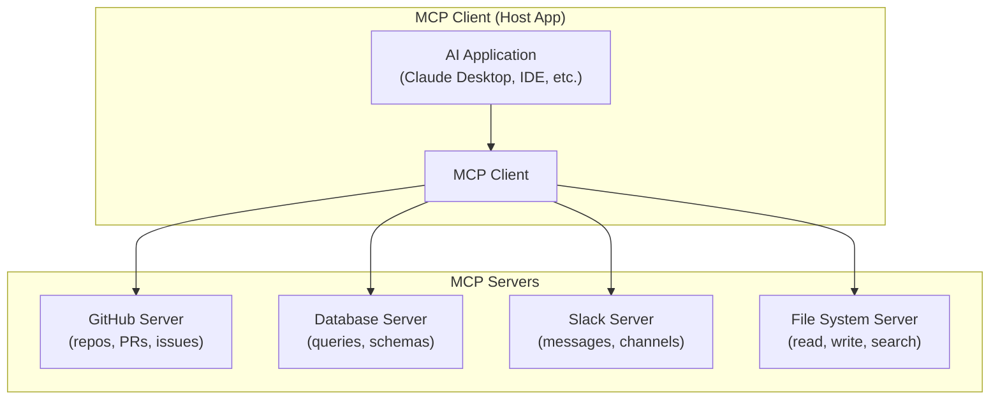
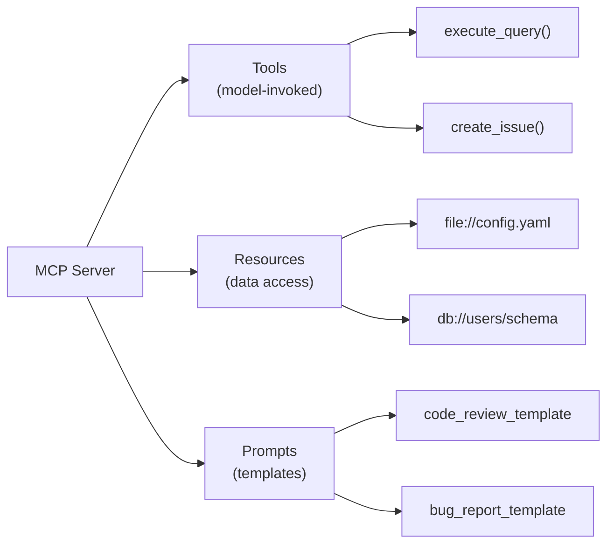

# Model Context Protocol (MCP)

An open standard for connecting LLMs to external data sources and tools — Anthropic's protocol for universal tool integration.

---

## What is MCP

The **Model Context Protocol (MCP)** is an open standard created by Anthropic that defines how LLM applications connect to external data sources, tools, and services. Think of it as a **universal adapter** — instead of building custom integrations for every tool, you build one MCP server and any MCP-compatible client can use it.



**The USB analogy:** Before USB, every device needed a unique cable and port. USB standardized the connection, and any USB device works with any USB port. MCP does the same for LLM tool integrations — any MCP server works with any MCP client.

---

## Architecture

### Core Concepts

| Concept | Description | Example |
|---------|-------------|---------|
| **Host** | The application that runs the LLM | Claude Desktop, IDE, custom app |
| **Client** | Connects to MCP servers (inside the host) | Typically 1 client per server connection |
| **Server** | Exposes capabilities via MCP | GitHub server, DB server, custom API server |
| **Transport** | Communication mechanism | stdio, HTTP+SSE |

### Three Primitives

MCP servers expose three types of capabilities:



| Primitive | Who Controls | Purpose | Example |
|-----------|-------------|---------|---------|
| **Tools** | Model decides when to call | Actions and computations | `run_query`, `create_file` |
| **Resources** | Application/user selects | Read-only data access | File contents, DB schemas |
| **Prompts** | User selects | Reusable prompt templates | Code review template |

---

## Building an MCP Server

### Python SDK

```python
from mcp.server import Server
from mcp.server.stdio import stdio_server
from mcp.types import Tool, Resource, TextContent
import json

# Create server
server = Server("weather-server")

# Define tools
@server.list_tools()
async def list_tools():
    return [
        Tool(
            name="get_weather",
            description="Get current weather for a city",
            inputSchema={
                "type": "object",
                "properties": {
                    "city": {"type": "string", "description": "City name"},
                    "units": {
                        "type": "string",
                        "enum": ["celsius", "fahrenheit"],
                        "default": "celsius",
                    },
                },
                "required": ["city"],
            },
        ),
        Tool(
            name="get_forecast",
            description="Get 5-day weather forecast for a city",
            inputSchema={
                "type": "object",
                "properties": {
                    "city": {"type": "string"},
                    "days": {"type": "integer", "minimum": 1, "maximum": 7},
                },
                "required": ["city"],
            },
        ),
    ]

# Handle tool calls
@server.call_tool()
async def call_tool(name: str, arguments: dict):
    if name == "get_weather":
        weather = await fetch_weather(arguments["city"], arguments.get("units", "celsius"))
        return [TextContent(type="text", text=json.dumps(weather))]
    elif name == "get_forecast":
        forecast = await fetch_forecast(arguments["city"], arguments.get("days", 5))
        return [TextContent(type="text", text=json.dumps(forecast))]
    else:
        raise ValueError(f"Unknown tool: {name}")

# Define resources
@server.list_resources()
async def list_resources():
    return [
        Resource(
            uri="weather://supported-cities",
            name="Supported Cities",
            description="List of cities with weather data",
            mimeType="application/json",
        ),
    ]

@server.read_resource()
async def read_resource(uri: str):
    if uri == "weather://supported-cities":
        cities = await get_supported_cities()
        return json.dumps(cities)
    raise ValueError(f"Unknown resource: {uri}")

# Run the server
async def main():
    async with stdio_server() as (read_stream, write_stream):
        await server.run(read_stream, write_stream)

if __name__ == "__main__":
    import asyncio
    asyncio.run(main())
```

### TypeScript SDK

```typescript
import { Server } from "@modelcontextprotocol/sdk/server/index.js";
import { StdioServerTransport } from "@modelcontextprotocol/sdk/server/stdio.js";

const server = new Server(
  { name: "database-server", version: "1.0.0" },
  { capabilities: { tools: {}, resources: {} } }
);

// List tools
server.setRequestHandler("tools/list", async () => ({
  tools: [
    {
      name: "query_database",
      description: "Execute a read-only SQL query",
      inputSchema: {
        type: "object",
        properties: {
          sql: { type: "string", description: "SQL SELECT query" },
          database: { type: "string", enum: ["production", "staging"] },
        },
        required: ["sql", "database"],
      },
    },
  ],
}));

// Handle tool calls
server.setRequestHandler("tools/call", async (request) => {
  if (request.params.name === "query_database") {
    const { sql, database } = request.params.arguments;

    // Validate: only SELECT queries
    if (!sql.trim().toUpperCase().startsWith("SELECT")) {
      return {
        content: [{ type: "text", text: "Error: Only SELECT queries allowed" }],
        isError: true,
      };
    }

    const results = await executeQuery(database, sql);
    return {
      content: [{ type: "text", text: JSON.stringify(results) }],
    };
  }
});

// Start server
const transport = new StdioServerTransport();
await server.connect(transport);
```

---

## Transport Mechanisms

### stdio (Standard I/O)

Communication through stdin/stdout. The host spawns the server as a child process.

```json
// claude_desktop_config.json
{
  "mcpServers": {
    "weather": {
      "command": "python",
      "args": ["/path/to/weather_server.py"],
      "env": {
        "WEATHER_API_KEY": "your-key-here"
      }
    }
  }
}
```

**Best for:** Local tools, IDE integrations, desktop applications.

### HTTP + Server-Sent Events (SSE)

For remote servers accessible over the network:

```python
from mcp.server.sse import SseServerTransport
from starlette.applications import Starlette
from starlette.routing import Route

transport = SseServerTransport("/messages")

async def handle_sse(request):
    async with transport.connect_sse(request.scope, request.receive, request._send) as streams:
        await server.run(streams[0], streams[1])

app = Starlette(routes=[
    Route("/sse", endpoint=handle_sse),
    Route("/messages", endpoint=transport.handle_post_message, methods=["POST"]),
])
```

**Best for:** Shared servers, cloud deployments, multi-user access.

| Transport | Latency | Setup | Security | Use Case |
|-----------|---------|-------|----------|----------|
| **stdio** | Very low | Simple | Process isolation | Local tools, IDE |
| **HTTP+SSE** | Higher | More complex | Network security needed | Remote, shared |

---

## MCP vs Direct Tool Calling

| Aspect | Direct Tool Calling | MCP |
|--------|-------------------|-----|
| **Integration effort** | Custom per provider | Standard protocol |
| **Server reuse** | Provider-specific | Any MCP client |
| **Discovery** | Hardcoded | Dynamic list/describe |
| **Ecosystem** | Provider ecosystem | Open ecosystem |
| **Transport** | HTTP API calls | stdio / HTTP+SSE |
| **Resources** | Not built-in | First-class primitive |
| **Prompts** | Not built-in | First-class primitive |

---

## Production MCP Patterns

### Multi-Server Architecture

```python
# A single host can connect to many MCP servers
servers = {
    "github": MCPClient("python", ["github_server.py"]),
    "database": MCPClient("node", ["database_server.js"]),
    "slack": MCPClient("python", ["slack_server.py"]),
    "filesystem": MCPClient("python", ["fs_server.py"]),
}

# All servers' tools are available to the model simultaneously
# The model can chain across servers:
# 1. Search GitHub for recent PRs (github server)
# 2. Query related database records (database server)
# 3. Post summary to Slack (slack server)
```

### Security Best Practices

| Risk | Mitigation |
|------|-----------|
| **Unauthorized tool access** | Require user confirmation for sensitive operations |
| **Data exfiltration** | Scope server permissions narrowly |
| **Code injection** | Validate and sanitize all inputs |
| **Excessive access** | Principle of least privilege per server |
| **Credential exposure** | Use environment variables, never embed in code |

---

## MCP Ecosystem

| Server | Purpose |
|--------|---------|
| **@modelcontextprotocol/server-filesystem** | Read/write/search files |
| **@modelcontextprotocol/server-github** | GitHub repos, PRs, issues |
| **@modelcontextprotocol/server-postgres** | PostgreSQL queries |
| **@modelcontextprotocol/server-slack** | Slack messages and channels |
| **@modelcontextprotocol/server-brave-search** | Web search |
| **@modelcontextprotocol/server-memory** | Persistent memory/knowledge graph |
| **@modelcontextprotocol/server-puppeteer** | Browser automation |

---

## Common Interview Questions

**1. What is MCP and why does it matter?**

MCP (Model Context Protocol) is an open standard by Anthropic for connecting LLMs to external tools, data, and services. Before MCP, every tool integration was custom — if you had N LLM clients and M tools, you needed N×M integrations. MCP reduces this to N+M by providing a standard protocol. A tool developer builds one MCP server, and it works with any MCP-compatible client (Claude Desktop, IDEs, custom apps). It matters because it creates an ecosystem similar to USB — standardized connectivity that enables composability and reuse.

**2. Explain the three MCP primitives.**

(1) **Tools** — functions the model can invoke (e.g., `run_query`, `send_email`). The model decides when to call them based on user intent. Similar to function calling. (2) **Resources** — read-only data the application can access (e.g., file contents, database schemas, API documentation). Resources are selected by the application/user, not the model. Similar to RAG context. (3) **Prompts** — reusable prompt templates that users can select (e.g., "code review", "bug report"). They provide guided workflows. Tools are model-controlled, resources are app-controlled, and prompts are user-controlled.

**3. Compare MCP to direct API tool calling. When would you use each?**

Direct tool calling (OpenAI/Anthropic function calling): simpler setup for a few tools, tightly coupled to one provider's API, no server to maintain. MCP: standardized protocol that works across clients, tool servers are reusable and shareable, supports resources and prompts beyond just tools, better for teams with many tools. Use direct tool calling for: simple applications with 2-3 tools, single-provider deployments. Use MCP for: complex tool ecosystems, tools shared across multiple LLM clients, when you want the community ecosystem, or when building extensible platforms.

**4. What are MCP transports and when do you use each?**

**stdio** — server runs as a child process, communicating via stdin/stdout. Best for local tools, IDE integrations, and desktop apps. Low latency, simple security (process isolation). **HTTP+SSE** — server runs as a web service, using HTTP for requests and Server-Sent Events for streaming. Best for remote/shared servers, cloud deployments, multi-user setups. Higher latency but accessible over the network. Choose stdio when the tool is co-located with the host; choose HTTP+SSE when tools are remote or shared.

**5. How would you secure an MCP server in production?**

(1) Validate and sanitize all inputs (SQL injection, path traversal). (2) Implement least-privilege — each server should only access what it needs. (3) User confirmation for destructive operations (delete, send, modify). (4) Environment variables for credentials. (5) Rate limiting for expensive operations. (6) Audit logging for all tool calls. (7) For HTTP+SSE transport, add authentication (API keys, OAuth), TLS encryption, and CORS policies. (8) Scope database access to read-only where possible.

**6. How does MCP enable composability across tools?**

A single host can connect to many MCP servers simultaneously. All servers' tools, resources, and prompts are jointly available to the model. This enables cross-server workflows: "Find recent PRs on GitHub (server 1), check related database records (server 2), summarize findings (LLM), and post to Slack (server 3)" — all in one conversation. The model seamlessly chains tool calls across servers because they all speak the same protocol.

**7. How does MCP handle resources vs tools?**

Resources are **read-only data** selected by the application or user (not the model). They're like attaching documents to the context. Tools are **actions** invoked by the model when it decides they're needed. Resources use URIs (e.g., `file:///path/to/file`, `db://users/schema`) and are listed/read via the protocol. This separation is important: resources don't require model agency (the app decides what context to provide), while tools require model agency (the model decides what actions to take). This gives fine-grained control over what the model can access vs what it can do.

**8. What's the MCP developer ecosystem like and how do you build a custom server?**

The ecosystem includes official servers for common services (GitHub, PostgreSQL, Slack, filesystem, Brave Search), plus community servers. Building a custom server: install the SDK (`pip install mcp` or `npm install @modelcontextprotocol/sdk`), implement handlers for `list_tools`, `call_tool`, and optionally `list_resources`/`read_resource`. Register in the host's config. The server is a standalone process — it can be any language that speaks the MCP protocol. Best practice: start with a simple tool, test with Claude Desktop, then add resources and prompts as needed.
