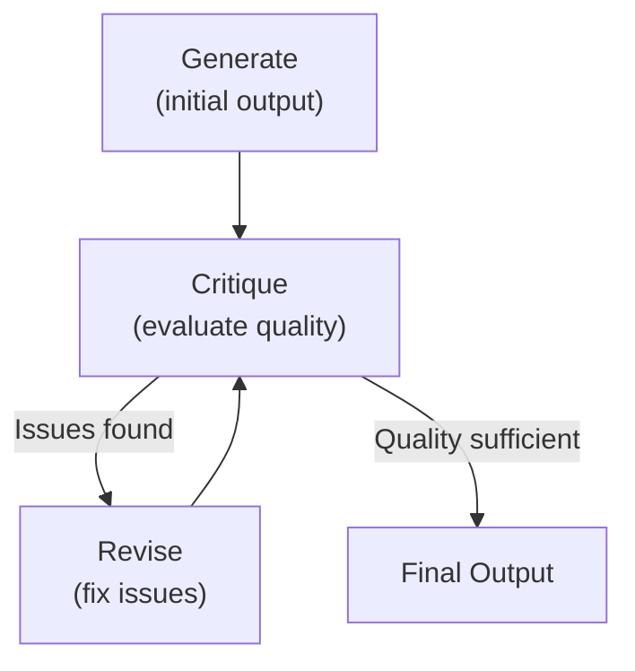

# Agentic Patterns

Design patterns for building autonomous LLM agents — reasoning strategies, multi-agent coordination, and control flow.

> **Scope:** This guide covers agent **design patterns**. For agent architectures and frameworks, see [agents-and-tools.md](agents-and-tools.md).

---

## Single-Agent Patterns

### ReAct (Reason + Act)

The most fundamental agent pattern. The model alternates between **reasoning** (thinking about what to do) and **acting** (calling a tool), using observations from tool results to guide next steps.

```mermaid
graph LR
    Thought["💭 Thought\n(reasoning)"] --> Action["⚡ Action\n(tool call)"]
    Action --> Observation["👁️ Observation\n(tool result)"]
    Observation --> Thought
    Observation -->|"Task complete"| Answer["✅ Final Answer"]
```



**Example trace:**

```
User: What is the population-weighted average temperature of the G7 countries today?

Thought 1: I need to find the G7 countries, get their populations, and current temperatures. Let me start with the G7 members.
Action 1: search("G7 member countries 2024")
Observation 1: The G7 members are: USA, UK, France, Germany, Italy, Canada, Japan.

Thought 2: Now I need populations and current temperatures for each. Let me get populations first.
Action 2: search("G7 countries population 2024")
Observation 2: USA: 335M, UK: 68M, France: 68M, Germany: 84M, Italy: 59M, Canada: 41M, Japan: 124M

Thought 3: Now I need current temperatures. Let me check weather for each capital.
Action 3: get_weather_batch(cities=["Washington DC", "London", "Paris", "Berlin", "Rome", "Ottawa", "Tokyo"])
Observation 3: DC: 15°C, London: 12°C, Paris: 14°C, Berlin: 10°C, Rome: 18°C, Ottawa: 5°C, Tokyo: 20°C

Thought 4: Now I can calculate the population-weighted average.
  Total population: 779M
  Weighted sum: 335×15 + 68×12 + 68×14 + 84×10 + 59×18 + 41×5 + 124×20 = 11,501
  Weighted average: 11,501 / 779 ≈ 14.8°C

Answer: The population-weighted average temperature of G7 countries today is approximately 14.8°C.
```

**Implementation:**

```python
REACT_SYSTEM_PROMPT = """You are a helpful assistant. You have access to tools.

For each step, you MUST follow this format:
Thought: [your reasoning about what to do next]
Action: [tool name and arguments]

After receiving an observation, continue with another Thought/Action or provide a final answer.

When you have enough information, respond with:
Thought: I now have enough information to answer.
Answer: [your final answer]
"""

async def react_loop(question: str, tools: list, max_steps: int = 10):
    messages = [
        {"role": "system", "content": REACT_SYSTEM_PROMPT},
        {"role": "user", "content": question}
    ]

    for step in range(max_steps):
        response = await llm.generate(messages, tools=tools)

        if not response.tool_calls:
            return response.content  # Final answer

        # Execute tool and add observation
        messages.append(response)
        for tc in response.tool_calls:
            result = await execute_tool(tc)
            messages.append({"role": "tool", "tool_call_id": tc.id, "content": result})

    return "Max steps reached without an answer."
```

**When to use ReAct:** Default choice for most agent tasks. Works well for information gathering, multi-step reasoning, and tasks where the next action depends on previous results.

### Plan-and-Solve

Generate a **complete plan upfront**, then execute each step. Better than ReAct for complex multi-step tasks because the model can see the full picture before acting.

```python
PLAN_AND_SOLVE_PROMPT = """Given the following task, create a step-by-step plan, then execute each step.

Task: {task}

First, create a numbered plan. Then execute each step one at a time, using tools as needed.
After completing all steps, provide your final answer.

Plan:
1. ...
2. ...
3. ...

Now executing:
Step 1: ...
"""

async def plan_and_solve(task: str, tools: list):
    # Phase 1: Plan
    plan_response = await llm.generate([
        {"role": "system", "content": "Create a detailed plan for this task."},
        {"role": "user", "content": task}
    ])
    plan = plan_response.content

    # Phase 2: Execute each step
    messages = [
        {"role": "system", "content": f"Execute this plan step by step:\n{plan}"},
        {"role": "user", "content": task}
    ]

    return await react_loop(task, tools, messages=messages)
```

**Variants:**
- **Plan-and-Execute** — generate plan, execute it rigidly, replan only if a step fails
- **Least-to-Most** — solve the simplest subproblem first, use its answer to solve the next harder one
- **Adaptive planning** — generate initial plan, update it after each step based on observations

**When to use:** Complex tasks with 5+ steps, tasks requiring coordination between multiple tools, tasks where the order of operations matters.

### Reflection / Self-Correction

The agent generates output, **critiques its own work**, and revises based on the critique. This can use the same model or a separate "critic" model.



```python
async def reflection_loop(task: str, max_revisions: int = 3):
    # Generate initial output
    draft = await llm.generate([
        {"role": "user", "content": task}
    ])

    for revision in range(max_revisions):
        # Critique
        critique = await llm.generate([
            {"role": "system", "content": "Critically evaluate this output. List specific issues, errors, or improvements needed. If the output is good enough, say 'APPROVED'."},
            {"role": "user", "content": f"Task: {task}\n\nOutput:\n{draft.content}"}
        ])

        if "APPROVED" in critique.content:
            return draft.content

        # Revise based on critique
        draft = await llm.generate([
            {"role": "user", "content": f"Task: {task}\n\nPrevious output:\n{draft.content}\n\nCritique:\n{critique.content}\n\nPlease revise the output to address all issues."}
        ])

    return draft.content
```

**Reflexion** — an enhanced version that maintains a **memory of past attempts and failures**, using them to avoid repeating mistakes.

**When to use:** Code generation (generate → test → fix), writing tasks (draft → review → revise), any task where quality improves with iteration.

### Tool-Augmented Generation

The model decides **during generation** when to call tools, inserting tool calls inline rather than in a separate loop.

```
The GDP of France in 2023 was [TOOL: search("France GDP 2023")] → $3.03 trillion,
while Germany's was [TOOL: search("Germany GDP 2023")] → $4.46 trillion.
Therefore, Germany's GDP was about 47% larger.
```

**Toolformer-style:** The model was trained to insert `<tool>...</tool>` markers during generation. This is a training-time approach, different from the runtime ReAct pattern.

**Code interpreter:** A special case where the tool is "execute Python code." The model generates code, executes it, and uses the result to continue generation.

```python
# Agent with code execution
async def code_interpreter_step(question: str):
    response = await llm.generate([
        {"role": "system", "content": "If you need to compute something, write and execute Python code."},
        {"role": "user", "content": question}
    ])

    if response.tool_calls and response.tool_calls[0].function.name == "execute_code":
        code = response.tool_calls[0].function.arguments["code"]
        result = sandbox_execute(code)  # Run in sandboxed environment
        return result
```

---

## Multi-Agent Patterns

### Supervisor / Manager

An **orchestrator agent** delegates tasks to specialist agents. The supervisor handles routing, aggregation, and error handling.

```mermaid
graph TD
    User["User Request"] --> Supervisor["🎯 Supervisor Agent\n(routing, coordination)"]
    Supervisor --> Research["🔍 Research Agent\n(search, data gathering)"]
    Supervisor --> Writing["✍️ Writing Agent\n(content creation)"]
    Supervisor --> Review["📝 Review Agent\n(quality check)"]
    Research --> Supervisor
    Writing --> Supervisor
    Review --> Supervisor
    Supervisor --> User
```



```python
async def supervisor_agent(task: str):
    # Supervisor decides which specialist to delegate to
    routing = await llm.generate([
        {"role": "system", "content": """You are a supervisor. Route tasks to specialists:
        - RESEARCH: for information gathering, fact-checking
        - WRITING: for content creation, drafting
        - REVIEW: for quality checking, editing
        Respond with the specialist name and specific instructions."""},
        {"role": "user", "content": task}
    ])

    specialist = parse_routing(routing.content)
    result = await run_specialist(specialist.name, specialist.instructions)

    # Supervisor decides if result is complete or needs more work
    evaluation = await llm.generate([
        {"role": "system", "content": "Evaluate if this result fully addresses the original task."},
        {"role": "user", "content": f"Task: {task}\nResult: {result}"}
    ])

    if needs_more_work(evaluation):
        return await supervisor_agent(f"Continue: {task}\nPrevious result: {result}")
    return result
```

### Debate / Adversarial

Multiple agents argue different positions, then a judge selects the best response. Improves quality through diverse perspectives.

```python
async def debate_pattern(question: str, num_rounds: int = 2):
    # Two agents with different perspectives
    agent_a_prompt = "You are Agent A. Argue for the MOST OPTIMISTIC interpretation."
    agent_b_prompt = "You are Agent B. Argue for the MOST CRITICAL interpretation."

    debate_history = []

    for round_num in range(num_rounds):
        # Agent A argues
        a_response = await llm.generate([
            {"role": "system", "content": agent_a_prompt},
            {"role": "user", "content": f"Question: {question}\nDebate so far: {debate_history}"}
        ])
        debate_history.append(f"Agent A: {a_response.content}")

        # Agent B responds
        b_response = await llm.generate([
            {"role": "system", "content": agent_b_prompt},
            {"role": "user", "content": f"Question: {question}\nDebate so far: {debate_history}"}
        ])
        debate_history.append(f"Agent B: {b_response.content}")

    # Judge synthesizes
    judge_response = await llm.generate([
        {"role": "system", "content": "Synthesize the strongest arguments from both sides into a balanced, well-reasoned answer."},
        {"role": "user", "content": f"Question: {question}\nDebate:\n{chr(10).join(debate_history)}"}
    ])

    return judge_response.content
```

### Pipeline / Assembly Line

Each agent handles one stage and passes the result to the next. Clear separation of concerns.

```mermaid
graph LR
    Input["User Question"] --> Analyst["📊 Analyst\n(research & gather data)"]
    Analyst --> Writer["✍️ Writer\n(draft response)"]
    Writer --> Reviewer["📝 Reviewer\n(fact-check & improve)"]
    Reviewer --> Publisher["📤 Publisher\n(format & deliver)"]
    Publisher --> Output["Final Response"]
```



### Swarm / Collaborative

Agents work **in parallel** on different aspects of a task, then combine results. Good for naturally parallelizable work.

```python
async def swarm_pattern(task: str):
    # Break task into independent subtasks
    subtasks = await decompose_task(task)

    # Execute all subtasks in parallel with different specialist agents
    results = await asyncio.gather(*[
        run_specialist(subtask) for subtask in subtasks
    ])

    # Synthesize results
    synthesis = await llm.generate([
        {"role": "system", "content": "Combine these independent research results into a coherent answer."},
        {"role": "user", "content": f"Task: {task}\nResults:\n{format_results(results)}"}
    ])

    return synthesis.content
```

### Pattern Selection Guide

| Pattern | Best For | Latency | Cost | Complexity |
|---------|----------|---------|------|-----------|
| **Supervisor** | Complex tasks needing coordination | Medium | Medium | Medium |
| **Debate** | Tasks needing diverse perspectives | High | High | Medium |
| **Pipeline** | Tasks with clear sequential stages | Medium-High | Medium | Low |
| **Swarm** | Parallelizable research/analysis | Low (parallel) | Medium | Medium |

---

## Control Flow Patterns

| Pattern | Description | Example |
|---------|-------------|---------|
| **Sequential** | Each step depends on the previous | Research → Write → Review |
| **Parallel** | Independent subtasks run simultaneously | Search 3 databases at once |
| **Conditional** | Branch based on intermediate results | If customer is VIP → premium support flow |
| **Loop** | Retry/iterate until quality threshold | Generate code → test → fix → test → ... |
| **Human-in-the-loop** | Pause for human approval at critical steps | Pause before sending email or making payment |
| **Map-reduce** | Apply same operation to many items, combine | Analyze 100 documents, summarize findings |

```python
# Human-in-the-loop pattern
async def safe_agent(task: str, tools: list):
    for step in range(max_steps):
        response = await llm.generate(messages, tools=tools)

        if response.tool_calls:
            for tc in response.tool_calls:
                # Check if tool requires approval
                if tc.function.name in DESTRUCTIVE_TOOLS:
                    approved = await request_human_approval(
                        f"Agent wants to call {tc.function.name} "
                        f"with args: {tc.function.arguments}"
                    )
                    if not approved:
                        messages.append({
                            "role": "tool",
                            "content": "Action was denied by the user. Try a different approach."
                        })
                        continue

                result = await execute_tool(tc)
                messages.append({"role": "tool", "content": result})
```

---

## State Management

Agents need to track multiple types of state to function effectively:

| State Type | What | Persistence | Example |
|-----------|------|-------------|---------|
| **Conversation state** | Messages exchanged so far | Session | Chat history |
| **Task state** | Current plan, completed steps, remaining work | Session | "Steps 1-3 done, step 4 in progress" |
| **World state** | External system state | Persistent | Database records, file contents |
| **Agent state** | Internal reasoning, intermediate conclusions | Session | "User seems frustrated, escalate soon" |

```python
from langgraph.checkpoint.memory import MemorySaver

# LangGraph example with persistent state
memory = MemorySaver()

graph = StateGraph(AgentState)
# ... define nodes and edges ...
app = graph.compile(checkpointer=memory)

# Run with thread ID for session persistence
config = {"configurable": {"thread_id": "user-123"}}
result = app.invoke({"messages": [("user", "Continue where we left off")]}, config)
```

**Checkpointing** — save agent state periodically so it can recover from failures without restarting the entire task. Critical for long-running agents (research tasks, multi-stage workflows).

---

## Common Interview Questions

**1. ReAct vs Plan-and-Solve — when to use each?**

**ReAct** is the default choice for most agent tasks. It's flexible and adaptive — the model decides the next action based on the latest observation, so it handles unexpected results well. Best for: information gathering, Q&A, tasks where the path isn't known upfront. **Plan-and-Solve** is better for complex tasks with 5+ steps where the model benefits from seeing the full picture before starting. It generates a plan upfront, then executes it. Best for: multi-step workflows, tasks with dependencies between steps, tasks where you need to estimate cost/time upfront. The tradeoff: ReAct is more adaptive but can meander; Plan-and-Solve is more structured but less flexible when the plan needs to change. Hybrid approaches work well: plan first, then use ReAct-style execution with replanning when observations deviate from expectations.

**2. How do you design a multi-agent system? What are the coordination challenges?**

Start by identifying natural specializations in your task — research, writing, review, action-taking. Each becomes an agent with specific tools and system prompts. Use a **supervisor pattern** for coordination: one agent routes tasks, collects results, and decides when work is complete. Key challenges: (1) **Communication** — agents need a shared context format. (2) **State consistency** — when Agent A modifies state, Agent B needs to see the update. (3) **Conflict resolution** — what happens when agents disagree? Use a judge or voting. (4) **Error propagation** — one agent's failure shouldn't crash the whole system. (5) **Cost explosion** — multi-agent systems multiply LLM calls. Set budget limits per sub-agent. Start simple (2-3 agents) and add complexity only when needed.

**3. How do you prevent infinite loops in agentic systems?**

Multiple safeguards: (1) **Max iterations** — hard limit on agent loop steps (e.g., 15). (2) **Token/cost budget** — stop if cumulative tokens exceed threshold. (3) **Loop detection** — track (tool_name, arguments) pairs; if the same call repeats 3+ times, break. (4) **Progress detection** — if the agent's state hasn't meaningfully changed in N steps, intervene. (5) **Timeout** — wall-clock time limit on the entire agent run. (6) **Self-awareness** — include in the system prompt: "If you notice you're repeating the same actions without progress, stop and explain what you've tried." Make failure graceful — when limits are hit, the agent should summarize what it accomplished and what remains.

**4. What is the reflection pattern and when does it improve quality?**

Reflection is generate-critique-revise: the agent produces an initial output, then a critic evaluates it for errors or improvements, and the agent revises based on the critique. This can use the same model (self-reflection) or a separate model. It improves quality when: (a) the task has clear quality criteria the model can evaluate against (code correctness, factual accuracy), (b) common errors are recognizable by the model, (c) the task benefits from iteration (writing, code). It's less useful when: (a) the model can't reliably evaluate quality (subjective tasks), (b) the first attempt is usually good enough, (c) latency matters more than quality. Typically 2-3 reflection rounds are sufficient — diminishing returns after that.

**5. How would you add human-in-the-loop to an agent workflow?**

Classify tools into three tiers: (1) **Safe** — no side effects, execute automatically (search, read, calculate). (2) **Reversible** — has side effects but can be undone, log and execute with optional notification (create draft, add to cart). (3) **Irreversible** — cannot be undone, requires explicit human approval before execution (send email, process payment, delete data). Implement by checking the tool's tier before execution. For approval, present the user with the tool name, arguments, and the agent's reasoning for the action. If denied, pass the denial back to the agent so it can try an alternative approach. Also add approval for budget thresholds — pause if cumulative cost exceeds a limit.
