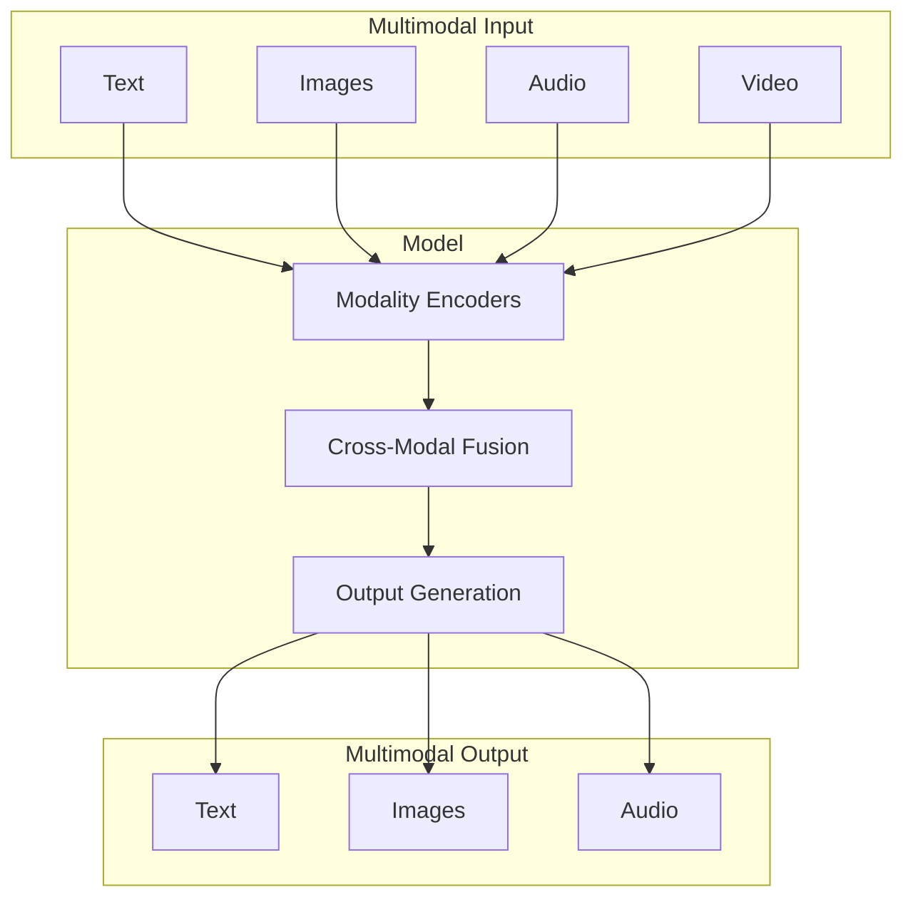
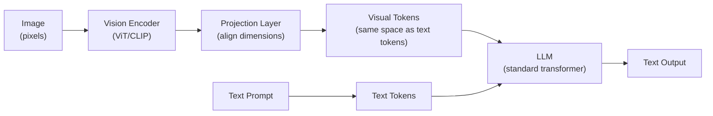

# Multimodal Models

LLMs that process and generate beyond text — images, audio, video, and cross-modal reasoning.

---

## What Are Multimodal Models

Multimodal models process **multiple types of input** (text, images, audio, video) and can often **generate** multiple modalities as output. They extend language models beyond text-only capabilities.



| Model | Input Modalities | Output Modalities | Provider |
|-------|-----------------|-------------------|----------|
| **GPT-4o** | Text, image, audio | Text, audio | OpenAI |
| **Claude 3.5 Sonnet** | Text, image | Text | Anthropic |
| **Gemini 1.5 Pro** | Text, image, audio, video | Text | Google |
| **LLaVA** | Text, image | Text | Open source |
| **DALL·E 3** | Text | Image | OpenAI |
| **Whisper** | Audio | Text | OpenAI |
| **GPT-4o Realtime** | Text, audio | Text, audio | OpenAI |

---

## Vision Models

### How Vision Works in LLMs

Vision-language models use a **vision encoder** (typically a ViT — Vision Transformer) to convert images into token-like embeddings that can be processed alongside text tokens.



**Key architectures:**
- **CLIP-based:** Use CLIP's image encoder to produce visual embeddings. Simple and effective. (LLaVA, many open-source models)
- **Native vision:** Vision encoder trained end-to-end with the LLM. Better cross-modal understanding. (GPT-4o, Gemini)
- **Fuyu architecture:** Process raw image patches directly without a separate vision encoder. Simpler but requires more data.

### OpenAI Vision API

```python
from openai import OpenAI
import base64

client = OpenAI()

# Method 1: Image via URL
response = client.chat.completions.create(
    model="gpt-4o",
    messages=[
        {
            "role": "user",
            "content": [
                {"type": "text", "text": "What's in this image? Describe in detail."},
                {
                    "type": "image_url",
                    "image_url": {"url": "https://example.com/photo.jpg"},
                },
            ],
        }
    ],
)

# Method 2: Base64-encoded image
with open("diagram.png", "rb") as f:
    base64_image = base64.b64encode(f.read()).decode("utf-8")

response = client.chat.completions.create(
    model="gpt-4o",
    messages=[
        {
            "role": "user",
            "content": [
                {"type": "text", "text": "Explain this architecture diagram."},
                {
                    "type": "image_url",
                    "image_url": {"url": f"data:image/png;base64,{base64_image}"},
                },
            ],
        }
    ],
)

# Method 3: Multiple images
response = client.chat.completions.create(
    model="gpt-4o",
    messages=[
        {
            "role": "user",
            "content": [
                {"type": "text", "text": "Compare these two UI designs:"},
                {"type": "image_url", "image_url": {"url": "https://example.com/design_v1.png"}},
                {"type": "image_url", "image_url": {"url": "https://example.com/design_v2.png"}},
            ],
        }
    ],
)
```

### Claude Vision

```python
import anthropic
import base64

client = anthropic.Anthropic()

with open("chart.png", "rb") as f:
    image_data = base64.standard_b64encode(f.read()).decode("utf-8")

response = client.messages.create(
    model="claude-3-5-sonnet-20241022",
    max_tokens=1024,
    messages=[
        {
            "role": "user",
            "content": [
                {
                    "type": "image",
                    "source": {
                        "type": "base64",
                        "media_type": "image/png",
                        "data": image_data,
                    },
                },
                {"type": "text", "text": "Analyze this chart. What trends do you see?"},
            ],
        }
    ],
)
```

### Vision Use Cases

| Use Case | Description | Example |
|----------|-------------|---------|
| **Document understanding** | OCR + comprehension | Extract data from invoices, receipts |
| **Code from screenshots** | Generate code from UI designs | Screenshot → HTML/CSS |
| **Chart analysis** | Interpret graphs and charts | Describe trends, extract data points |
| **Visual QA** | Answer questions about images | "How many people are in this photo?" |
| **UI testing** | Verify UI renders correctly | Compare screenshots to expected layouts |
| **Diagram comprehension** | Understand technical diagrams | Explain architecture diagrams |

### Image Token Costs

```python
# OpenAI images are resized and divided into 512×512 tiles
# Each tile costs ~170 tokens

def estimate_image_tokens(width: int, height: int, detail: str = "auto") -> int:
    """Estimate token cost of an image in GPT-4o."""
    if detail == "low":
        return 85  # Fixed cost regardless of size

    # High detail: resize to fit in 2048×2048, then tile into 512×512
    scale = min(2048 / max(width, height), 1.0)
    w, h = int(width * scale), int(height * scale)

    # Scale shortest side to 768px
    scale2 = 768 / min(w, h)
    w, h = int(w * scale2), int(h * scale2)

    tiles_w = (w + 511) // 512
    tiles_h = (h + 511) // 512
    total_tiles = tiles_w * tiles_h

    return 85 + (170 * total_tiles)

# Example: 1920×1080 image in high detail
print(estimate_image_tokens(1920, 1080, "high"))  # ~765 tokens
```

---

## Audio Models

### Speech-to-Text (Whisper)

```python
from openai import OpenAI

client = OpenAI()

# Transcribe audio
with open("meeting.mp3", "rb") as audio_file:
    transcript = client.audio.transcriptions.create(
        model="whisper-1",
        file=audio_file,
        language="en",              # Optional: specify language
        response_format="verbose_json",  # Get timestamps
        timestamp_granularities=["word", "segment"],
    )

for segment in transcript.segments:
    print(f"[{segment['start']:.1f}s - {segment['end']:.1f}s] {segment['text']}")

# Translation (any language → English)
translation = client.audio.translations.create(
    model="whisper-1",
    file=open("spanish_audio.mp3", "rb"),
)
```

### Text-to-Speech

```python
# OpenAI TTS
response = client.audio.speech.create(
    model="tts-1-hd",
    voice="nova",           # alloy, echo, fable, onyx, nova, shimmer
    input="Hello! Welcome to our AI-powered assistant.",
    speed=1.0,              # 0.25 to 4.0
)

with open("output.mp3", "wb") as f:
    f.write(response.content)
```

### Realtime Audio (GPT-4o)

```python
# GPT-4o Realtime API — speech-to-speech with low latency
# Uses WebSockets for streaming audio
import websocket
import json

ws = websocket.WebSocket()
ws.connect("wss://api.openai.com/v1/realtime?model=gpt-4o-realtime-preview")

# Send session config
ws.send(json.dumps({
    "type": "session.update",
    "session": {
        "modalities": ["text", "audio"],
        "instructions": "You are a helpful assistant.",
        "voice": "alloy",
        "input_audio_format": "pcm16",
        "output_audio_format": "pcm16",
    }
}))

# Stream audio chunks in, receive audio chunks out
# ~200ms latency for natural conversation
```

---

## Image Generation

### DALL·E 3

```python
response = client.images.generate(
    model="dall-e-3",
    prompt="A serene Japanese garden with cherry blossoms, watercolor style",
    size="1024x1024",
    quality="hd",           # "standard" or "hd"
    style="vivid",          # "vivid" or "natural"
    n=1,
)
image_url = response.data[0].url
revised_prompt = response.data[0].revised_prompt  # DALL-E 3 rewrites prompts
```

### Image Editing (GPT-4o / DALL·E)

```python
# GPT-4o image editing
response = client.images.edit(
    model="dall-e-2",
    image=open("original.png", "rb"),
    mask=open("mask.png", "rb"),      # Transparent areas = where to edit
    prompt="Replace the background with a sunset over the ocean",
    size="1024x1024",
)
```

---

## Video Understanding

```python
# Gemini 1.5 Pro — native video understanding
import google.generativeai as genai

model = genai.GenerativeModel("gemini-1.5-pro")

# Upload video
video = genai.upload_file("demo_video.mp4")

# Ask questions about the video
response = model.generate_content([
    video,
    "Summarize what happens in this video. Note any key events with timestamps.",
])
print(response.text)
```

---

## Production Patterns

### Document Processing Pipeline

```python
def process_document(image_path: str) -> dict:
    """Extract structured data from a document image."""
    with open(image_path, "rb") as f:
        base64_image = base64.b64encode(f.read()).decode("utf-8")

    response = client.beta.chat.completions.parse(
        model="gpt-4o",
        response_format=InvoiceData,  # Pydantic model
        messages=[
            {"role": "system", "content": "Extract all data from this invoice image."},
            {
                "role": "user",
                "content": [
                    {"type": "text", "text": "Extract the invoice data:"},
                    {"type": "image_url", "image_url": {"url": f"data:image/png;base64,{base64_image}"}},
                ],
            },
        ],
    )
    return response.choices[0].message.parsed
```

### Cost and Latency Considerations

| Input Type | Typical Tokens | Latency Impact | Cost Considerations |
|-----------|---------------|----------------|---------------------|
| **Text** | 1 token ≈ 4 chars | Baseline | Per token |
| **Image** | 85-1700 tokens | +100-500ms | Higher than equivalent text |
| **Audio** | ~25 tokens/second | +processing time | Per second/minute |
| **Video** | Frames × image tokens | Significant | Very high |

---

## Common Interview Questions

**1. How do vision-language models process images?**

A vision encoder (typically a Vision Transformer/ViT or CLIP encoder) converts the image into a sequence of embedding vectors — essentially "visual tokens." These are projected into the same embedding space as text tokens, then concatenated and processed by the standard transformer decoder. The model treats visual tokens just like text tokens during attention computation. Some architectures (LLaVA) use a simple linear projection; others (Flamingo) use cross-attention layers. The key insight: the image becomes "just more tokens" to the language model, allowing the same architecture to reason about visual and textual information jointly.

**2. How does image token cost work? How do you optimize it?**

Images are divided into tiles (e.g., 512×512 for OpenAI), each costing ~170 tokens. A 1920×1080 image in "high detail" mode costs ~765 tokens. Optimization strategies: (1) Use "low detail" mode when fine detail isn't needed — fixed 85 tokens regardless of size. (2) Resize images before sending — smaller images have fewer tiles. (3) Crop to the region of interest rather than sending full images. (4) Use lower resolution when acceptable. (5) Batch processing — send multiple questions about one image in a single request (image tokens paid once).

**3. Compare the multimodal capabilities of GPT-4o, Claude, and Gemini.**

**GPT-4o**: Text + image input, text output. Strong vision (diagrams, charts, OCR). Audio I/O via Realtime API. Image generation via DALL-E. **Claude 3.5 Sonnet**: Text + image input, text only output. Excellent at detailed image analysis, particularly documents and diagrams. No audio or video. **Gemini 1.5 Pro**: Text + image + audio + video input, text output. Unique advantage: native video understanding (up to 1 hour) and audio understanding. 2M context window fits very long multimodal content. Best for video analysis. GPT-4o is strongest for audio conversations, Claude for detailed image analysis, Gemini for video and long multimodal contexts.

**4. What are practical use cases for multimodal models in production?**

(1) **Document processing** — OCR + structured extraction from invoices, receipts, forms (vision). (2) **Visual QA for e-commerce** — "Is this product damaged?" from customer photos. (3) **Accessibility** — image descriptions, audio transcription with speaker identification. (4) **Content moderation** — detect unsafe images alongside text context. (5) **Code generation from designs** — convert UI mockups/screenshots to HTML/CSS. (6) **Meeting summarization** — transcribe + summarize audio recordings. (7) **Technical support** — analyze screenshots of error messages. (8) **Quality inspection** — automated visual inspection in manufacturing.

**5. How does GPT-4o's Realtime Audio API work?**

It processes audio-in, audio-out with ~200ms latency via WebSockets. The model receives raw audio chunks (PCM16), understands speech natively (not through a separate ASR step), reasons about content and context, and generates spoken audio in response. Key advantages: natural conversation flow (no transcribe→think→speak pipeline delay), captures tone/emotion/prosody, supports interruptions. This is different from the Whisper→GPT→TTS pipeline, which has higher latency (~2-3 seconds) due to three serial steps.

**6. How would you build a document processing pipeline with multimodal models?**

(1) **Intake** — accept document images (scans, photos, PDF renders). (2) **Classification** — vision model classifies document type (invoice, receipt, form, contract). (3) **Extraction** — use vision + structured output to extract fields into a Pydantic model. Vision model reads text, tables, logos, etc. from the image directly. (4) **Validation** — business rules check extracted data (total = sum of line items, dates are valid). (5) **Human review** — low-confidence extractions flagged for review. Use confidence scores from the model and validator failures as triggers. Key optimization: batch similar documents, cache schemas, use GPT-4o-mini for classification and GPT-4o for extraction.

**7. What are the limitations of current multimodal models?**

(1) **Spatial reasoning** — models struggle with precise spatial relationships ("Is the red circle above or below the blue square?"). (2) **Counting** — poor at exact counting beyond small numbers. (3) **Fine text** — small or low-resolution text may be missed. (4) **Hallucination** — models can "see" things that aren't there, especially when prompted suggestively. (5) **Cost** — image tokens are expensive; video processing is very costly. (6) **Real-time** — most APIs add significant latency for image processing. (7) **Generation quality** — image generation is good but not perfect; artifacts, incorrect text in images.

**8. How do you evaluate multimodal model performance?**

Modality-specific benchmarks: **Vision**: VQAv2 (visual question answering), OCR accuracy, MMMU (multimodal understanding). **Audio**: Word Error Rate (WER) for transcription, speaker diarization accuracy. **Cross-modal**: GQA (grounded visual QA), image-text matching. For production: build task-specific eval sets with human-labeled ground truth. Compare against human performance on the same task. Track: accuracy, latency per modality, cost per document, and edge case failure rates. Most important: test with real-world data (blurry photos, noisy audio, handwritten text) not just clean benchmarks.
