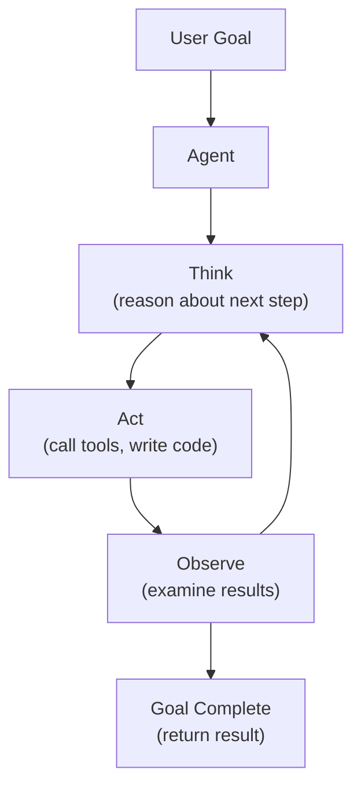

# Agents and Tools

Building autonomous AI agents — architectures, reasoning loops, memory, planning, and multi-agent systems.

---

## What Are AI Agents

An AI agent is an LLM that can **reason, plan, and take actions** autonomously to achieve a goal. Unlike simple chatbots that respond to individual prompts, agents operate in a loop: observe, think, act, observe the result, and repeat.



| Chatbot | Agent |
|---------|-------|
| Single turn: prompt → response | Multi-turn: reason → act → observe → repeat |
| User drives every step | Agent drives its own workflow |
| No tool use | Uses tools autonomously |
| No memory between calls | Maintains state across steps |
| Fixed behavior | Adapts strategy based on results |

---

## Agent Loop Architecture

### The Core Loop

```python
from openai import OpenAI
import json

client = OpenAI()

def agent_loop(goal: str, tools: list[dict], max_steps: int = 10) -> str:
    """Core agent loop: reason → act → observe → repeat."""
    messages = [
        {"role": "system", "content": f"""You are an autonomous agent. Your goal: {goal}

Available tools are provided. Use them to accomplish your goal.
Think step by step. After each tool call, reflect on the result.
When the goal is accomplished, write your final answer."""},
        {"role": "user", "content": goal},
    ]

    for step in range(max_steps):
        response = client.chat.completions.create(
            model="gpt-4o",
            messages=messages,
            tools=tools,
            tool_choice="auto",
        )

        message = response.choices[0].message
        messages.append(message)

        # If no tool calls, the agent is done
        if not message.tool_calls:
            return message.content

        # Execute tool calls
        for tool_call in message.tool_calls:
            result = execute_tool(tool_call.function.name, tool_call.function.arguments)
            messages.append({
                "role": "tool",
                "tool_call_id": tool_call.id,
                "content": json.dumps(result),
            })

    return "Max steps reached without completing goal."
```

---

## Agent Frameworks

### ReAct (Reasoning + Acting)

The most common agent pattern — interleave reasoning traces with tool actions:

```
User: What's the GDP per capita of the country with the tallest building?

Thought: I need to find which country has the tallest building, then look up its GDP per capita.
Action: search("tallest building in the world")
Observation: The Burj Khalifa in Dubai, UAE is the tallest building at 828m.

Thought: The tallest building is in the UAE. Now I need the GDP per capita.
Action: search("UAE GDP per capita 2024")
Observation: UAE GDP per capita is approximately $50,350 (2024).

Thought: I now have the answer.
Answer: The tallest building in the world is the Burj Khalifa in the UAE. The UAE's GDP per capita is approximately $50,350.
```

### Plan-and-Execute

Generate a complete plan first, then execute each step:

```python
def plan_and_execute(goal: str, tools: list[dict]) -> str:
    """Generate a plan, then execute step by step."""

    # Phase 1: Generate plan
    plan_response = client.chat.completions.create(
        model="gpt-4o",
        messages=[{
            "role": "user",
            "content": f"""Create a step-by-step plan to accomplish this goal: {goal}

Available tools: {json.dumps([t['function']['name'] for t in tools])}

Output a numbered list of steps. Each step should specify which tool to use."""
        }],
    )
    plan = plan_response.choices[0].message.content

    # Phase 2: Execute each step
    messages = [
        {"role": "system", "content": f"Execute this plan step by step:\n{plan}"},
        {"role": "user", "content": f"Begin executing the plan for: {goal}"},
    ]

    return agent_loop_with_messages(messages, tools)
```

### Reflexion

Agent reflects on its performance and improves:

```python
def reflexion_agent(goal: str, tools: list[dict], max_attempts: int = 3) -> str:
    """Agent that reflects on failures and retries with improvements."""
    reflections = []

    for attempt in range(max_attempts):
        # Execute with current knowledge + past reflections
        context = ""
        if reflections:
            context = f"\n\nPrevious attempts and reflections:\n" + "\n".join(reflections)

        result = agent_loop(goal + context, tools)

        # Evaluate result
        evaluation = client.chat.completions.create(
            model="gpt-4o",
            messages=[{
                "role": "user",
                "content": f"Goal: {goal}\nResult: {result}\n\nDid the agent accomplish the goal? If not, what went wrong and how should it improve? Respond with 'SUCCESS' or a reflection.",
            }],
        ).choices[0].message.content

        if "SUCCESS" in evaluation.upper():
            return result

        reflections.append(f"Attempt {attempt+1}: {evaluation}")

    return f"Failed after {max_attempts} attempts. Last result: {result}"
```

---

## Memory Systems

### Working Memory (In-Context)

```python
class AgentMemory:
    """Multi-tier memory for agents."""

    def __init__(self):
        self.scratchpad = []     # Working notes
        self.facts = {}          # Learned facts
        self.plan = []           # Current plan steps
        self.completed = []      # Completed actions

    def add_note(self, note: str):
        """Add a working note."""
        self.scratchpad.append(note)

    def store_fact(self, key: str, value: str):
        """Store a learned fact."""
        self.facts[key] = value

    def get_context(self) -> str:
        """Build memory context for the prompt."""
        parts = []
        if self.facts:
            parts.append("Known facts:\n" + "\n".join(f"- {k}: {v}" for k, v in self.facts.items()))
        if self.scratchpad:
            parts.append("Working notes:\n" + "\n".join(f"- {n}" for n in self.scratchpad[-5:]))
        if self.plan:
            parts.append("Current plan:\n" + "\n".join(
                f"{'✓' if s in self.completed else '○'} {s}" for s in self.plan
            ))
        return "\n\n".join(parts)
```

### Long-Term Memory (Persistent)

```python
class PersistentAgentMemory:
    """Vector-based long-term memory for agents."""

    def __init__(self, collection_name: str = "agent_memory"):
        import chromadb
        self.client = chromadb.Client()
        self.collection = self.client.get_or_create_collection(collection_name)

    def store(self, text: str, metadata: dict = None):
        """Store a memory with embedding."""
        self.collection.add(
            documents=[text],
            metadatas=[metadata or {}],
            ids=[f"mem_{self.collection.count()}"],
        )

    def recall(self, query: str, n: int = 5) -> list[str]:
        """Retrieve relevant memories."""
        results = self.collection.query(query_texts=[query], n_results=n)
        return results["documents"][0]
```

---

## Multi-Agent Systems

### Orchestrator Pattern

One agent coordinates specialists:

```python
class Orchestrator:
    """Central agent that delegates to specialist agents."""

    def __init__(self):
        self.agents = {
            "researcher": Agent(system_prompt="You research topics thoroughly.", tools=[search_tool]),
            "coder": Agent(system_prompt="You write production-quality code.", tools=[code_tool]),
            "reviewer": Agent(system_prompt="You review code for bugs and improvements.", tools=[review_tool]),
        }

    def run(self, goal: str) -> str:
        # Orchestrator decides the workflow
        plan = self.plan(goal)  # "1. Researcher gathers info, 2. Coder implements, 3. Reviewer checks"

        results = {}
        for step in plan:
            agent_name = step["agent"]
            task = step["task"]
            context = step.get("context", "")
            results[step["id"]] = self.agents[agent_name].run(task + context)

        return self.synthesize(results)
```

### Debate Pattern

Multiple agents debate to improve quality:

```python
def debate(question: str, rounds: int = 3) -> str:
    """Multiple agents debate to reach a better answer."""
    agents = [
        {"name": "Optimist", "system": "You argue for feasibility and benefits."},
        {"name": "Skeptic", "system": "You challenge assumptions and find risks."},
        {"name": "Pragmatist", "system": "You find practical middle-ground solutions."},
    ]

    history = f"Question: {question}\n\n"

    for round in range(rounds):
        for agent in agents:
            response = client.chat.completions.create(
                model="gpt-4o",
                messages=[
                    {"role": "system", "content": agent["system"]},
                    {"role": "user", "content": history + f"\nRound {round+1}: Provide your perspective."},
                ],
            ).choices[0].message.content

            history += f"\n{agent['name']}: {response}\n"

    # Final synthesis
    synthesis = client.chat.completions.create(
        model="gpt-4o",
        messages=[
            {"role": "system", "content": "Synthesize the debate into a balanced conclusion."},
            {"role": "user", "content": history},
        ],
    ).choices[0].message.content

    return synthesis
```

### Multi-Agent Comparison

| Pattern | Agents | Communication | Best For |
|---------|--------|---------------|----------|
| **Orchestrator** | Central coordinator + specialists | Hub-and-spoke | Complex workflows with clear steps |
| **Debate** | Multiple perspectives | Broadcast | Decision-making, analysis |
| **Pipeline** | Sequential stages | Chain | Data processing, content creation |
| **Swarm** | Peer-to-peer handoffs | Direct | Customer service, routing |
| **Supervisor** | Manager + workers | Hierarchical | Quality-controlled tasks |

---

## Agent Design Patterns

### Error Recovery

```python
def resilient_agent(goal: str, max_retries: int = 3) -> str:
    """Agent with built-in error recovery."""
    for attempt in range(max_retries):
        try:
            result = agent_loop(goal, tools)

            # Validate result
            if is_valid_result(result, goal):
                return result

            # Self-correction
            goal = f"{goal}\n\nPrevious attempt produced an invalid result: {result}\nPlease fix the issues and try again."

        except Exception as e:
            if attempt == max_retries - 1:
                raise
            goal = f"{goal}\n\nPrevious attempt failed with error: {e}\nPlease try a different approach."
```

### Human-in-the-Loop

```python
async def agent_with_approval(goal: str, tools: list[dict]) -> str:
    """Agent that asks for human approval on sensitive actions."""
    SENSITIVE_TOOLS = {"delete_file", "send_email", "deploy", "write_database"}

    messages = [...]  # Setup

    while True:
        response = client.chat.completions.create(...)
        message = response.choices[0].message

        if not message.tool_calls:
            return message.content

        for tool_call in message.tool_calls:
            if tool_call.function.name in SENSITIVE_TOOLS:
                approved = await request_human_approval(
                    f"Agent wants to call {tool_call.function.name} "
                    f"with args: {tool_call.function.arguments}"
                )
                if not approved:
                    messages.append({
                        "role": "tool",
                        "tool_call_id": tool_call.id,
                        "content": "Action denied by user. Try an alternative approach.",
                    })
                    continue

            result = execute_tool(tool_call.function.name, tool_call.function.arguments)
            messages.append({"role": "tool", "tool_call_id": tool_call.id, "content": json.dumps(result)})
```

### Guardrails

```python
class AgentGuardrails:
    """Safety guardrails for agent behavior."""

    def __init__(self):
        self.max_steps = 20
        self.max_cost = 1.0          # USD
        self.max_tool_calls = 50
        self.allowed_domains = ["api.example.com"]
        self.blocked_tools = ["delete_all", "format_disk"]

    def check_tool_call(self, name: str, args: dict) -> bool:
        if name in self.blocked_tools:
            raise PermissionError(f"Tool {name} is blocked")
        return True

    def check_budget(self, current_cost: float):
        if current_cost > self.max_cost:
            raise BudgetExceeded(f"Agent exceeded budget: ${current_cost:.2f}")

    def check_step_limit(self, current_step: int):
        if current_step > self.max_steps:
            raise StepLimitExceeded(f"Agent exceeded {self.max_steps} steps")
```

---

## Production Considerations

| Concern | Solution |
|---------|----------|
| **Cost control** | Token budgets, step limits, model cascade (cheap → expensive) |
| **Latency** | Parallel tool calls, caching, faster models for simple steps |
| **Reliability** | Retry logic, fallback strategies, checkpoint/resume |
| **Observability** | Log every thought/action, trace execution, cost tracking |
| **Safety** | Human-in-the-loop for sensitive actions, guardrails, sandboxing |
| **Testing** | Deterministic test scenarios, mock tools, trajectory evaluation |

---

## Common Interview Questions

**1. What makes an agent different from a chatbot?**

A chatbot responds to individual messages — it's reactive and user-driven. An agent operates **autonomously** in a loop: it receives a goal, reasons about how to accomplish it, takes actions (tool calls), observes results, and iterates until the goal is achieved. Key differences: (1) agency — the agent decides what to do next, not the user, (2) tool use — agents can interact with external systems, (3) multi-step reasoning — agents plan and execute multi-step workflows, (4) persistence — agents maintain state across multiple reasoning steps. Think of a chatbot as answering questions vs. an agent as completing tasks.

**2. Explain the ReAct pattern and why it works.**

ReAct (Reasoning + Acting) interleaves "Thought" traces (verbal reasoning about what to do next) with "Action" steps (tool calls) and "Observation" steps (tool results). It works because: (1) explicit reasoning traces force the model to think before acting, reducing errors, (2) observations ground the reasoning in real data rather than hallucinated assumptions, (3) the interleaving creates a natural error-correction mechanism — if an observation doesn't match expectations, the next thought can adjust. Without ReAct, models often skip to incorrect conclusions or call wrong tools. The thought traces also provide excellent debugging visibility.

**3. How do you implement memory in an agent system?**

Multi-tier approach: (1) **Working memory** — the conversation/scratchpad in the current context window. Contains recent actions, tool results, and notes. Limited by context window size. (2) **Short-term memory** — conversation history managed with sliding window + summarization. Older turns are compressed. (3) **Long-term memory** — persistent storage in a vector database. Important facts, learned preferences, and past task results are embedded and retrieved by relevance when needed. (4) **Structured memory** — key-value store for explicit facts (user preferences, confirmed decisions). Agent reads relevant memories at the start of each reasoning step.

**4. Compare Plan-and-Execute vs ReAct agent architectures.**

**ReAct** interleaves reasoning and action on the fly — no upfront plan, just "think, act, observe, repeat." Good for exploratory tasks where you don't know the steps in advance. Flexible and adaptive, but can lose track of the overall goal on long tasks. **Plan-and-Execute** creates a complete plan first, then executes each step. Better for complex, well-defined tasks with clear milestones. The plan provides structure and prevents drift, but adapting mid-execution requires replanning. In practice, hybrid approaches work best: create an initial plan, execute with ReAct-style reasoning per step, and replan if execution reveals the plan was wrong.

**5. How do you prevent runaway agents?**

Multiple layers of control: (1) **Step limits** — hard cap on reasoning steps (10-20 for most tasks). (2) **Cost budgets** — track token usage, stop when budget exceeded. (3) **Tool call limits** — max total tool invocations. (4) **Time limits** — overall execution timeout. (5) **Guardrails** — block dangerous tools, validate arguments, restrict domains. (6) **Human-in-the-loop** — require approval for destructive actions. (7) **Loop detection** — detect when the agent is repeating the same actions/thoughts. (8) **Sandboxing** — execute code and tools in isolated environments. Most important: combine multiple controls. No single safeguard is sufficient.

**6. What are multi-agent systems and when should you use them?**

Multi-agent systems use multiple LLMs (potentially different models) with different roles to collaboratively solve a task. Patterns: orchestrator (central coordinator + specialists), debate (multiple perspectives), pipeline (sequential stages), swarm (peer handoffs). Use when: the task benefits from specialization (different roles have different system prompts/tools), you need quality through diverse perspectives (debate pattern), or the workflow has clear stages (research → code → review). Avoid for: simple tasks (overhead isn't justified), latency-sensitive applications (multiple agents = multiple LLM calls), and cost-constrained scenarios.

**7. How do you evaluate agent performance?**

(1) **Task completion rate** — does the agent accomplish the goal? Binary or scored. (2) **Step efficiency** — how many steps does it take? Fewer is better. (3) **Tool accuracy** — does it call the right tools with correct arguments? (4) **Cost** — total tokens consumed. (5) **Trajectory quality** — is the reasoning trace logical and efficient? Evaluated by humans or LLM-as-judge. (6) **Error recovery** — does it handle tool failures gracefully? Build standardized benchmarks: define tasks with clear success criteria, run agents multiple times (stochastic outputs), report mean ± std on all metrics.

**8. How would you design a production coding agent?**

Architecture: (1) **Planning** — parse the request, generate a plan with file-level steps. (2) **Context gathering** — search codebase (tools: grep, file read, AST analysis) to understand existing patterns. (3) **Code generation** — write/edit code following existing conventions. Tools: file write, code linting, type checking. (4) **Verification** — run tests, check compilation, verify the change accomplishes the goal. (5) **Error correction** — if tests fail, read errors, fix code, retry. Key tools: file read/write, terminal execution (tests, lint), code search, git operations. Guardrails: max steps, never modify production configs, never push without review. Human-in-the-loop for final approval. Memory: current file contents, test results across iterations.
