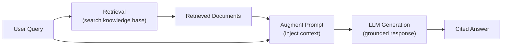
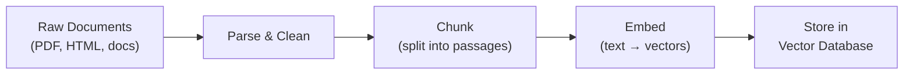
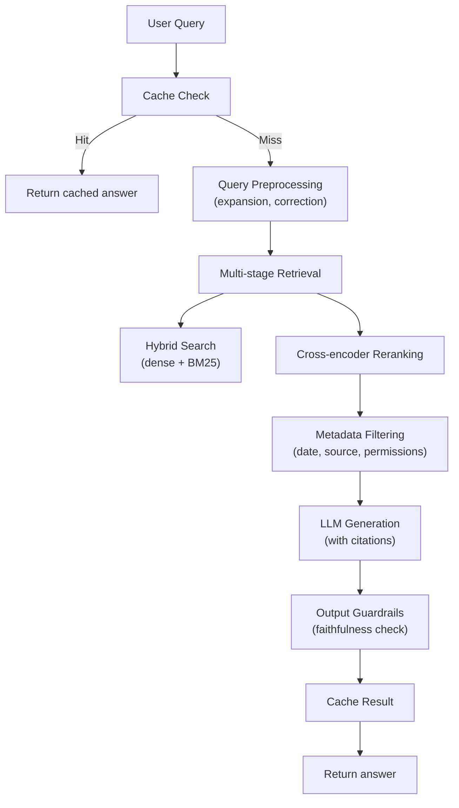

# RAG Architecture

Retrieval-Augmented Generation — grounding LLM outputs with external knowledge for accuracy, recency, and verifiability.

---

## Why RAG

LLMs have a fundamental limitation: their knowledge is frozen at training time. RAG solves this by **retrieving relevant information** from external sources and injecting it into the prompt before generation.



| Problem | Without RAG | With RAG |
|---------|------------|---------|
| **Outdated info** | Frozen at training cutoff | Real-time knowledge |
| **Hallucinations** | Plausible but false | Grounded in sources |
| **Domain knowledge** | General only | Access to private data |
| **Verifiability** | No sources | Citable references |
| **Cost** | Fine-tuning expensive | Retrieval is cheap |

---

## Core RAG Pipeline

### 1. Ingestion (Offline)



```python
from langchain_community.document_loaders import PyPDFLoader, TextLoader
from langchain.text_splitter import RecursiveCharacterTextSplitter
from langchain_openai import OpenAIEmbeddings
from langchain_community.vectorstores import Chroma

# Step 1: Load documents
loader = PyPDFLoader("technical_manual.pdf")
documents = loader.load()

# Step 2: Chunk
splitter = RecursiveCharacterTextSplitter(
    chunk_size=500,         # ~tokens (varies by embedding model)
    chunk_overlap=50,       # Overlap to preserve cross-chunk context
    separators=["\n\n", "\n", ". ", " "],  # Try larger splits first
)
chunks = splitter.split_documents(documents)

# Step 3: Embed and store
embeddings = OpenAIEmbeddings(model="text-embedding-3-large")
vectorstore = Chroma.from_documents(
    documents=chunks,
    embedding=embeddings,
    persist_directory="./chroma_db",
)
```

### 2. Retrieval (Online)

```python
# Basic similarity search
results = vectorstore.similarity_search(
    query="How does the authentication system work?",
    k=5,  # Top 5 results
)

# With similarity scores
results_with_scores = vectorstore.similarity_search_with_score(
    query="How does the authentication system work?",
    k=5,
)
for doc, score in results_with_scores:
    print(f"Score: {score:.3f} | {doc.page_content[:100]}...")
```

### 3. Generation

```python
from openai import OpenAI

client = OpenAI()

def rag_generate(query: str, context_docs: list[str]) -> str:
    """Generate an answer grounded in retrieved context."""
    context = "\n\n---\n\n".join(context_docs)

    response = client.chat.completions.create(
        model="gpt-4o",
        messages=[
            {"role": "system", "content": """Answer questions based ONLY on the provided context.
If the context doesn't contain enough information to answer, say "I don't have enough information."
Always cite which passage your answer comes from."""},
            {"role": "user", "content": f"""Context:
{context}

Question: {query}

Answer (with citations):"""},
        ],
        temperature=0.1,  # Low temperature for factual answers
    )
    return response.choices[0].message.content
```

---

## Embedding Models

### Comparison

| Model | Dimensions | Context Length | Quality (MTEB) | Speed | Cost |
|-------|-----------|---------------|----------------|-------|------|
| **text-embedding-3-large** (OpenAI) | 3072 | 8K | Top tier | Fast API | $0.13/M tokens |
| **text-embedding-3-small** (OpenAI) | 1536 | 8K | Good | Fast API | $0.02/M tokens |
| **voyage-3** (Voyage AI) | 1024 | 32K | Top tier | Fast API | $0.06/M tokens |
| **all-MiniLM-L6-v2** (S-BERT) | 384 | 256 | Decent | Very fast (local) | Free |
| **bge-large-en-v1.5** (BAAI) | 1024 | 512 | Good | Fast (local) | Free |
| **nomic-embed-text** | 768 | 8K | Good | Fast (local) | Free |
| **mxbai-embed-large** | 1024 | 512 | Good | Fast (local) | Free |

### Using Embeddings

```python
from openai import OpenAI
import numpy as np

client = OpenAI()

def get_embedding(text: str, model: str = "text-embedding-3-large") -> list[float]:
    """Get embedding vector for text."""
    response = client.embeddings.create(
        input=text,
        model=model,
    )
    return response.data[0].embedding

def cosine_similarity(a: list[float], b: list[float]) -> float:
    """Compute cosine similarity between two vectors."""
    a, b = np.array(a), np.array(b)
    return np.dot(a, b) / (np.linalg.norm(a) * np.linalg.norm(b))

# Example
query_emb = get_embedding("How does authentication work?")
doc_emb = get_embedding("The auth system uses JWT tokens with RSA-256 signatures.")
print(f"Similarity: {cosine_similarity(query_emb, doc_emb):.3f}")
```

---

## Vector Databases

| Database | Type | Scalability | Key Features |
|----------|------|-------------|-------------|
| **Chroma** | Embedded | Small-medium | Simple API, Python-native |
| **Pinecone** | Managed cloud | Large | Serverless, auto-scaling |
| **Weaviate** | Self-hosted/cloud | Large | GraphQL, hybrid search |
| **Qdrant** | Self-hosted/cloud | Large | Rust-based, fast filtering |
| **Milvus** | Self-hosted/cloud | Very large | GPU acceleration |
| **pgvector** | PostgreSQL extension | Medium-large | SQL integration, familiar |
| **FAISS** | Library (in-memory) | Medium | Facebook's ANN library |

### pgvector (PostgreSQL)

```sql
-- Setup
CREATE EXTENSION vector;

CREATE TABLE documents (
    id SERIAL PRIMARY KEY,
    content TEXT,
    embedding vector(1536),  -- Match your model dimensions
    metadata JSONB
);

-- Create index for fast search
CREATE INDEX ON documents USING hnsw (embedding vector_cosine_ops);

-- Insert
INSERT INTO documents (content, embedding, metadata)
VALUES ('Auth uses JWT...', '[0.1, 0.2, ...]'::vector, '{"source": "docs"}');

-- Search (cosine similarity)
SELECT content, 1 - (embedding <=> $1::vector) AS similarity
FROM documents
ORDER BY embedding <=> $1::vector
LIMIT 5;
```

---

## Advanced Retrieval Strategies

### Hybrid Search (Dense + Sparse)

Combine semantic (dense vector) and keyword (sparse/BM25) search:

```python
from langchain.retrievers import EnsembleRetriever
from langchain_community.retrievers import BM25Retriever
from langchain_community.vectorstores import Chroma

# Dense retriever (semantic)
dense_retriever = vectorstore.as_retriever(search_kwargs={"k": 5})

# Sparse retriever (keyword/BM25)
bm25_retriever = BM25Retriever.from_documents(chunks, k=5)

# Ensemble with Reciprocal Rank Fusion
hybrid_retriever = EnsembleRetriever(
    retrievers=[dense_retriever, bm25_retriever],
    weights=[0.6, 0.4],  # Favor semantic, supplement with keyword
)

results = hybrid_retriever.invoke("JWT token expiration")
```

**Why hybrid?** Dense search finds semantically similar passages ("authentication mechanism" matches "login system"), while sparse search catches exact keywords ("JWT", "RSA-256") that dense search might miss.

### HyDE (Hypothetical Document Embeddings)

Generate a **hypothetical answer** to the query, then search for documents similar to that hypothetical answer rather than the original query.

```python
def hyde_retrieval(query: str, vectorstore, k: int = 5):
    """HyDE: embed a hypothetical answer instead of the query."""
    # Step 1: Generate a hypothetical answer
    hypothetical = client.chat.completions.create(
        model="gpt-4o-mini",
        messages=[{"role": "user", "content": f"Write a short paragraph answering: {query}"}],
        temperature=0.7,
    ).choices[0].message.content

    # Step 2: Use the hypothetical answer as the search query
    results = vectorstore.similarity_search(hypothetical, k=k)
    return results
```

**Why HyDE works:** The hypothetical answer is in the same "style" as the stored documents, improving embedding similarity. A query like "How do I fix error 503?" becomes a paragraph about 503 errors, which better matches document passages.

### Multi-Query Retrieval

Generate multiple reformulations of the query and combine results:

```python
def multi_query_retrieval(query: str, vectorstore, k: int = 5):
    """Generate multiple query variants for broader retrieval."""
    # Generate query variants
    variants = client.chat.completions.create(
        model="gpt-4o-mini",
        messages=[{"role": "user", "content": f"""Generate 3 different versions of this question,
each approaching it from a different angle:

Original: {query}

Variants (one per line):"""}],
        temperature=0.7,
    ).choices[0].message.content.strip().split("\n")

    # Retrieve for each variant
    all_docs = set()
    for variant in [query] + variants:
        results = vectorstore.similarity_search(variant, k=k)
        for doc in results:
            all_docs.add(doc.page_content)

    return list(all_docs)[:k]
```

### Reranking

Use a cross-encoder model to **rerank** retrieved documents for higher precision:

```python
from sentence_transformers import CrossEncoder

reranker = CrossEncoder("cross-encoder/ms-marco-MiniLM-L-6-v2")

def retrieve_and_rerank(query: str, vectorstore, k_retrieve: int = 20, k_final: int = 5):
    """Retrieve broadly, then rerank for precision."""
    # Step 1: Broad retrieval (over-fetch)
    candidates = vectorstore.similarity_search(query, k=k_retrieve)

    # Step 2: Rerank with cross-encoder
    pairs = [(query, doc.page_content) for doc in candidates]
    scores = reranker.predict(pairs)

    # Step 3: Return top-k after reranking
    ranked = sorted(zip(scores, candidates), key=lambda x: x[0], reverse=True)
    return [doc for _, doc in ranked[:k_final]]
```

**Why reranking helps:** Bi-encoder retrieval (embedding similarity) is fast but imprecise — it encodes query and document independently. Cross-encoders process query and document **together**, capturing fine-grained interactions. The two-stage pipeline gets the best of both: speed from bi-encoders, precision from cross-encoders.

### Contextual Retrieval

Add context to chunks before embedding them:

```python
def add_context_to_chunk(chunk: str, document_summary: str, section_title: str) -> str:
    """Prepend contextual information to each chunk before embedding."""
    return f"""Document: {document_summary}
Section: {section_title}

{chunk}"""
```

**Anthropic's Contextual Retrieval:** Prepend a brief contextual description (generated by an LLM) to each chunk explaining where it fits in the overall document. This improves retrieval accuracy by 49% according to Anthropic's benchmarks, because isolated chunks often lack context about what document/section they belong to.

---

## RAG Evaluation

### RAGAS Framework

```python
from ragas import evaluate
from ragas.metrics import (
    faithfulness,
    answer_relevancy,
    context_precision,
    context_recall,
)
from datasets import Dataset

# Prepare evaluation data
eval_data = Dataset.from_dict({
    "question": ["How does auth work?", "What are the rate limits?"],
    "answer": ["Auth uses JWT tokens...", "Rate limit is 100 req/min..."],
    "contexts": [
        ["JWT documentation chunk...", "Auth flow description..."],
        ["API limits section...", "Rate limiting config..."],
    ],
    "ground_truth": ["JWT with RSA-256...", "100 requests per minute..."],
})

results = evaluate(
    dataset=eval_data,
    metrics=[faithfulness, answer_relevancy, context_precision, context_recall],
)
print(results)
# {'faithfulness': 0.92, 'answer_relevancy': 0.88, 'context_precision': 0.85, 'context_recall': 0.90}
```

### Key RAG Metrics

| Metric | What It Measures | Good Score |
|--------|-----------------|-----------|
| **Context Precision** | How much of retrieved context is relevant | > 0.8 |
| **Context Recall** | How much relevant context was retrieved | > 0.8 |
| **Faithfulness** | Does the answer only use information from context? | > 0.9 |
| **Answer Relevancy** | Does the answer actually address the question? | > 0.85 |
| **Answer Correctness** | Is the answer factually correct vs ground truth? | > 0.8 |

---

## Production RAG Architecture



### Production Considerations

| Concern | Solution |
|---------|----------|
| **Latency** | Cache frequent queries, precompute embeddings, use fast vector DB |
| **Freshness** | Incremental indexing pipeline, TTL on cached results |
| **Permissions** | Store ACLs with documents, filter results by user permissions |
| **Scalability** | Horizontal scaling of vector DB, async processing |
| **Monitoring** | Track retrieval quality, faithfulness scores, user feedback |
| **Cost** | Use smaller models for embedding, cache aggressively |

---

## Common Interview Questions

**1. How does RAG work end-to-end?**

RAG has two phases: **offline ingestion** and **online retrieval**. Offline: documents are parsed, chunked (typically 256-512 tokens), and embedded using a model like `text-embedding-3-large`. The resulting vectors are stored in a vector database (Pinecone, Chroma, pgvector). Online: when a user asks a question, the query is embedded with the same model, similar vectors are retrieved via approximate nearest neighbor search, the retrieved document chunks are injected into the LLM prompt as context, and the LLM generates an answer grounded in that context. The key insight: RAG separates knowledge storage (vector DB) from reasoning (LLM), allowing you to update knowledge without retraining.

**2. How do you choose chunk size and overlap?**

Chunk size should balance two concerns: too small and chunks lack sufficient context (a sentence fragment isn't useful); too large and chunks dilute the specific information with noise. Sweet spot: 256-512 tokens for most embedding models. Overlap (10-20% of chunk size) ensures information at chunk boundaries isn't lost. The optimal size depends on: your embedding model's optimal input length, the nature of your documents (dense technical docs need smaller chunks, narrative text can use larger), and your retrieval task (precise Q&A needs smaller, summarization needs larger). Always evaluate empirically — test different sizes against your retrieval accuracy metrics.

**3. What is hybrid search and why use it?**

Hybrid search combines dense (semantic) and sparse (keyword/BM25) retrieval. Dense search excels at finding semantically similar content even with different wording ("authentication mechanism" matches "login system"). Sparse search excels at exact keyword matching ("JWT", "RSA-256"), which dense search can miss because these specific tokens may not have strong semantic embeddings. Combined, they cover more relevant documents. Typical fusion: Reciprocal Rank Fusion (RRF) merges ranked lists from both methods. Weight tuning (e.g., 60% dense, 40% sparse) depends on your content type — technical documentation benefits from higher sparse weight, conversational content from higher dense weight.

**4. HyDE vs multi-query retrieval — compare these advanced strategies.**

**HyDE** generates a hypothetical answer and uses that as the search query. This bridges the gap between question-style queries and document-style passages — the hypothetical answer has similar vocabulary and structure to stored documents, improving embedding-based retrieval. Best when queries are questions but documents are declarative statements. **Multi-query** generates multiple reformulations of the query ("different angles") and retrieves for each, combining results. This broadens recall by catching documents that match different phrasings. Best when the query is ambiguous or the concept has multiple aspects. They can also be combined: generate multiple hypothetical answers, retrieve for each.

**5. How do you evaluate RAG quality?**

Four key dimensions, measurable with RAGAS or custom evals: (1) **Context Precision** — are the retrieved documents relevant? Low precision means noisy context diluting the LLM's attention. (2) **Context Recall** — did you retrieve all relevant documents? Low recall means missing information. (3) **Faithfulness** — does the answer only use information from the retrieved context? Low faithfulness means hallucination despite having context. (4) **Answer Relevancy** — does the answer actually address the question? Build an evaluation dataset with questions, ground truth answers, and relevant document IDs. Run the full RAG pipeline, compare outputs. Monitor in production via user feedback, thumbs up/down signals, and LLM-as-judge automated evaluation.

**6. What are the key failure modes of RAG?**

(1) **Bad retrieval** — wrong or irrelevant documents returned. Fix: improve embeddings, chunking, or add reranking. (2) **Lost in the middle** — relevant context is retrieved but ignored because it's in the middle of the prompt. Fix: reorder by relevance, put best results first/last. (3) **Insufficient context** — the answer requires information across multiple chunks that aren't retrieved together. Fix: larger chunks, parent document retrieval, or multi-hop retrieval. (4) **Unfaithful generation** — LLM ignores context and generates from parametric knowledge. Fix: stronger system prompt ("ONLY use provided context"), lower temperature, faithfulness evaluation. (5) **Stale data** — vector store is out of date. Fix: incremental indexing pipeline. (6) **Wrong granularity** — chunks too small (lack context) or too large (dilute signal). Fix: tune chunk size for your content.

**7. How does reranking improve RAG and what are the tradeoffs?**

Reranking uses a cross-encoder model that processes query and document **together** (not independently like bi-encoders), capturing fine-grained semantic interactions. This gives much higher precision but is too slow for the initial retrieval stage. The two-stage pipeline: (1) bi-encoder retrieves top-20 candidates fast (O(1) with ANN), (2) cross-encoder reranks those 20 by scoring each pair (O(20) forward passes, still fast since 20 is small). Tradeoffs: adds latency (~50-100ms for reranking 20 documents), requires an additional model, and has a recall ceiling limited by the first stage — reranking can't find documents the initial retrieval missed. Typical quality improvement: 10-30% in precision@5.

**8. RAG vs fine-tuning — when to use each?**

**RAG** for: dynamic or frequently changing knowledge (news, docs, data), when you need citations/verifiability, when data is too large to fine-tune on, when you want to test quickly (no training needed). **Fine-tuning** for: teaching the model a specific style/format/tone, injecting static domain knowledge that rarely changes, improving performance on specific tasks, reducing inference cost (no context retrieval needed per request). **Both together** is often ideal: fine-tune the model on your domain to improve its reasoning patterns, and use RAG for specific, up-to-date knowledge retrieval. The key insight: RAG adds knowledge, fine-tuning changes behavior. If you need both new knowledge and new behavior, combine them.
