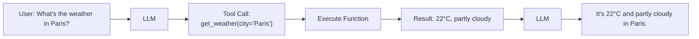
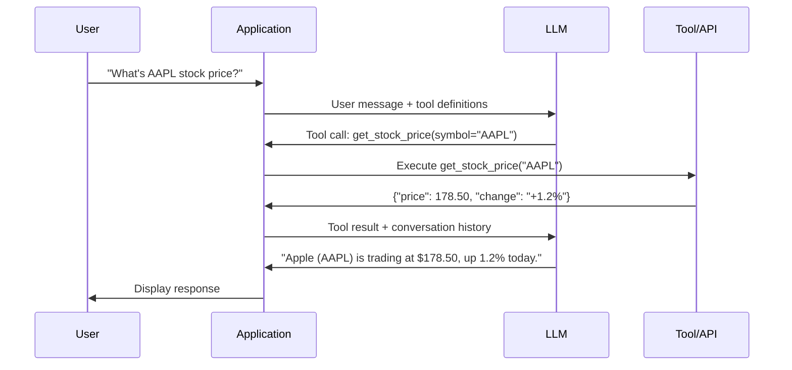

# Tool Calling

Enabling LLMs to invoke external functions and APIs — how tool calling works, schema design, and execution patterns.

---

## Why Tool Calling

LLMs are fundamentally text-in, text-out systems. They can't browse the web, query databases, send emails, or perform calculations natively. **Tool calling** bridges this gap by letting the model request specific function executions.



| Without Tools | With Tools |
|--------------|-----------|
| "I don't have real-time data" | Fetches live weather data |
| Approximate mental math | Precise calculations |
| Can't verify claims | Database lookups |
| Static knowledge | Dynamic API calls |

---

## How Tool Calling Works

### The Protocol

1. **Define tools** — provide the model with function schemas (name, description, parameters)
2. **Model decides** — the model generates a tool call (function name + arguments) instead of regular text
3. **Execute** — your code executes the function with the model's arguments
4. **Return results** — send the function output back to the model
5. **Model responds** — the model incorporates the tool result into its final answer



---

## API Implementations

### OpenAI Function Calling

```python
from openai import OpenAI
import json

client = OpenAI()

# Define tools
tools = [
    {
        "type": "function",
        "function": {
            "name": "get_weather",
            "description": "Get current weather for a location. Use this when the user asks about weather conditions.",
            "parameters": {
                "type": "object",
                "properties": {
                    "location": {
                        "type": "string",
                        "description": "City and country, e.g., 'Paris, France'",
                    },
                    "unit": {
                        "type": "string",
                        "enum": ["celsius", "fahrenheit"],
                        "description": "Temperature unit",
                    },
                },
                "required": ["location"],
            },
        },
    },
    {
        "type": "function",
        "function": {
            "name": "search_web",
            "description": "Search the web for current information.",
            "parameters": {
                "type": "object",
                "properties": {
                    "query": {"type": "string", "description": "Search query"},
                },
                "required": ["query"],
            },
        },
    },
]

# Initial request
response = client.chat.completions.create(
    model="gpt-4o",
    messages=[{"role": "user", "content": "What's the weather in Paris?"}],
    tools=tools,
    tool_choice="auto",  # Let model decide whether to call tools
)

message = response.choices[0].message

# Check if the model wants to call a tool
if message.tool_calls:
    for tool_call in message.tool_calls:
        function_name = tool_call.function.name
        arguments = json.loads(tool_call.function.arguments)

        # Execute the function
        if function_name == "get_weather":
            result = get_weather(**arguments)  # Your implementation
        elif function_name == "search_web":
            result = search_web(**arguments)

        # Send result back to the model
        messages = [
            {"role": "user", "content": "What's the weather in Paris?"},
            message,  # Include the assistant's tool call message
            {
                "role": "tool",
                "tool_call_id": tool_call.id,
                "content": json.dumps(result),
            },
        ]

    # Get final response
    final_response = client.chat.completions.create(
        model="gpt-4o",
        messages=messages,
    )
    print(final_response.choices[0].message.content)
```

### Anthropic Tool Use

```python
import anthropic

client = anthropic.Anthropic()

response = client.messages.create(
    model="claude-3-5-sonnet-20241022",
    max_tokens=1024,
    tools=[
        {
            "name": "get_weather",
            "description": "Get current weather for a location.",
            "input_schema": {
                "type": "object",
                "properties": {
                    "location": {"type": "string", "description": "City name"},
                    "unit": {"type": "string", "enum": ["celsius", "fahrenheit"]},
                },
                "required": ["location"],
            },
        },
    ],
    messages=[{"role": "user", "content": "What's the weather in Paris?"}],
)

# Process tool use blocks
for block in response.content:
    if block.type == "tool_use":
        # Execute the tool
        result = get_weather(**block.input)

        # Continue conversation with tool result
        follow_up = client.messages.create(
            model="claude-3-5-sonnet-20241022",
            max_tokens=1024,
            tools=[...],  # Same tools
            messages=[
                {"role": "user", "content": "What's the weather in Paris?"},
                {"role": "assistant", "content": response.content},
                {
                    "role": "user",
                    "content": [
                        {
                            "type": "tool_result",
                            "tool_use_id": block.id,
                            "content": json.dumps(result),
                        }
                    ],
                },
            ],
        )
```

### Key API Differences

| Feature | OpenAI | Anthropic | Google Gemini |
|---------|--------|-----------|---------------|
| **Tool format** | `tools` array | `tools` array | `tools` array |
| **Schema** | JSON Schema `parameters` | JSON Schema `input_schema` | Similar to OpenAI |
| **Result role** | `role: "tool"` | `role: "user"` with `tool_result` | `role: "function"` |
| **Parallel calls** | Supported | Supported | Supported |
| **Force tool** | `tool_choice: {"type": "function", "function": {"name": "X"}}` | `tool_choice: {"type": "tool", "name": "X"}` | `tool_config` |
| **Stream tool calls** | Yes (delta chunks) | Yes (content blocks) | Yes |

---

## Tool Schema Design

### Good Schema Design

```python
# GOOD: Clear descriptions, typed parameters, sensible defaults
good_tool = {
    "type": "function",
    "function": {
        "name": "search_database",
        "description": "Search the product database by name, category, or price range. Returns up to 10 matching products.",
        "parameters": {
            "type": "object",
            "properties": {
                "query": {
                    "type": "string",
                    "description": "Search query — product name or keyword",
                },
                "category": {
                    "type": "string",
                    "enum": ["electronics", "clothing", "books", "home", "all"],
                    "description": "Product category to filter by. Defaults to 'all'.",
                },
                "min_price": {
                    "type": "number",
                    "description": "Minimum price in USD. Must be >= 0.",
                },
                "max_price": {
                    "type": "number",
                    "description": "Maximum price in USD. Must be > min_price.",
                },
                "sort_by": {
                    "type": "string",
                    "enum": ["relevance", "price_asc", "price_desc", "rating"],
                    "description": "Sort order for results. Defaults to 'relevance'.",
                },
            },
            "required": ["query"],
        },
    },
}
```

### Schema Design Principles

| Principle | Why |
|-----------|-----|
| **Descriptive names** | `search_products` not `sp` or `func1` |
| **Detailed descriptions** | The model uses descriptions to decide when to call the tool |
| **Use enums** | Constrain values to valid options (`enum: ["asc", "desc"]`) |
| **Mark required fields** | Only require what's truly necessary |
| **Add parameter descriptions** | Each parameter needs its own description |
| **Specify types precisely** | `number` vs `integer` vs `string` |
| **Document constraints** | "Must be >= 0", "Maximum 100 characters" |

---

## Execution Patterns

### Sequential Tool Calls

The model calls one tool, gets the result, then calls another:

```python
def handle_tool_calls_sequential(messages, tools):
    """Handle multi-step tool calling."""
    while True:
        response = client.chat.completions.create(
            model="gpt-4o",
            messages=messages,
            tools=tools,
        )

        message = response.choices[0].message
        messages.append(message)

        if not message.tool_calls:
            return message.content  # Final text response

        # Execute each tool call
        for tool_call in message.tool_calls:
            result = execute_tool(tool_call.function.name, tool_call.function.arguments)
            messages.append({
                "role": "tool",
                "tool_call_id": tool_call.id,
                "content": json.dumps(result),
            })
```

### Parallel Tool Calls

The model requests multiple tools in a single response:

```python
# The model can return multiple tool_calls in one response
# Example: "What's the weather in Paris and London?"
# → Two parallel tool calls: get_weather("Paris"), get_weather("London")

# Execute in parallel
import asyncio

async def execute_tools_parallel(tool_calls):
    """Execute multiple tool calls concurrently."""
    tasks = []
    for tc in tool_calls:
        tasks.append(execute_tool_async(tc.function.name, tc.function.arguments))
    results = await asyncio.gather(*tasks)
    return list(zip(tool_calls, results))
```

### Error Handling

```python
def execute_tool_safely(name: str, arguments: str) -> dict:
    """Execute a tool with comprehensive error handling."""
    try:
        args = json.loads(arguments)
    except json.JSONDecodeError:
        return {"error": "Invalid arguments format"}

    # Validate tool exists
    if name not in TOOL_REGISTRY:
        return {"error": f"Unknown tool: {name}"}

    try:
        result = TOOL_REGISTRY[name](**args)
        return {"result": result}
    except TypeError as e:
        return {"error": f"Invalid arguments: {e}"}
    except TimeoutError:
        return {"error": "Tool execution timed out"}
    except Exception as e:
        return {"error": f"Tool execution failed: {type(e).__name__}: {e}"}
```

### Tool Choice Control

```python
# Let model decide whether to call tools
tool_choice = "auto"

# Force the model to call a specific tool
tool_choice = {"type": "function", "function": {"name": "get_weather"}}

# Force the model to call any tool (but must call one)
tool_choice = "required"

# Prevent tool calling (text response only)
tool_choice = "none"
```

---

## Streaming Tool Calls

```python
stream = client.chat.completions.create(
    model="gpt-4o",
    messages=messages,
    tools=tools,
    stream=True,
)

tool_calls = {}
current_content = ""

for chunk in stream:
    delta = chunk.choices[0].delta

    # Accumulate text content
    if delta.content:
        current_content += delta.content
        print(delta.content, end="", flush=True)

    # Accumulate tool calls (arrive in chunks)
    if delta.tool_calls:
        for tc_delta in delta.tool_calls:
            idx = tc_delta.index
            if idx not in tool_calls:
                tool_calls[idx] = {"id": tc_delta.id, "name": "", "arguments": ""}
            if tc_delta.function.name:
                tool_calls[idx]["name"] += tc_delta.function.name
            if tc_delta.function.arguments:
                tool_calls[idx]["arguments"] += tc_delta.function.arguments

# After stream completes, execute accumulated tool calls
for idx, tc in tool_calls.items():
    result = execute_tool(tc["name"], tc["arguments"])
```

---

## Best Practices

### Security

```python
# 1. Never expose dangerous tools
SAFE_TOOLS = ["search", "calculate", "get_weather"]
DANGEROUS_TOOLS = ["execute_code", "delete_record", "send_email"]

# 2. Validate arguments before execution
def validate_and_execute(name: str, args: dict) -> dict:
    """Validate tool arguments before execution."""
    if name not in ALLOWED_TOOLS:
        raise PermissionError(f"Tool {name} not allowed")

    # Schema validation
    schema = TOOL_SCHEMAS[name]
    validate(instance=args, schema=schema)

    # Business logic validation
    if name == "send_email" and args.get("to", "").count("@") != 1:
        raise ValueError("Invalid email address")

    return TOOL_REGISTRY[name](**args)

# 3. Rate limit tool calls
# 4. Log all tool executions for audit
# 5. Use human-in-the-loop for destructive actions
```

### Performance

| Tip | Implementation |
|-----|---------------|
| **Limit tool count** | 5-15 tools max; too many confuse the model |
| **Group related tools** | One tool with `action` parameter vs many small tools |
| **Cache results** | Cache identical tool call results |
| **Timeout all tools** | Set maximum execution time (e.g., 10 seconds) |
| **Prefer structured results** | Return JSON, not free text |

---

## Common Interview Questions

**1. How does tool calling work end-to-end?**

The application defines available tools as function schemas (name, description, parameters in JSON Schema). These schemas are sent with the user's message to the LLM. The model decides whether to call tools and generates structured tool call objects (function name + arguments). The application executes the function with the model's arguments, then sends the result back to the model as a tool message. The model incorporates the result into its final natural language response. This can happen in multiple rounds — the model might call tool A, examine the result, then call tool B based on what it learned. The model never executes code itself; it only generates the function call specification.

**2. How do you design good tool schemas?**

Key principles: (1) Descriptive function names that clearly indicate purpose. (2) Detailed descriptions — the model relies entirely on descriptions to decide when and how to use each tool. (3) Use enums for constrained parameters. (4) Only mark parameters as required if truly necessary. (5) Add descriptions to every parameter. (6) Keep the total number of tools manageable (5-15). (7) Design tools at the right granularity — too fine-grained (separate tools for every database table) overwhelms the model; too coarse (one "do everything" tool) provides no structure. Test tool descriptions by asking: "Would a new developer understand when to use this function from the description alone?"

**3. How do you handle tool execution errors?**

Return structured error information to the model so it can recover. Never let exceptions propagate silently. Include: error type, human-readable message, and suggestions for retry. The model can often self-correct — if a search returns no results, it might reformulate the query; if a parameter is invalid, it might fix the value. Wrap executions in try/except, add timeouts (tools hitting external APIs can hang), validate arguments before execution, and log all calls for debugging. For critical operations (payments, deletions), require explicit confirmation before executing.

**4. Parallel vs sequential tool calls — when does the model use each?**

The model generates parallel tool calls when the calls are **independent** — e.g., "What's the weather in Paris and London?" produces two simultaneous `get_weather` calls. It uses sequential calls when results are **dependent** — e.g., "Find the cheapest hotel in the city with the best weather" requires getting weather first, then searching hotels based on the result. Your application should support both: execute parallel calls concurrently (using `asyncio.gather`), and handle sequential rounds by looping until the model stops requesting tools. Some models are better at parallel tool calling than others.

**5. How do you control when the model calls tools?**

`tool_choice` parameter: `"auto"` (model decides), `"required"` (must call some tool), `{"name": "specific_tool"}` (force specific tool), `"none"` (no tools). Beyond this parameter: tool descriptions heavily influence when the model calls them — clear, specific descriptions with example use cases reduce misuse. You can also use system prompt instructions: "Only use tools when the user explicitly asks for real-time data" or "Always try to answer from your knowledge first, use tools only when necessary."

**6. What are the security concerns with tool calling?**

(1) **Indirect prompt injection** — if tool results contain untrusted content (web pages, user data), they could contain instructions that trick the model into calling other tools maliciously. (2) **Excessive permissions** — exposing destructive tools (delete, send, modify) without validation. (3) **Data exfiltration** — the model could be tricked into sending sensitive data through a tool call. (4) **Denial of service** — infinite tool-calling loops or excessive API calls. Mitigations: validate all arguments, sanitize tool results, limit tool permissions per user role, rate limit tool calls, require human approval for destructive actions, and never trust tool results as instructions.

**7. How do you test tool calling systems?**

Multi-level testing: (1) **Schema validation** — ensure tool schemas are valid JSON Schema and descriptions are clear. (2) **Tool selection** — does the model pick the right tool for a given query? Test with diverse inputs. (3) **Argument extraction** — does the model extract correct arguments from natural language? (4) **Error recovery** — does the model handle tool failures gracefully? (5) **End-to-end** — full pipeline tests with mocked tool responses. (6) **Edge cases** — ambiguous queries, missing information, concurrent requests. Create a test suite of query → expected tool calls → expected final response, and run it against new model versions and schema changes.

**8. Compare OpenAI and Anthropic tool calling APIs.**

Both support defining tools with JSON Schema, parallel tool calls, and streaming. Key differences: OpenAI uses `role: "tool"` for results, Anthropic uses `role: "user"` with `tool_result` content blocks. OpenAI tool calls are in `message.tool_calls` as a list, Anthropic puts them as `tool_use` content blocks mixed with text. OpenAI's `tool_choice` accepts `"auto"`, `"required"`, `"none"`, or a specific function name. Anthropic similarly supports `{"type": "auto"}`, `{"type": "any"}`, and `{"type": "tool", "name": "..."}`. Anthropic's model tends to emit thinking text before tool calls (useful for debugging), while OpenAI's is more direct. Both support streaming tool call arguments as delta chunks.
