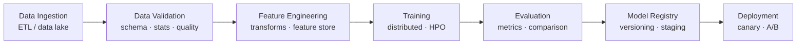
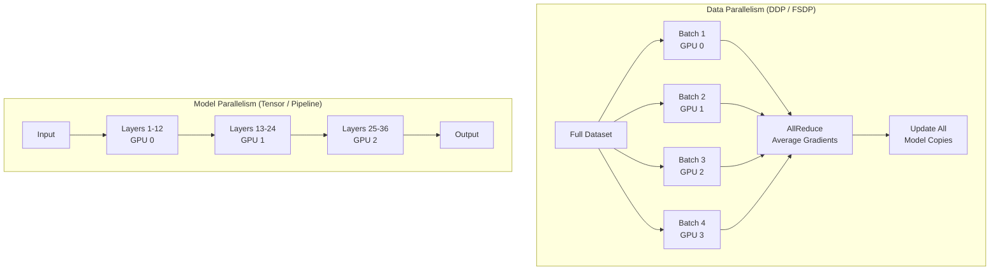
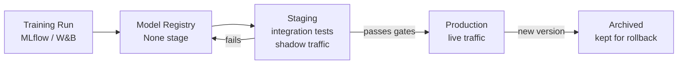
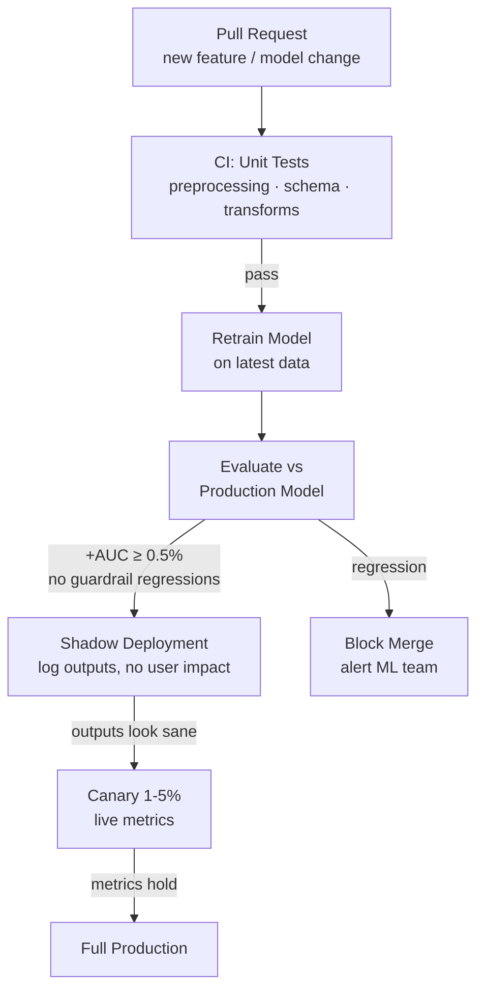

# Training Pipelines

End-to-end ML training infrastructure — from data ingestion to model registry, with orchestration and reproducibility.

---

## The Big Picture

> **Plain English:** A training pipeline is the automated assembly line that turns raw data into a production-ready model. Instead of running scripts manually on your laptop, a pipeline orchestrates every step — data validation, feature engineering, training, evaluation, and model registration — in a repeatable, monitored, and auditable way.

**Why pipelines over scripts:**

| Ad-hoc scripts | ML Pipeline |
|----------------|-------------|
| "Works on my machine" | Runs identically every time |
| Manual re-runs when data changes | Triggered automatically |
| No audit trail | Every run logged with inputs/outputs |
| Hard to reproduce results | Fully reproducible by design |
| Breaks silently | Failures are caught and alerted |

**The anatomy of a training pipeline:**



**When to retrain:**

| Trigger | Example | Action |
|---------|---------|--------|
| **Schedule** | Every Monday 2am | Retrain on latest week's data |
| **Data drift** | PSI > 0.2 on key features | Alert + trigger retrain |
| **Performance degradation** | Accuracy drops 3% vs baseline | Emergency retrain |
| **Data volume threshold** | 100K new labeled examples | Incremental retrain |
| **Code/model change** | New feature branch merged | CI/CD-triggered retrain |

---

## Pipeline Components

### Data Ingestion

> **Plain English:** Data ingestion is the first step — pulling data from wherever it lives (databases, data lakes, Kafka streams) and making it available for the pipeline. The key decision is batch vs streaming: do you need a fresh snapshot every hour, or do you process records as they arrive in real time?

```python
# Batch ingestion with Apache Spark
from pyspark.sql import SparkSession
from pyspark.sql.functions import col, to_timestamp

spark = SparkSession.builder.appName("training-ingestion").getOrCreate()

def ingest_training_data(
    source_path: str,
    start_date: str,
    end_date: str,
    output_path: str,
) -> int:
    """Load and partition training data for a date range."""
    df = (
        spark.read.parquet(source_path)
        .filter(
            (col("event_date") >= start_date) &
            (col("event_date") <= end_date)
        )
        .repartition(200)   # tune for cluster size
    )

    row_count = df.count()

    df.write.mode("overwrite").parquet(output_path)
    print(f"Ingested {row_count:,} rows → {output_path}")
    return row_count
```

### Data Validation

> **Plain English:** Before training, you validate that the data looks the way you expect. A bug in an upstream pipeline or schema change can silently poison your model. Data validation catches this early — before you waste hours training on garbage data.

```python
# Great Expectations for data validation
import great_expectations as gx
from great_expectations.core.batch import RuntimeBatchRequest

context = gx.get_context()

# Define expectations (usually created interactively, then version-controlled)
suite = context.add_expectation_suite("training_data_suite")

validator = context.get_validator(
    batch_request=RuntimeBatchRequest(
        datasource_name="spark_datasource",
        data_connector_name="runtime_connector",
        data_asset_name="training_df",
        runtime_parameters={"batch_data": df},
        batch_identifiers={"run_id": "2024-01-15"},
    ),
    expectation_suite_name="training_data_suite",
)

# Define rules
validator.expect_column_to_exist("user_id")
validator.expect_column_values_to_not_be_null("user_id", mostly=0.99)
validator.expect_column_values_to_be_between("age", min_value=0, max_value=120)
validator.expect_column_values_to_be_in_set("country", {"US", "UK", "CA", "AU"})
validator.expect_column_mean_to_be_between("purchase_amount", min_value=10, max_value=500)

# Run validation
results = validator.validate()
if not results.success:
    failed = [r for r in results.results if not r.success]
    raise ValueError(f"Data validation failed: {len(failed)} checks failed\n"
                     + "\n".join(str(r.expectation_config) for r in failed))

print(f"Validation passed: {len(results.results)} checks")
```

**Key validations to always include:**

| Check | What It Catches |
|-------|----------------|
| Schema validation | Column added/removed/renamed upstream |
| Null rate per column | Pipeline failures causing missing data |
| Value range checks | Data entry errors, unit changes |
| Row count vs previous run | Unexpected data loss or explosion |
| Distribution checks (PSI) | Silent data drift before training |
| Referential integrity | Foreign key mismatches between tables |

### Distributed Training

> **Plain English:** When your model or dataset is too large for one GPU, you need distributed training — splitting the work across multiple GPUs or machines. The two main strategies are data parallelism (each GPU trains on a different batch, gradients are averaged) and model parallelism (the model itself is split across GPUs because it doesn't fit in one).



```python
# PyTorch Distributed Data Parallel (DDP) — most common approach
import torch
import torch.distributed as dist
from torch.nn.parallel import DistributedDataParallel as DDP
from torch.utils.data.distributed import DistributedSampler

def train_ddp(rank: int, world_size: int, model, dataset, config):
    """Training function called on each process."""
    # Initialize process group
    dist.init_process_group(
        backend="nccl",   # NCCL for GPU, gloo for CPU
        rank=rank,
        world_size=world_size,
    )

    # Move model to this process's GPU and wrap with DDP
    torch.cuda.set_device(rank)
    model = model.to(rank)
    model = DDP(model, device_ids=[rank])

    # Distributed sampler ensures each GPU sees different data
    sampler = DistributedSampler(dataset, num_replicas=world_size, rank=rank)
    loader = torch.utils.data.DataLoader(
        dataset, batch_size=config.batch_size, sampler=sampler
    )

    optimizer = torch.optim.AdamW(model.parameters(), lr=config.lr)

    for epoch in range(config.epochs):
        sampler.set_epoch(epoch)   # shuffle per epoch
        for batch in loader:
            outputs = model(batch["input_ids"].to(rank))
            loss = outputs.loss
            loss.backward()
            optimizer.step()
            optimizer.zero_grad()

        # Only rank 0 saves checkpoints
        if rank == 0:
            save_checkpoint(model.module, epoch, config)

    dist.destroy_process_group()

# Launch with torchrun
# torchrun --nproc_per_node=4 train.py
```

**Parallelism strategies by model size:**

| Model Size | Strategy | Tool |
|------------|----------|------|
| Fits on 1 GPU | Single GPU | vanilla PyTorch |
| Fits on 1 node | Data Parallel | DDP (`torch.distributed`) |
| Very large (>10B params) | Sharded Data Parallel | FSDP, DeepSpeed ZeRO-3 |
| Transformer layers too big | Tensor Parallelism | Megatron-LM, tensor_parallel |
| Sequential bottleneck | Pipeline Parallelism | GPipe, PipeDream |

```python
# FSDP (Fully Sharded Data Parallel) — for very large models
from torch.distributed.fsdp import FullyShardedDataParallel as FSDP
from torch.distributed.fsdp.fully_sharded_data_parallel import (
    CPUOffload, BackwardPrefetch, MixedPrecision
)
import torch

# Mixed precision policy
mp_policy = MixedPrecision(
    param_dtype=torch.bfloat16,
    reduce_dtype=torch.float32,
    buffer_dtype=torch.bfloat16,
)

model = FSDP(
    model,
    mixed_precision=mp_policy,
    cpu_offload=CPUOffload(offload_params=False),  # True to offload to CPU RAM
    backward_prefetch=BackwardPrefetch.BACKWARD_PRE,
)
```

---

## Hyperparameter Tuning

> **Plain English:** Hyperparameters are settings you choose before training (learning rate, number of layers, batch size). Finding the best combination is hyperparameter optimization (HPO). Grid search checks every combination exhaustively — too slow for many parameters. Bayesian optimization is smarter: it builds a model of which hyperparameters are likely to work well and focuses the search there.

```python
# Optuna: Bayesian hyperparameter optimization
import optuna
import torch

def objective(trial: optuna.Trial) -> float:
    """Define the search space and evaluate one configuration."""
    # Suggest hyperparameter values
    lr          = trial.suggest_float("lr", 1e-5, 1e-2, log=True)
    batch_size  = trial.suggest_categorical("batch_size", [16, 32, 64, 128])
    dropout     = trial.suggest_float("dropout", 0.0, 0.5)
    num_layers  = trial.suggest_int("num_layers", 2, 8)
    weight_decay = trial.suggest_float("weight_decay", 1e-6, 1e-2, log=True)

    # Build and train model with these hyperparameters
    model = build_model(num_layers=num_layers, dropout=dropout)
    val_loss = train_and_evaluate(model, lr=lr, batch_size=batch_size,
                                   weight_decay=weight_decay, epochs=10)

    return val_loss  # Optuna minimizes this

# Create study with pruning (stop bad trials early)
study = optuna.create_study(
    direction="minimize",
    pruner=optuna.pruners.MedianPruner(n_startup_trials=5, n_warmup_steps=10),
    sampler=optuna.samplers.TPESampler(seed=42),  # Bayesian TPE sampler
)
study.optimize(objective, n_trials=100, n_jobs=4)  # parallel trials

print(f"Best params: {study.best_params}")
print(f"Best val loss: {study.best_value:.4f}")

# Visualize
fig = optuna.visualization.plot_optimization_history(study)
fig = optuna.visualization.plot_param_importances(study)
```

**HPO strategies compared:**

| Strategy | Trials | When to Use |
|----------|--------|-------------|
| **Grid search** | All combinations | ≤ 3 params with few values |
| **Random search** | N random samples | > 3 params, good baseline |
| **Bayesian (TPE/GP)** | Sequential, informed | Most cases — best efficiency |
| **Hyperband / ASHA** | Many trials with early stopping | When evaluation is expensive |
| **Population-Based Training** | Evolves configs during training | LLM fine-tuning, RL |

---

## Experiment Tracking

> **Plain English:** Experiment tracking is like a lab notebook for ML. Every training run logs what you tried (hyperparameters, code version, data version) and what you got (metrics, loss curves, model artifacts). Without it, two weeks later you won't remember which run produced your best model or what settings you used.

### MLflow

```python
import mlflow
import mlflow.pytorch

# Set experiment (creates if doesn't exist)
mlflow.set_experiment("recommendation-model-v2")

with mlflow.start_run(run_name="lr-0.001-dropout-0.3") as run:
    # Log parameters
    mlflow.log_params({
        "learning_rate": 0.001,
        "batch_size": 64,
        "dropout": 0.3,
        "epochs": 20,
        "model_arch": "transformer",
        "data_version": "delta_v42",
        "git_commit": subprocess.check_output(["git", "rev-parse", "HEAD"]).decode().strip(),
    })

    for epoch in range(20):
        train_loss, val_loss, val_auc = train_epoch(model, ...)

        # Log metrics per step
        mlflow.log_metrics({
            "train_loss": train_loss,
            "val_loss": val_loss,
            "val_auc": val_auc,
        }, step=epoch)

    # Log model artifact
    mlflow.pytorch.log_model(
        model,
        artifact_path="model",
        registered_model_name="recommender",
        input_example=sample_input,
    )

    # Log any other artifacts
    mlflow.log_artifact("feature_importance.png")
    mlflow.log_artifact("confusion_matrix.csv")

    print(f"Run ID: {run.info.run_id}")

# Query runs programmatically
client = mlflow.MlflowClient()
runs = client.search_runs(
    experiment_ids=["1"],
    filter_string="metrics.val_auc > 0.85",
    order_by=["metrics.val_auc DESC"],
    max_results=5,
)
```

### Weights & Biases

```python
import wandb

# Initialize run
run = wandb.init(
    project="recommendation-model",
    name="lr-0.001-dropout-0.3",
    config={
        "learning_rate": 0.001,
        "batch_size": 64,
        "dropout": 0.3,
        "architecture": "transformer",
    },
    tags=["v2", "production-candidate"],
)

for epoch in range(config.epochs):
    train_loss, val_loss = train_epoch(...)

    wandb.log({
        "train/loss": train_loss,
        "val/loss": val_loss,
        "epoch": epoch,
        "learning_rate": scheduler.get_last_lr()[0],
    })

# Save model as artifact
artifact = wandb.Artifact("recommender-model", type="model")
artifact.add_file("model.pt")
run.log_artifact(artifact)

wandb.finish()
```

**MLflow vs W&B:**

| Feature | MLflow | Weights & Biases |
|---------|--------|-----------------|
| **Hosting** | Self-hosted or Databricks | Managed SaaS (free tier available) |
| **Model registry** | Built-in | Built-in |
| **Visualization** | Basic | Rich — parallel coordinates, custom charts |
| **Collaboration** | Limited | Team-first — comments, reports |
| **Sweeps (HPO)** | External (Optuna) | Built-in sweep agents |
| **Artifacts** | File-based | Dataset/model versioning |
| **Cost** | Free (self-hosted) | Free tier → paid for teams |
| **Best for** | Databricks users, self-hosted | Teams, visualization-heavy workflows |

---

## Orchestration

> **Plain English:** Orchestration tools are the "project managers" of your pipeline. They define which step runs first, handle dependencies (step B can't run until step A finishes), retry failures, and give you a visual dashboard of what's running. Without orchestration, a human has to manually kick off each step and babysit the process.

### Kubeflow Pipelines

```python
from kfp import dsl, compiler
from kfp.dsl import Dataset, Model, Output, Input

@dsl.component(base_image="python:3.11", packages_to_install=["pandas", "scikit-learn"])
def validate_data(
    raw_data: Input[Dataset],
    validated_data: Output[Dataset],
    min_rows: int = 10000,
):
    import pandas as pd
    df = pd.read_parquet(raw_data.path)
    assert len(df) >= min_rows, f"Too few rows: {len(df)}"
    df.to_parquet(validated_data.path, index=False)

@dsl.component(base_image="pytorch/pytorch:2.1.0-cuda11.8-cudnn8-runtime")
def train_model(
    training_data: Input[Dataset],
    model_output: Output[Model],
    learning_rate: float = 0.001,
    epochs: int = 10,
):
    # Training logic here
    torch.save(model.state_dict(), model_output.path)

@dsl.pipeline(name="ml-training-pipeline", description="End-to-end training pipeline")
def training_pipeline(
    data_path: str,
    learning_rate: float = 0.001,
    epochs: int = 10,
):
    ingest_task   = ingest_data(source_path=data_path)
    validate_task = validate_data(raw_data=ingest_task.outputs["output_data"])
    train_task    = train_model(
        training_data=validate_task.outputs["validated_data"],
        learning_rate=learning_rate,
        epochs=epochs,
    ).set_accelerator_type("nvidia.com/gpu").set_gpu_limit(1)

# Compile and submit
compiler.Compiler().compile(training_pipeline, "pipeline.yaml")
```

### Apache Airflow

```python
from airflow import DAG
from airflow.operators.python import PythonOperator
from airflow.providers.cncf.kubernetes.operators.pod import KubernetesPodOperator
from datetime import datetime, timedelta

with DAG(
    "ml_training_pipeline",
    default_args={
        "owner": "ml-team",
        "retries": 2,
        "retry_delay": timedelta(minutes=5),
        "on_failure_callback": alert_slack,
    },
    schedule_interval="0 2 * * 1",   # every Monday at 2am
    start_date=datetime(2024, 1, 1),
    catchup=False,
    tags=["ml", "training"],
) as dag:

    validate = PythonOperator(
        task_id="validate_data",
        python_callable=run_data_validation,
        op_kwargs={"data_path": "s3://bucket/features/", "date": "{{ ds }}"},
    )

    train = KubernetesPodOperator(
        task_id="train_model",
        image="my-registry/ml-training:latest",
        cmds=["python", "train.py"],
        arguments=["--date", "{{ ds }}", "--lr", "0.001"],
        resources={"limit": {"nvidia.com/gpu": "1"}},
        node_selector={"cloud.google.com/gke-accelerator": "nvidia-tesla-a100"},
    )

    evaluate = PythonOperator(
        task_id="evaluate_model",
        python_callable=run_evaluation,
    )

    register = PythonOperator(
        task_id="register_model",
        python_callable=register_to_mlflow,
    )

    validate >> train >> evaluate >> register
```

---

## Model Registry

> **Plain English:** The model registry is the official catalog of your trained models. It tracks every version, what data and code produced it, its evaluation metrics, and its current lifecycle stage (Staging → Production → Archived). Think of it as Git + approval workflow for models.



```python
import mlflow
from mlflow.tracking import MlflowClient

client = MlflowClient()

# Register a model from a training run
model_uri = f"runs:/{run_id}/model"
model_version = mlflow.register_model(
    model_uri=model_uri,
    name="recommender",
)
print(f"Registered version {model_version.version}")

# Transition through lifecycle stages
client.transition_model_version_stage(
    name="recommender",
    version=model_version.version,
    stage="Staging",
    archive_existing_versions=False,
)

# Add tags and description
client.update_model_version(
    name="recommender",
    version=model_version.version,
    description="Trained on 2024-01-15 data, +3.2% AUC vs v12",
)
client.set_model_version_tag(
    name="recommender",
    version=model_version.version,
    key="data_version",
    value="delta_v42",
)

# Load the production model in serving
model = mlflow.pytorch.load_model("models:/recommender/Production")

# Compare versions
versions = client.search_model_versions("name='recommender'")
for v in versions:
    run = client.get_run(v.run_id)
    print(f"v{v.version} | stage={v.current_stage} | AUC={run.data.metrics.get('val_auc', 'N/A'):.4f}")
```

---

## CI/CD for ML

> **Plain English:** CI/CD for ML means that when you push new training code, an automated system runs your pipeline, validates the new model against the old one, and only promotes it to production if it's actually better. This prevents accidentally shipping a regression.



```python
# Model comparison gate — blocks promotion if new model is worse
def model_comparison_gate(
    new_model_run_id: str,
    production_model_name: str,
    primary_metric: str = "val_auc",
    min_improvement: float = 0.005,    # 0.5% minimum lift to justify promotion
    guardrail_metrics: dict = None,    # must not regress
) -> bool:
    """Return True if new model should be promoted."""
    client = MlflowClient()

    # Get production model metrics
    prod_versions = client.get_latest_versions(production_model_name, stages=["Production"])
    if not prod_versions:
        return True   # no production model yet, always promote

    prod_run = client.get_run(prod_versions[0].run_id)
    prod_metrics = prod_run.data.metrics

    # Get new model metrics
    new_run = client.get_run(new_model_run_id)
    new_metrics = new_run.data.metrics

    # Check primary metric
    prod_score = prod_metrics.get(primary_metric, 0)
    new_score  = new_metrics.get(primary_metric, 0)
    improvement = new_score - prod_score

    print(f"{primary_metric}: prod={prod_score:.4f} new={new_score:.4f} delta={improvement:+.4f}")

    if improvement < min_improvement:
        print(f"FAIL: improvement {improvement:.4f} < threshold {min_improvement}")
        return False

    # Check guardrail metrics
    guardrail_metrics = guardrail_metrics or {"val_loss": 0.05}  # max allowed regression
    for metric, max_regression in guardrail_metrics.items():
        prod_val = prod_metrics.get(metric, float("inf"))
        new_val  = new_metrics.get(metric, float("inf"))
        regression = new_val - prod_val
        if regression > max_regression:
            print(f"GUARDRAIL FAIL: {metric} regressed by {regression:.4f} (max {max_regression})")
            return False

    print("Gate passed — new model is better")
    return True
```

---

## Common Interview Questions

**Q1: How would you design a retraining pipeline that triggers on data drift?**
The pipeline needs a drift detection layer that continuously compares incoming serving data against the training distribution. Concretely: (1) log all incoming feature vectors (sampled, say 10%) to a monitoring store; (2) run a drift detection job hourly/daily using statistical tests (KS test for continuous, Chi-squared for categorical, PSI for both); (3) if any critical feature's PSI exceeds 0.2 or the prediction distribution shifts significantly, trigger a pipeline run via your orchestration tool (Airflow, Kubeflow); (4) the pipeline retrains on the latest data window, validates the model with automated comparison gates, and promotes to staging if it passes. Crucially, also set a maximum retrain interval (e.g., weekly) regardless of drift — models degrade over time even without detectable drift.

**Q2: MLflow vs Weights & Biases — tradeoffs?**
MLflow is open-source and self-hosted, making it free at any scale and suitable for organizations with strict data residency requirements. It integrates natively with Databricks and has a solid model registry. Weaknesses: the UI is basic, collaboration features are limited, and you own the infrastructure. W&B is a managed SaaS with a far richer UI — sweep (HPO) management, parallel coordinates visualization, team reports, and annotations on training runs. It's the default choice for research and teams that prioritize visibility and velocity. The free tier supports small teams. Choose MLflow when you need self-hosting or Databricks integration; choose W&B when team collaboration and rich visualization matter more than operational control.

**Q3: How do you ensure reproducibility in ML training?**
Full reproducibility requires pinning four things: (1) code — git commit hash stored alongside every run; (2) data — Delta table version or DVC hash logged as a run parameter; (3) configuration — all hyperparameters, feature lists, and preprocessing configs logged as experiment parameters; (4) environment — Docker image tag or conda environment YAML captured as an artifact. Additionally: set all random seeds (`torch.manual_seed`, `numpy.random.seed`, `random.seed`, and `PYTHONHASHSEED` env var); use deterministic CUDA operations (`torch.use_deterministic_algorithms(True)`); log the hardware type (GPU model) since numerics can differ between GPU architectures. Store the complete manifest in your experiment tracker so you can reproduce any run by checking out the git commit, pulling the data version, and running with the logged config.

**Q4: How do you handle failed training runs in production pipelines?**
Three layers of handling: (1) **automatic retries** — most orchestrators (Airflow, Kubeflow) support configurable retry counts with backoff; transient failures (preempted spot instance, network blip) often resolve on retry; (2) **checkpointing** — save model state every N epochs so a failed run restarts from the last checkpoint rather than from scratch; critical for multi-day training runs; (3) **alerting and triage** — failures that exhaust retries should page the on-call ML engineer via PagerDuty/Slack with the run ID and error log. Maintain a runbook for common failure modes: OOM errors (reduce batch size or increase gradient accumulation), data validation failures (investigate upstream pipeline), evaluation failures (check for NaN in loss, gradient explosion). Never silently discard a failed run — every failure is logged with its full stack trace in the experiment tracker.

**Q5: Explain the difference between shadow and canary deployments for ML models.**
Shadow deployment runs the new model in parallel with the production model. Every request is served by the production model (users see production outputs only), but the new model also processes the request and its output is logged for comparison. Zero user impact — you can validate output quality, latency, and error rates at full production load before any user sees the new model. Use it to catch bugs, distribution differences, and latency regressions. Canary deployment routes a small fraction (1-5%) of live traffic to the new model, and real users see its outputs. This gives you real feedback on business metrics (conversion, engagement) that shadow mode can't provide. The sequence: shadow first (validate correctness) → canary (validate live metrics) → A/B test (statistically validate lift) → full rollout.
