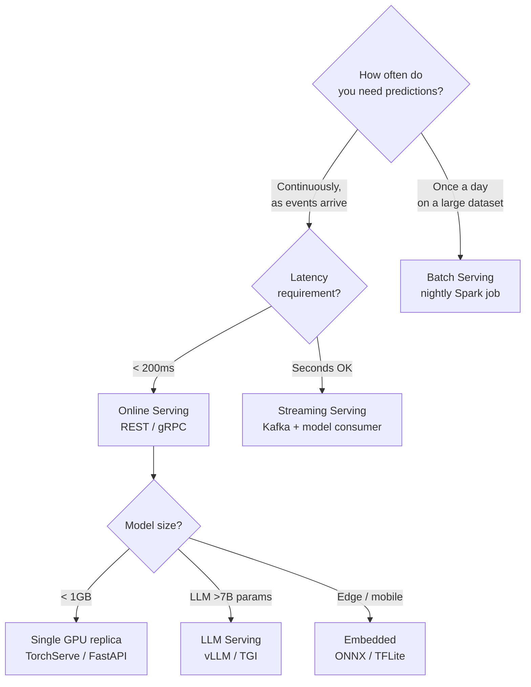
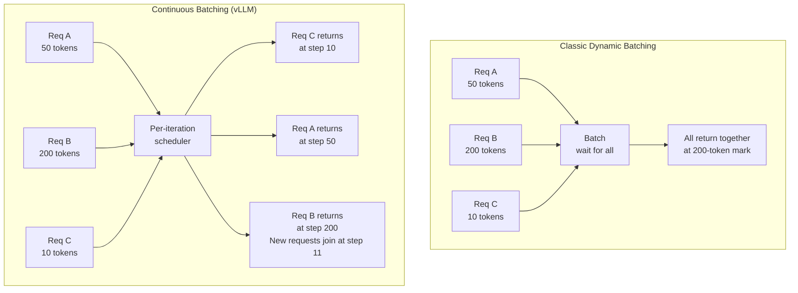
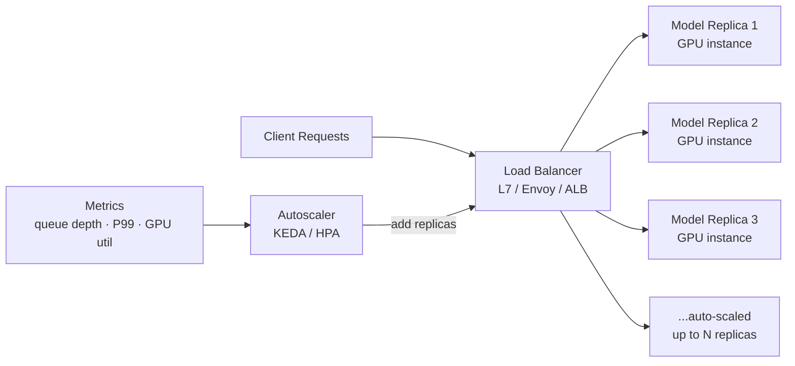
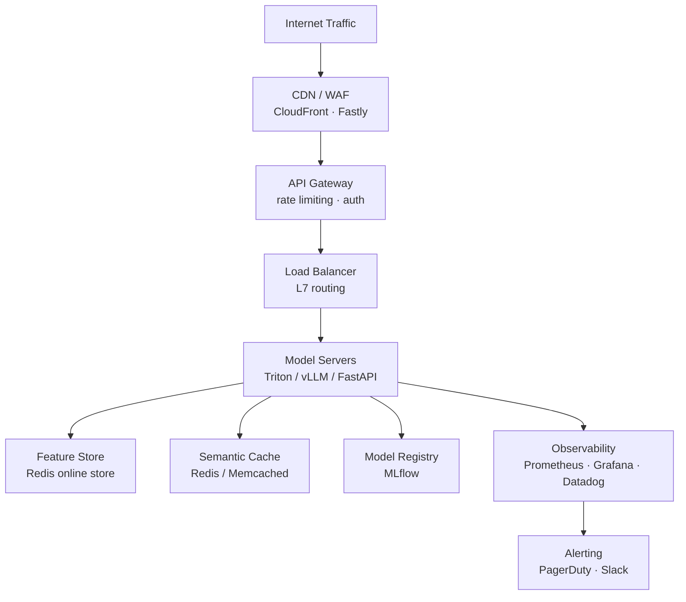

# Model Serving

Deploying ML models to production — serving architectures, latency optimization, and scaling strategies.

---

## The Big Picture

> **Plain English:** Model serving is the infrastructure that takes a trained model and makes it available to answer real user requests. It's the difference between a model that works in a Jupyter notebook and one that handles millions of requests per day with 99.9% uptime. The challenges are latency (users won't wait more than 200ms), throughput (handling many requests at once), and reliability (the service must stay up when traffic spikes or a GPU fails).

**The serving decision tree:**



**The four serving patterns at a glance:**

| Pattern | Latency | Throughput | Use Case |
|---------|---------|------------|----------|
| **Online (real-time)** | < 200ms | Medium | Fraud detection, recommendations, chatbots |
| **Batch** | Hours | Very high | Overnight scoring, report generation |
| **Streaming** | Seconds | High | Anomaly detection on event streams |
| **Embedded (edge)** | < 10ms | Varies | Mobile apps, IoT, offline-capable |

---

## Serving Architectures

### Online Serving

> **Plain English:** The most common pattern — a user's request arrives at an API endpoint, your model processes it, and the response is returned within milliseconds. The engineering challenge is keeping that latency low even as traffic grows.

```python
# FastAPI serving pattern — simple but production-capable
from fastapi import FastAPI, HTTPException
from pydantic import BaseModel
import torch
import time

app = FastAPI()

# Load model once at startup (not per request)
model = load_model("models:/recommender/Production")
model.eval()

class PredictionRequest(BaseModel):
    user_id: str
    candidate_item_ids: list[str]
    context: dict = {}

class PredictionResponse(BaseModel):
    ranked_items: list[str]
    scores: list[float]
    latency_ms: float

@app.post("/predict", response_model=PredictionResponse)
async def predict(request: PredictionRequest):
    start = time.perf_counter()
    try:
        # Fetch features from online store (<5ms)
        features = feature_store.get_online_features(
            user_id=request.user_id,
            item_ids=request.candidate_item_ids,
        )

        # Run model inference
        with torch.inference_mode():
            scores = model(features).cpu().numpy()

        # Rank items
        ranked_idx = scores.argsort()[::-1]
        ranked_items = [request.candidate_item_ids[i] for i in ranked_idx]

        latency_ms = (time.perf_counter() - start) * 1000
        return PredictionResponse(
            ranked_items=ranked_items,
            scores=scores[ranked_idx].tolist(),
            latency_ms=latency_ms,
        )
    except Exception as e:
        raise HTTPException(status_code=500, detail=str(e))

@app.get("/health")
async def health():
    return {"status": "ok", "model_version": model.version}
```

### Batch Serving

```python
# Spark batch scoring — millions of users in parallel
from pyspark.sql import SparkSession
from pyspark.sql.functions import pandas_udf
import pandas as pd
import torch

spark = SparkSession.builder.getOrCreate()

# Broadcast the model to all workers
model_broadcast = spark.sparkContext.broadcast(load_model("models:/recommender/Production"))

@pandas_udf("array<float>")
def score_users(user_features: pd.Series) -> pd.Series:
    """UDF applied to each partition — runs on executor GPUs."""
    model = model_broadcast.value
    model.eval()
    with torch.inference_mode():
        tensors = torch.tensor(user_features.tolist(), dtype=torch.float32)
        scores = model(tensors).cpu().numpy()
    return pd.Series(scores.tolist())

# Score all users
users_df = spark.table("user_features").filter("is_active = true")
predictions = users_df.withColumn("scores", score_users("feature_vector"))
predictions.write.mode("overwrite").parquet("s3://bucket/predictions/2024-01-15/")
```

### Streaming Serving

```python
# Kafka consumer that applies a model in real-time
from kafka import KafkaConsumer, KafkaProducer
import json
import torch

consumer = KafkaConsumer(
    "user-events",
    bootstrap_servers=["kafka:9092"],
    group_id="model-scorer",
    auto_offset_reset="latest",
    value_deserializer=lambda v: json.loads(v.decode("utf-8")),
)
producer = KafkaProducer(
    bootstrap_servers=["kafka:9092"],
    value_serializer=lambda v: json.dumps(v).encode("utf-8"),
)

model = load_model("models:/anomaly-detector/Production")
model.eval()

for message in consumer:
    event = message.value
    features = extract_features(event)

    with torch.inference_mode():
        score = model(features).item()

    if score > ANOMALY_THRESHOLD:
        producer.send("anomaly-alerts", {
            "user_id": event["user_id"],
            "event_id": event["event_id"],
            "anomaly_score": score,
            "timestamp": event["timestamp"],
        })
```

---

## LLM Serving

> **Plain English:** Serving large language models is fundamentally different from serving classical ML models. The key challenges are: (1) LLMs are huge (7B–70B+ parameters) and barely fit in GPU memory; (2) generation is sequential — you can't parallelize across tokens; (3) the KV-cache (memory of past tokens) grows with each token and can exhaust GPU memory if not managed carefully.

### vLLM and PagedAttention

> **Plain English:** The KV-cache problem: imagine a restaurant where every table has reserved seats for all their potential guests, even if only 2 out of 10 show up. Most of the GPU memory reserved for KV-cache is wasted because requests have different lengths. PagedAttention fixes this by managing KV-cache like virtual memory in an OS — dynamically allocating only what each request actually uses.

```python
# vLLM: production LLM serving
from vllm import LLM, SamplingParams

# Load model with vLLM (handles PagedAttention, continuous batching automatically)
llm = LLM(
    model="meta-llama/Llama-3-8B-Instruct",
    tensor_parallel_size=2,      # split across 2 GPUs
    gpu_memory_utilization=0.90, # use 90% of GPU memory for KV-cache
    max_model_len=8192,
    quantization="awq",          # 4-bit quantization for memory efficiency
)

sampling_params = SamplingParams(
    temperature=0.7,
    top_p=0.9,
    max_tokens=512,
)

# Continuous batching: vLLM automatically groups requests efficiently
prompts = [
    "Explain gradient descent in simple terms.",
    "Write a Python function to reverse a linked list.",
    "What is the capital of France?",
]
outputs = llm.generate(prompts, sampling_params)

for output in outputs:
    print(f"Prompt: {output.prompt[:50]}...")
    print(f"Response: {output.outputs[0].text[:100]}...")
    print(f"Tokens/sec: {output.metrics.generation_speed:.1f}")
```

### Continuous Batching vs Dynamic Batching

> **Plain English:** Classic batching waits for a group of requests to arrive, processes them together, and returns all responses at once. This is wasteful for LLMs — short requests finish early but must wait for slow requests to complete before the batch is released. Continuous batching (also called iteration-level scheduling) fixes this: finished requests leave the batch immediately and new ones join, keeping the GPU maximally utilized.



| Metric | Dynamic Batching | Continuous Batching |
|--------|-----------------|---------------------|
| GPU utilization | 40-60% | 80-95% |
| Short-request latency | Blocked by slow requests | Returns immediately |
| Throughput | Baseline | 2-5x higher |

---

## Latency Optimization

> **Plain English:** Every millisecond matters in online serving. Latency optimization is a layered problem — you can get gains at the model level (smaller model, quantized weights), the inference level (better batching, compiled kernels), and the systems level (caching, hardware choice).

### Model-Level Optimizations

```python
# 1. ONNX export for runtime-independent optimization
import torch
import onnx
import onnxruntime as ort

# Export PyTorch model to ONNX
dummy_input = torch.randn(1, 128, 768)   # batch × seq_len × hidden_dim
torch.onnx.export(
    model,
    dummy_input,
    "model.onnx",
    opset_version=17,
    input_names=["input"],
    output_names=["output"],
    dynamic_axes={
        "input":  {0: "batch_size", 1: "sequence_length"},
        "output": {0: "batch_size"},
    },
)

# Run with ONNX Runtime (faster than PyTorch on CPU, competitive on GPU)
sess = ort.InferenceSession(
    "model.onnx",
    providers=["CUDAExecutionProvider", "CPUExecutionProvider"],
)
output = sess.run(None, {"input": dummy_input.numpy()})

# 2. TorchScript compilation
scripted = torch.jit.script(model)
scripted.save("model_scripted.pt")
# Faster inference, no Python GIL overhead

# 3. torch.compile (PyTorch 2.x)
compiled_model = torch.compile(model, mode="max-autotune")
# JIT-compiles the model for specific input shapes → 20-50% speedup
```

### Quantization for Serving

```python
# INT8 dynamic quantization — no calibration data needed
import torch.quantization

model_int8 = torch.quantization.quantize_dynamic(
    model,
    qconfig_spec={torch.nn.Linear},
    dtype=torch.qint8,
)

# Compare
original_size = sum(p.nelement() * p.element_size() for p in model.parameters())
quantized_size = sum(p.nelement() * p.element_size() for p in model_int8.parameters())
print(f"Size reduction: {original_size/quantized_size:.1f}x")

# For LLMs: AWQ (Activation-Aware Weight Quantization) — best quality/speed tradeoff
# pip install autoawq
from awq import AutoAWQForCausalLM
from transformers import AutoTokenizer

model = AutoAWQForCausalLM.from_pretrained("meta-llama/Llama-3-8B")
tokenizer = AutoTokenizer.from_pretrained("meta-llama/Llama-3-8B")
quant_config = {"zero_point": True, "q_group_size": 128, "w_bit": 4, "version": "GEMM"}
model.quantize(tokenizer, quant_config=quant_config, calib_data=calibration_dataset)
model.save_quantized("llama-3-8b-awq")
```

### Caching

```python
# Semantic caching — return cached responses for similar queries
import hashlib
import redis
from sentence_transformers import SentenceTransformer
import numpy as np

class SemanticCache:
    def __init__(self, similarity_threshold: float = 0.95):
        self.redis = redis.Redis(host="localhost", port=6379)
        self.embedder = SentenceTransformer("all-MiniLM-L6-v2")
        self.threshold = similarity_threshold

    def _embed(self, text: str) -> np.ndarray:
        return self.embedder.encode(text, normalize_embeddings=True)

    def get(self, query: str) -> str | None:
        query_emb = self._embed(query)

        # Check all cached entries (in practice, use a vector DB for scale)
        for key in self.redis.scan_iter("cache:*"):
            entry = json.loads(self.redis.get(key))
            cached_emb = np.array(entry["embedding"])
            similarity = float(np.dot(query_emb, cached_emb))

            if similarity >= self.threshold:
                return entry["response"]
        return None

    def set(self, query: str, response: str, ttl_seconds: int = 3600):
        query_emb = self._embed(query)
        key = f"cache:{hashlib.md5(query.encode()).hexdigest()}"
        self.redis.setex(
            key, ttl_seconds,
            json.dumps({"query": query, "embedding": query_emb.tolist(), "response": response}),
        )

# In your serving handler
cache = SemanticCache(similarity_threshold=0.95)

def handle_request(query: str) -> str:
    if cached := cache.get(query):
        return cached   # < 5ms
    response = model.generate(query)   # 200-2000ms
    cache.set(query, response)
    return response
```

---

## Scaling

### Horizontal Scaling and Autoscaling



```yaml
# Kubernetes HPA for model serving
apiVersion: autoscaling/v2
kind: HorizontalPodAutoscaler
metadata:
  name: model-server-hpa
spec:
  scaleTargetRef:
    apiVersion: apps/v1
    kind: Deployment
    name: model-server
  minReplicas: 2
  maxReplicas: 20
  metrics:
    - type: Resource
      resource:
        name: cpu
        target:
          type: Utilization
          averageUtilization: 70
    - type: External
      external:
        metric:
          name: request_queue_depth     # custom metric from Prometheus
        target:
          type: AverageValue
          averageValue: "10"            # scale up when > 10 queued requests per pod
```

### Zero-Downtime Model Updates

```python
# Blue-green deployment pattern
# 1. Deploy new model version alongside old (blue = old, green = new)
# 2. Run smoke tests on green
# 3. Switch 100% traffic to green in one step
# 4. Keep blue running for 15 minutes for quick rollback

class ModelRouter:
    def __init__(self):
        self.blue_model  = load_model("models:/recommender/3")   # current production
        self.green_model = None
        self.green_fraction = 0.0   # 0 = all blue, 1.0 = all green

    def predict(self, request) -> dict:
        # Canary: gradually shift traffic to green
        if self.green_model and random.random() < self.green_fraction:
            return self.green_model.predict(request)
        return self.blue_model.predict(request)

    def load_new_version(self, model_uri: str):
        """Load new model without downtime."""
        self.green_model = load_model(model_uri)
        self.green_fraction = 0.0   # start at 0%

    def promote(self, fraction: float):
        """Gradually shift traffic: 0.01 → 0.1 → 0.5 → 1.0"""
        self.green_fraction = fraction

    def rollback(self):
        self.green_model = None
        self.green_fraction = 0.0
```

### Multi-Model Serving

> **Plain English:** Instead of running a separate server for each of your 50 models, multi-model serving loads multiple models on a single fleet of servers and routes each request to the right model. This drastically reduces idle GPU cost.

```python
# NVIDIA Triton: multi-model serving
# Repository structure:
# model_repository/
#   recommender/
#     config.pbtxt
#     1/model.plan      (TensorRT engine)
#   fraud-detector/
#     config.pbtxt
#     1/model.onnx
#   sentiment/
#     config.pbtxt
#     1/model.pt

import tritonclient.grpc as triton_grpc

client = triton_grpc.InferenceServerClient(url="localhost:8001")

# Route to specific model by name
inputs = [triton_grpc.InferInput("input_ids", [1, 128], "INT64")]
inputs[0].set_data_from_numpy(input_array)

response = client.infer(
    model_name="recommender",
    model_version="1",
    inputs=inputs,
    outputs=[triton_grpc.InferRequestedOutput("logits")],
)
logits = response.as_numpy("logits")
```

---

## Production Serving Stack



---

## Common Interview Questions

**Q1: How would you serve an LLM with <200ms latency?**
For a 7B parameter model, achieving <200ms on typical prompts requires: (1) quantization — use AWQ or GPTQ INT4 to reduce model size 4x and improve throughput; (2) continuous batching via vLLM or TGI — never let the GPU sit idle between requests; (3) speculative decoding — use a small draft model to propose tokens that the large model verifies in parallel, achieving 2-3x speedup with no quality loss; (4) KV-cache optimization — PagedAttention eliminates memory fragmentation and allows larger effective batch sizes; (5) hardware — use the fastest available GPU (H100 over A100); (6) set a max_tokens budget — unbounded generation will blow your p99 latency. For simpler/shorter prompts (QA, classification), you can often distill to a smaller model (1B-3B) that hits <50ms trivially.

**Q2: Dynamic batching vs continuous batching — explain the difference.**
Dynamic batching groups multiple incoming requests into a single batch and processes them together to improve GPU utilization. The batch is released when all items complete or a timeout is reached. The problem for LLMs: requests generate different numbers of tokens, so short requests finish early but must wait for the longest request in the batch before returning. Continuous batching (iteration-level scheduling) fixes this by making scheduling decisions at every decoding step. When a sequence finishes, its slot in the batch is immediately filled by a new request. This keeps GPU utilization near 100% and eliminates head-of-line blocking for short requests. Continuous batching is why vLLM achieves 2-5x higher throughput than naive implementations for LLM serving.

**Q3: How do you handle model updates with zero downtime?**
Blue-green deployment: (1) deploy the new model version (green) alongside the current production version (blue) — they run simultaneously; (2) run automated smoke tests against green (sample requests, correctness checks); (3) shift 1-5% canary traffic to green and monitor latency, error rate, and business metrics for 30 minutes; (4) if clean, do a fast cutover — update the load balancer weights to 100% green; (5) keep blue running for 15 minutes so you can instant-rollback by flipping weights back. For stateful serving (KV-cache for LLMs, conversation state), drain connections gracefully — stop sending new requests to blue, wait for in-flight to complete, then terminate. In Kubernetes, use a rolling update strategy with `maxUnavailable: 0` to ensure continuous availability during the transition.

**Q4: When would you use batch vs real-time serving?**
Use batch serving when: the prediction doesn't need to be immediate (overnight product recommendations, monthly churn scores, fraud post-hoc analysis), the dataset is large enough that batch efficiency matters (millions of records), or the model is too large/slow for real-time (daily runs of a huge model are fine). Use real-time serving when: the prediction must influence the current user interaction (fraud detection at transaction time, content ranking for the current session, personalized search results), or when the features are inherently real-time (current context, live prices). A hybrid pattern is common: precompute long-horizon features in batch (user's 30-day history), store in the online feature store, and combine with real-time features at serving time.

**Q5: How do you scale a model serving system for 10K requests/sec?**
Decompose the problem: at 10K RPS with 100ms P99 latency, each server needs to handle ~1000 concurrent requests. Steps: (1) profile a single replica's max throughput — say one A100 handles 200 RPS at P99 <100ms; that means you need ~50 replicas minimum; (2) add 2x headroom for traffic spikes → 100 replicas; (3) put a load balancer in front (ALB, Envoy) with least-connection routing to avoid hot replicas; (4) enable autoscaling keyed on request queue depth and P99 latency (not just CPU); (5) enable request batching to improve GPU utilization — dynamic batching groups multiple requests, doubling effective throughput; (6) add semantic caching in front of the model layer — if 20% of requests are cache hits, you reduce model load by 20%; (7) for LLMs specifically, continuous batching (vLLM) and INT4 quantization typically give 4-8x more throughput per GPU vs naive serving. Monitor: GPU utilization, queue depth, P50/P99 latency, and error rate per replica.
