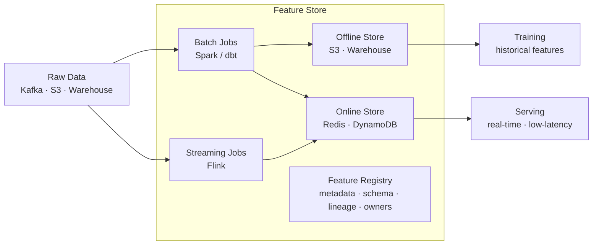
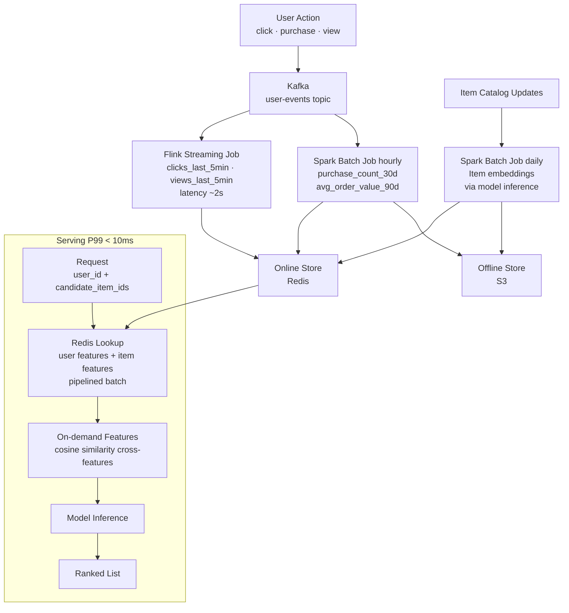

# Feature Stores

Centralized systems for managing, serving, and reusing ML features — bridging the gap between data engineering and model training/serving.

---

## The Big Picture

> **Plain English:** A feature store is a shared library of pre-computed ML features. Instead of every team recomputing "how many purchases did this user make in the last 30 days?" independently, you compute it once, store it, and let every model use it. The hard part isn't storing features — it's making sure the feature you use during training is *exactly identical* to the feature you compute in production when serving a live request. When they differ, it's called training-serving skew and it silently destroys model performance.

**The two problems feature stores solve:**

```
Problem 1: Feature reuse
  ❌ Team A computes "user_purchase_count_30d" for their model
  ❌ Team B computes "user_purchase_count_30d" slightly differently for theirs
  ❌ Both are slightly wrong in different ways, and nobody knows

  ✅ Feature store: compute it once, validate it, reuse it everywhere

Problem 2: Training-serving skew
  ❌ Training: computed from warehouse SQL on historical data
  ❌ Serving:  computed from live API calls with a different query
  ❌ Subtle difference (timezone, NULL handling, rounding) → model underperforms

  ✅ Feature store: same transformation code runs in both batch and streaming contexts
```

**The dual-store architecture:**



---

## Core Architecture

### Offline Store

> **Plain English:** The offline store is a warehouse or data lake that holds years of historical feature values. It's used at training time when you need millions of examples and don't care about millisecond latency — a query taking 30 seconds is fine.

- **Storage:** Amazon S3 + Parquet, BigQuery, Snowflake, Databricks Delta Lake
- **Latency:** Seconds to minutes (batch reads)
- **Use case:** Training data generation, batch scoring, backfills

```python
# Feast: retrieve historical features for training
from feast import FeatureStore
from datetime import datetime
import pandas as pd

store = FeatureStore(repo_path=".")

# Entity DataFrame: the "keys" + timestamps for which you want features
entity_df = pd.DataFrame({
    "user_id": ["user_001", "user_002", "user_003"],
    "event_timestamp": [
        datetime(2024, 1, 15, 10, 0, 0),
        datetime(2024, 1, 15, 11, 0, 0),
        datetime(2024, 1, 16, 9, 0, 0),
    ],
})

# Point-in-time correct join: fetches features as they were at event_timestamp
training_df = store.get_historical_features(
    entity_df=entity_df,
    features=[
        "user_stats:purchase_count_30d",
        "user_stats:avg_order_value_30d",
        "user_stats:days_since_last_purchase",
        "item_stats:view_count_7d",
        "item_stats:conversion_rate_30d",
    ],
).to_df()

print(training_df.head())
```

### Online Store

> **Plain English:** The online store is a key-value cache (usually Redis) that holds the *latest* value of each feature. When a user makes a request, the serving system queries the online store to get their features in milliseconds, then feeds them to the model for a prediction.

- **Storage:** Redis, DynamoDB, Bigtable, Cassandra
- **Latency:** 1–10ms (P99)
- **Use case:** Real-time model inference, online scoring

```python
# Feast: retrieve online features for serving
def get_prediction(user_id: str, item_id: str) -> dict:
    """Real-time serving using online feature store."""
    # Fetch features from online store (<10ms)
    feature_vector = store.get_online_features(
        features=[
            "user_stats:purchase_count_30d",
            "user_stats:avg_order_value_30d",
            "user_stats:days_since_last_purchase",
            "item_stats:view_count_7d",
            "item_stats:conversion_rate_30d",
        ],
        entity_rows=[{"user_id": user_id, "item_id": item_id}],
    ).to_dict()

    # Call model
    prediction = model.predict(feature_vector)
    return {"score": prediction, "features": feature_vector}
```

### Feature Registry

The central catalog of all features — their schemas, descriptions, owners, freshness requirements, and lineage. The registry is what prevents teams from duplicating work or computing the same feature differently.

```yaml
# feast: feature_repo/features.py
from feast import Entity, FeatureView, Field, FileSource
from feast.types import Float32, Int64, String
from datetime import timedelta

user = Entity(name="user_id", join_keys=["user_id"])

user_stats_source = FileSource(
    path="s3://bucket/features/user_stats.parquet",
    timestamp_field="event_timestamp",
)

user_stats_fv = FeatureView(
    name="user_stats",
    entities=[user],
    ttl=timedelta(days=90),          # how long features stay valid
    schema=[
        Field(name="purchase_count_30d",      dtype=Int64),
        Field(name="avg_order_value_30d",      dtype=Float32),
        Field(name="days_since_last_purchase", dtype=Int64),
    ],
    source=user_stats_source,
    tags={
        "team": "data-science",
        "owner": "alice@company.com",
        "description": "User purchase behavior over rolling 30-day window",
    },
)
```

---

## Feature Types

| Type | Latency | Computation | Example |
|------|---------|-------------|---------|
| **Batch features** | Precomputed (minutes to hours old) | Spark/SQL scheduled jobs | User's avg purchase last 30 days |
| **Streaming features** | Near real-time (seconds old) | Flink, Spark Streaming | Clicks in the last 5 minutes |
| **On-demand features** | Computed at request time | Function called at serving time | Distance to nearest store, current weather |
| **Precomputed embeddings** | Precomputed | Model inference batch job | User or item embedding vectors |

```python
# On-demand feature: computed at request time using request data + precomputed features
from feast import on_demand_feature_view
import pandas as pd

@on_demand_feature_view(
    sources=["user_location_fv"],  # precomputed features this depends on
    schema=[Field("distance_to_store_km", Float32)],
)
def user_distance_features(inputs: pd.DataFrame) -> pd.DataFrame:
    """Compute request-time features that depend on live inputs."""
    df = pd.DataFrame()
    df["distance_to_store_km"] = haversine(
        inputs["user_lat"], inputs["user_lon"],
        inputs["store_lat"], inputs["store_lon"],
    )
    return df
```

---

## Training-Serving Skew

> **Plain English:** Training-serving skew is one of the most insidious ML production bugs. Your model works great in testing but underperforms in production. The culprit: the features you used during training are computed slightly differently from the features you compute at serving time. It's like training a chef with metric measurements but then giving them imperial measuring cups in the restaurant.

### Common Sources of Skew

| Source | Training | Serving | Fix |
|--------|----------|---------|-----|
| **NULL handling** | `COALESCE(x, 0)` | `x if x else -1` | Same code for both |
| **Timestamp timezone** | UTC in SQL | Local time in API | Enforce UTC everywhere |
| **Aggregation window** | Rolling 30-day SQL | Last 30 purchases (count-based) | Align definitions |
| **Normalization** | Fit on training set | Recompute on serving request | Store scaler params |
| **Categorical encoding** | Training-time vocab | Different vocab at serving | Store vocab in feature store |
| **Feature freshness** | Up-to-date at query time | Stale cached value | Monitor freshness |

### Detecting Skew

```python
import pandas as pd
import numpy as np
from scipy import stats

def detect_training_serving_skew(
    training_features: pd.DataFrame,
    serving_features: pd.DataFrame,
    threshold_psi: float = 0.2,
) -> dict:
    """
    Compute Population Stability Index (PSI) between training and serving distributions.
    PSI < 0.1: no significant shift
    PSI 0.1-0.2: moderate shift, worth investigating
    PSI > 0.2: significant shift — potential skew
    """
    results = {}
    for col in training_features.columns:
        if training_features[col].dtype in [np.float64, np.float32, np.int64]:
            psi = _compute_psi(training_features[col], serving_features[col])
            results[col] = {
                "psi": psi,
                "skew_detected": psi > threshold_psi,
                "train_mean": training_features[col].mean(),
                "serve_mean": serving_features[col].mean(),
            }
    return results

def _compute_psi(expected: pd.Series, actual: pd.Series, buckets: int = 10) -> float:
    """Population Stability Index between two distributions."""
    # Create buckets based on expected distribution
    breakpoints = np.percentile(expected, np.linspace(0, 100, buckets + 1))
    breakpoints = np.unique(breakpoints)

    expected_counts = np.histogram(expected, bins=breakpoints)[0] / len(expected)
    actual_counts   = np.histogram(actual,   bins=breakpoints)[0] / len(actual)

    # Avoid log(0)
    expected_counts = np.where(expected_counts == 0, 0.0001, expected_counts)
    actual_counts   = np.where(actual_counts == 0, 0.0001, actual_counts)

    psi = np.sum((actual_counts - expected_counts) * np.log(actual_counts / expected_counts))
    return psi
```

---

## Point-in-Time Correct Joins

> **Plain English:** When building a training dataset, you often need to join events (e.g., "user clicked buy") with feature values (e.g., "user's 30-day purchase count"). The naive approach uses the *latest* feature value — but that's wrong. If the user clicked at 2pm and their purchase count at 2pm was 5, you can't use the value of 7 that they had by end of day. Point-in-time joins fix this.

### The Problem

```python
# WRONG: joins to latest feature value, leaks future data
events = pd.read_parquet("events.parquet")        # user_id, event_time, label
features = pd.read_parquet("user_features.parquet")  # user_id, feature_value (current)

training = events.merge(features, on="user_id")   # leaks future feature values!

# RIGHT: join to feature value as it existed at event_time
# (this is what feature stores do natively)
```

### How Feature Stores Handle It

```python
# Feast's get_historical_features automatically does point-in-time joins:
# For each row in entity_df (user_id + event_timestamp),
# it finds the most recent feature value BEFORE or AT event_timestamp.

# Internally, it performs an ASOF JOIN:
# SELECT e.user_id, e.event_timestamp, f.purchase_count_30d
# FROM events e
# ASOF JOIN features f
#   ON e.user_id = f.user_id
#   AND f.feature_timestamp <= e.event_timestamp   ← key constraint

training_df = store.get_historical_features(
    entity_df=entity_df,      # contains event timestamps
    features=["user_stats:purchase_count_30d"],
).to_df()
```

---

## Feature Store Tools

### Feast (Open Source)

```python
# feast/feature_store.yaml
project: my_ml_project
registry: s3://bucket/feast/registry.db
provider: aws
online_store:
    type: redis
    connection_string: "redis://localhost:6379"
offline_store:
    type: file   # or bigquery, redshift, snowflake
```

```bash
# Apply feature definitions to registry
feast apply

# Materialize features to online store (for the last 7 days of data)
feast materialize-incremental $(date -u +"%Y-%m-%dT%H:%M:%S")

# Run a UI to browse features
feast ui
```

**Pros:** Open source, flexible, works with any infrastructure, active community.
**Cons:** Operational overhead, you manage the infra, limited enterprise features.

### Tecton (Managed SaaS)

Tecton is the production-grade managed feature store built by the team that built Uber Michelangelo.

```python
from tecton import batch_feature_view, stream_feature_view, FilteredSource
from tecton.types import Field, Float64, Int64
from datetime import timedelta

@batch_feature_view(
    sources=[FilteredSource(transactions_batch)],
    entities=[user],
    mode="spark_sql",
    aggregation_interval=timedelta(days=1),
    batch_schedule=timedelta(days=1),
    ttl=timedelta(days=90),
    schema=[
        Field("purchase_count_30d", Int64),
        Field("total_spend_30d", Float64),
    ],
)
def user_purchase_features(transactions):
    return f"""
        SELECT
            user_id,
            COUNT(*) AS purchase_count_30d,
            SUM(amount) AS total_spend_30d
        FROM {transactions}
        WHERE transaction_date >= CURRENT_DATE - INTERVAL 30 DAYS
        GROUP BY user_id
    """
```

**Pros:** Fully managed, handles streaming natively, integrated monitoring, enterprise support.
**Cons:** Expensive, vendor lock-in.

### Comparison Table

| Tool | Type | Online Store | Offline Store | Streaming | Best For |
|------|------|-------------|---------------|-----------|----------|
| **Feast** | Open source | Redis, DynamoDB | File, BigQuery, Redshift | With Kafka connector | Lightweight, flexible infra |
| **Tecton** | Managed SaaS | Built-in | Built-in | First-class | Production-scale, enterprise |
| **Hopsworks** | Open/managed | Built-in (RonDB) | Built-in (Hudi) | Yes | Full ML platform |
| **SageMaker Feature Store** | AWS managed | Built-in | Built-in (S3) | Limited | AWS-native workflows |
| **Vertex AI Feature Store** | GCP managed | Built-in | BigQuery | Limited | GCP-native workflows |
| **Databricks Feature Store** | Platform | Built-in | Delta Lake | Via Structured Streaming | Databricks-native |

---

## Feature Engineering Best Practices

### Naming Conventions

Clear, consistent naming prevents the "what does this feature mean?" problem.

```
Pattern: {entity}__{feature_name}__{aggregation}__{window}

Examples:
  user__purchase_count__sum__30d
  user__avg_order_value__mean__90d
  item__view_count__sum__7d
  user_item__co_purchase_rate__ratio__30d

Anti-patterns:
  feature_1                  ← meaningless
  user_purchases             ← ambiguous (sum? count? last 7d? 30d?)
  userPurchaseCount30Days    ← inconsistent casing
```

### Feature Versioning

```python
# Version features explicitly when definitions change
user_purchase_v1 = FeatureView(
    name="user_purchase_v1",
    # original: simple count
    schema=[Field("purchase_count_30d", Int64)],
    ...
)

user_purchase_v2 = FeatureView(
    name="user_purchase_v2",
    # updated: exclude returns
    schema=[Field("net_purchase_count_30d", Int64)],
    ...
)

# Deprecate v1 after all models have migrated
# user_purchase_v1.tags = {"status": "deprecated", "sunset_date": "2024-06-01"}
```

### Feature Monitoring

```python
# Monitor feature freshness (is the online store being populated?)
from datetime import datetime, timedelta

def check_feature_freshness(store, feature_view_name: str, max_age_hours: int = 2) -> bool:
    """Alert if features haven't been updated recently."""
    fv = store.get_feature_view(feature_view_name)
    last_materialized = fv.materialization_intervals[-1].end_time

    age = datetime.utcnow() - last_materialized
    if age > timedelta(hours=max_age_hours):
        alert(f"Feature {feature_view_name} is {age} old — exceeds {max_age_hours}h threshold")
        return False
    return True

# Monitor feature distribution drift (is serving distribution shifting from training?)
def monitor_feature_distributions(feature_logs: pd.DataFrame, baseline: pd.DataFrame):
    skew = detect_training_serving_skew(baseline, feature_logs)
    for feature, result in skew.items():
        if result["skew_detected"]:
            alert(f"Feature {feature} PSI={result['psi']:.3f} — distribution shift detected")
```

---

## Designing a Feature Store for a Recommendation System

A common interview design problem. Here's a concrete reference architecture:



---

## Common Interview Questions

**Q1: What is training-serving skew and how do feature stores prevent it?**
Training-serving skew is when features are computed differently during training vs serving, causing the model to receive a different data distribution at inference time than it was trained on. Common causes: different SQL queries, NULL handling, timezone mismatches, or stale cached values. Feature stores prevent skew by: (1) using a single feature definition that generates both the offline (historical) and online (real-time) features through the same transformation logic; (2) the feature store materializes features to the online store by running the same transformation code that generated training data; (3) providing monitoring to detect distribution drift between training and serving feature values.

**Q2: Explain the online vs offline store architecture.**
The offline store (S3, BigQuery, warehouse) holds historical feature values for model training — it handles high-throughput batch reads and is used with point-in-time correct joins to build training datasets. Latency is seconds to minutes, which is fine for training. The online store (Redis, DynamoDB) holds only the *latest* feature values for real-time serving, optimized for sub-10ms key lookups. Both stores are populated from the same transformation logic — batch jobs write to both, streaming jobs write to the online store for near-real-time freshness. The "dual write" architecture ensures training and serving use the same feature values.

**Q3: How do you handle point-in-time correctness?**
Point-in-time correctness means joining training labels to the feature values that existed *at the time of the label event*, not the latest values. Naive joins use current feature values and leak future information (data leakage). Feature stores handle this via ASOF joins: for each training example with timestamp T, find the most recent feature value with a timestamp ≤ T. In Feast, `get_historical_features()` does this automatically. In SQL, you implement it as: `SELECT ... FROM events e LEFT JOIN features f ON f.entity_id = e.entity_id AND f.feature_ts = (SELECT MAX(fs.feature_ts) FROM features fs WHERE fs.entity_id = e.entity_id AND fs.feature_ts <= e.event_ts)`.

**Q4: Feast vs Tecton — tradeoffs?**
Feast is open source, free, and flexible — you bring your own infrastructure (Redis for online, any cloud for offline). It's great for teams with infra expertise who want to avoid vendor lock-in. Weaknesses: no native streaming support (requires custom connectors), limited monitoring, significant operational overhead. Tecton is a managed SaaS — it handles infrastructure, provides first-class streaming features, integrated monitoring, and enterprise support. It scales to very high throughput without manual ops. Weaknesses: expensive, vendor lock-in, less flexibility. Choose Feast for cost-sensitive or infrastructure-savvy teams; choose Tecton for teams that need production-grade features fast without operational investment.

**Q5: How would you design a feature store for a recommendation system?**
The key requirements are: (1) freshness — user behavior features need to be near-real-time (clicks in last 5 minutes); (2) scale — millions of users/items with sub-10ms serving latency; (3) point-in-time correctness for training. Architecture: (a) streaming pipeline (Flink/Spark Streaming) computes real-time features (recent clicks, views) and writes to Redis with a TTL; (b) batch pipeline (Spark, runs hourly/daily) computes historical aggregations (30-day purchase count) and materializes to both S3 (for training) and Redis (for serving); (c) item embeddings precomputed nightly via batch inference and stored in Redis; (d) at serving time, pipeline the Redis lookups for user + N candidate items, then call the ranking model; (e) monitor feature freshness and PSI drift with alerting.

**Q6: What is feature freshness and how do you monitor it?**
Feature freshness is how recently a feature was computed relative to the current time. A "days since last purchase" feature is stale if it was computed 3 days ago — its value is now off by 3 days. Staleness matters most for real-time signals (recent clicks, recent views) where values change rapidly. Monitoring: (1) track the timestamp of the latest materialization for each feature view and alert if it exceeds a threshold (e.g., user activity features must be refreshed every 2 hours); (2) monitor the distribution of feature ages in the online store — if a large fraction of keys haven't been updated in 24 hours, the materialization pipeline may have failed; (3) set TTLs in Redis that expire stale keys so the model receives a NULL/default rather than a stale value — this makes the problem visible rather than silently wrong.
