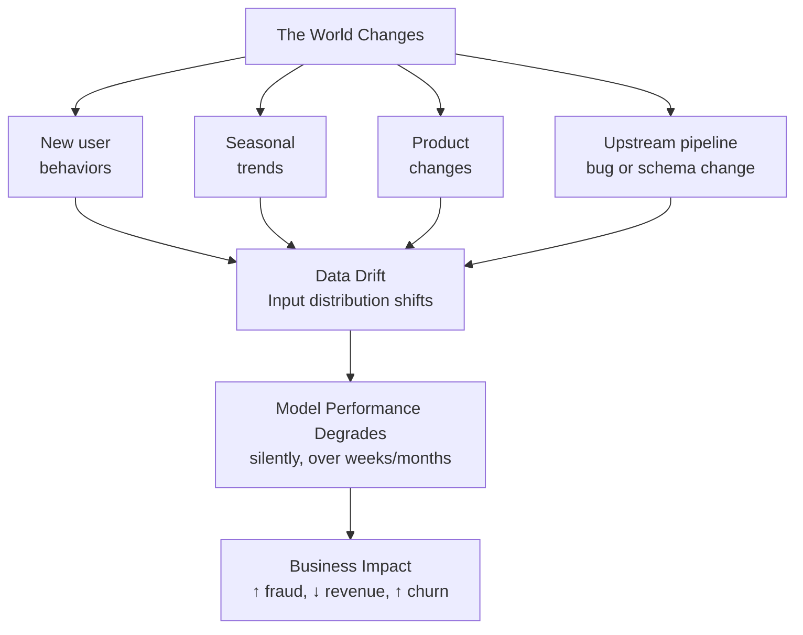
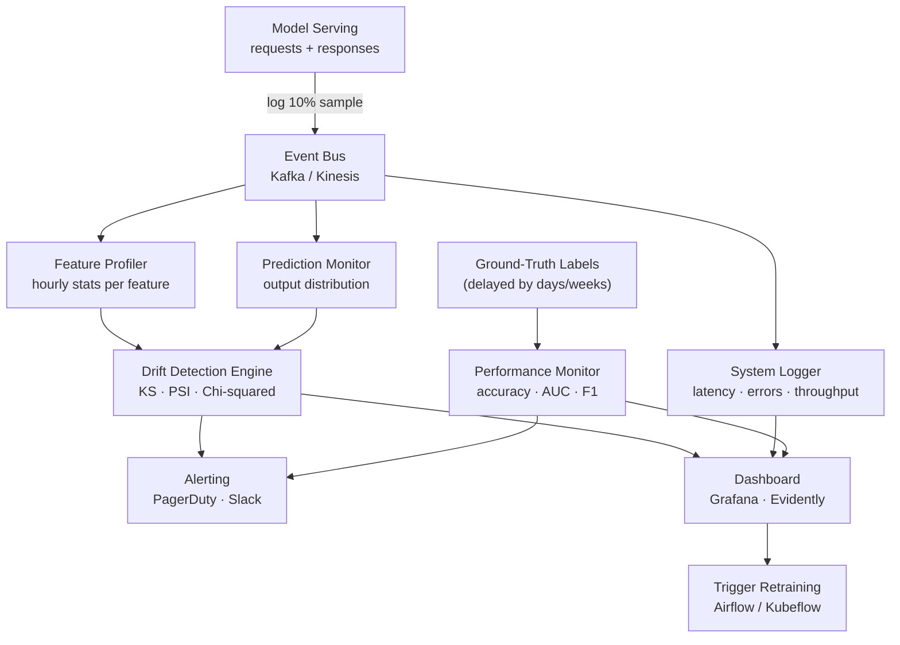
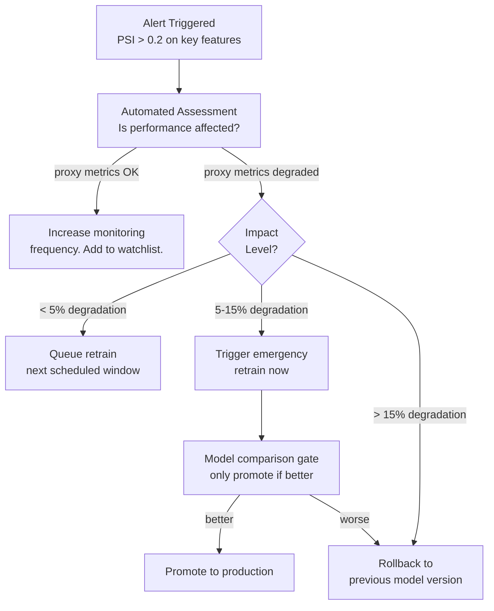

# ML Monitoring

Detecting data drift, model degradation, and system issues in production — keeping models reliable after deployment.

---

## The Big Picture

> **Plain English:** A model that works great when you deploy it will gradually get worse over time. The world changes — user behavior shifts, data pipelines get updated, new types of requests arrive that the model has never seen. ML monitoring is the system that catches this degradation before it causes a business problem. Without it, you only find out your model broke when a user complains or a revenue metric tanks.

**Why models degrade in production:**



**The monitoring pyramid — from system to business:**

| Layer | What You Monitor | Tools | Latency of Signal |
|-------|-----------------|-------|-------------------|
| **Infrastructure** | GPU util, latency, error rate | Prometheus, Datadog | Real-time |
| **Data quality** | Nulls, schema, value ranges | Great Expectations, Evidently | Minutes |
| **Feature drift** | Distribution shift per feature | Evidently, WhyLabs | Hours |
| **Prediction drift** | Output distribution shift | Custom, Arize | Hours |
| **Model performance** | Accuracy vs ground truth | Custom, Fiddler | Days (label delay) |
| **Business metrics** | Revenue, conversion, churn | Dashboards, A/B | Days |

---

## Types of Drift

> **Plain English:** "Drift" is the umbrella term for "the data looks different than it did when you trained the model." There are several distinct kinds, and they have different causes and remedies.

### Data Drift (Covariate Shift)

The distribution of input features $P(X)$ changes, but the relationship between inputs and outputs $P(Y|X)$ stays the same.

**Example:** A fraud detection model trained in summer. In December, purchase amounts and categories shift (holiday shopping). The model's features look different even though the definition of fraud hasn't changed.

**Detection:** Statistical tests comparing reference (training) distribution to serving distribution.

### Concept Drift

The relationship between inputs and outputs $P(Y|X)$ changes — the model's "world model" becomes stale.

**Example:** A loan approval model trained pre-COVID. Post-COVID, creditworthiness signals that used to predict defaults no longer do (job stability means something different in a pandemic economy).

**Detection:** Requires ground-truth labels, so detection is delayed. Monitor proxy metrics and model performance over time.

### Label Drift

The target variable distribution $P(Y)$ changes.

**Example:** Sentiment classification where positive/negative ratio in customer messages shifts dramatically after a product recall.

### Upstream Data Quality

Schema changes, pipeline failures, or data engineering bugs that silently corrupt the features arriving at the model.

**Example:** A join that used to produce one row per user now produces multiple rows (duplicates), causing features to be summed instead of averaged.

---

## Detection Methods

### Statistical Tests

> **Plain English:** To detect drift, you compare the distribution of features today against a reference distribution (usually your training data). Statistical tests quantify whether any observed difference could be due to random chance or represents a real shift.

```python
import numpy as np
from scipy import stats
from scipy.special import kl_div

def detect_drift(reference: np.ndarray, current: np.ndarray) -> dict:
    """Run a battery of drift detection tests on a single feature."""
    results = {}

    # 1. Kolmogorov-Smirnov test — for continuous features
    # Tests whether two samples come from the same distribution
    ks_stat, ks_pvalue = stats.ks_2samp(reference, current)
    results["ks_statistic"] = ks_stat
    results["ks_pvalue"] = ks_pvalue
    results["ks_drift"] = ks_pvalue < 0.05

    # 2. Population Stability Index (PSI) — industry standard in finance
    results["psi"] = compute_psi(reference, current)
    results["psi_drift"] = results["psi"] > 0.2

    # 3. Wasserstein distance — the "earth mover's" distance
    results["wasserstein"] = stats.wasserstein_distance(reference, current)

    # 4. Jensen-Shannon divergence (symmetric KL divergence)
    results["js_divergence"] = compute_js_divergence(reference, current)

    return results

def compute_psi(expected: np.ndarray, actual: np.ndarray, n_bins: int = 10) -> float:
    """Population Stability Index — most common in production monitoring."""
    # Bin using training distribution breakpoints
    breakpoints = np.percentile(expected, np.linspace(0, 100, n_bins + 1))
    breakpoints = np.unique(np.clip(breakpoints, -np.inf, np.inf))

    exp_counts = np.histogram(expected, bins=breakpoints)[0] / len(expected)
    act_counts = np.histogram(actual,   bins=breakpoints)[0] / len(actual)

    # Avoid log(0)
    exp_counts = np.clip(exp_counts, 1e-4, None)
    act_counts = np.clip(act_counts, 1e-4, None)

    psi = np.sum((act_counts - exp_counts) * np.log(act_counts / exp_counts))
    return float(psi)

def compute_js_divergence(p: np.ndarray, q: np.ndarray, n_bins: int = 50) -> float:
    """Jensen-Shannon divergence — bounded [0, 1], symmetric."""
    bins = np.histogram_bin_edges(np.concatenate([p, q]), bins=n_bins)
    p_hist = np.histogram(p, bins=bins, density=True)[0] + 1e-10
    q_hist = np.histogram(q, bins=bins, density=True)[0] + 1e-10
    m = 0.5 * (p_hist + q_hist)
    return float(0.5 * np.sum(kl_div(p_hist, m) + kl_div(q_hist, m)))

# Thresholds
PSI_THRESHOLDS = {
    "no_drift":       (0.0,  0.1),
    "slight_drift":   (0.1,  0.2),
    "significant":    (0.2,  float("inf")),
}
```

### Chi-Squared Test for Categorical Features

```python
def detect_categorical_drift(reference: list, current: list) -> dict:
    """Chi-squared test for categorical feature drift."""
    from scipy.stats import chi2_contingency
    import pandas as pd

    # Build contingency table
    ref_counts = pd.Series(reference).value_counts()
    cur_counts = pd.Series(current).value_counts()

    # Align categories
    all_cats = ref_counts.index.union(cur_counts.index)
    ref_aligned = ref_counts.reindex(all_cats, fill_value=0)
    cur_aligned = cur_counts.reindex(all_cats, fill_value=0)

    contingency = np.array([ref_aligned.values, cur_aligned.values])
    chi2, p_value, dof, _ = chi2_contingency(contingency)

    return {
        "chi2_statistic": chi2,
        "p_value": p_value,
        "drift_detected": p_value < 0.05,
        "new_categories": list(set(current) - set(reference)),
    }
```

### Evidently AI — Automated Drift Reports

```python
# Evidently: automated drift detection and reporting
from evidently.report import Report
from evidently.metric_preset import DataDriftPreset, DataQualityPreset
from evidently.metrics import (
    DatasetDriftMetric, ColumnDriftMetric,
    ColumnSummaryMetric, DatasetMissingValuesMetric,
)
import pandas as pd

reference_data = pd.read_parquet("training_features.parquet")
current_data   = pd.read_parquet("serving_features_last_7d.parquet")

# Comprehensive drift report
report = Report(metrics=[
    DataDriftPreset(drift_share=0.3),       # alert if > 30% of features drift
    DataQualityPreset(),
    DatasetMissingValuesMetric(),
])

report.run(reference_data=reference_data, current_data=current_data)
report.save_html("drift_report.html")

# Programmatic access to results
results = report.as_dict()
drift_detected = results["metrics"][0]["result"]["dataset_drift"]
drifted_features = [
    col for col, metrics in results["metrics"][0]["result"]["drift_by_columns"].items()
    if metrics["drift_detected"]
]
print(f"Drift detected: {drift_detected}")
print(f"Drifted features: {drifted_features}")
```

---

## Monitoring Pipeline Architecture



```python
# Production monitoring pipeline skeleton
import json
import time
from dataclasses import dataclass, asdict
from typing import Any

@dataclass
class PredictionLog:
    request_id: str
    user_id: str
    timestamp: float
    features: dict[str, float]
    prediction: float
    model_version: str
    latency_ms: float

class ModelMonitor:
    def __init__(self, reference_stats: dict, kafka_producer):
        self.reference_stats = reference_stats
        self.producer = kafka_producer
        self.window: list[PredictionLog] = []
        self.window_size = 10_000   # analyze every 10K predictions

    def log_prediction(self, log: PredictionLog):
        """Log each prediction and trigger analysis when window is full."""
        # Emit to Kafka for downstream processing
        self.producer.send("prediction-logs", json.dumps(asdict(log)).encode())

        self.window.append(log)
        if len(self.window) >= self.window_size:
            self._analyze_window()
            self.window = []

    def _analyze_window(self):
        """Run drift detection on the accumulated window."""
        feature_names = list(self.window[0].features.keys())

        for feature in feature_names:
            current_values = [log.features[feature] for log in self.window
                              if log.features.get(feature) is not None]
            reference_values = self.reference_stats[feature]["values"]

            psi = compute_psi(np.array(reference_values), np.array(current_values))

            if psi > 0.2:
                self._alert(f"PSI drift on '{feature}': {psi:.3f}")

        # Check prediction distribution
        predictions = [log.prediction for log in self.window]
        pred_psi = compute_psi(
            np.array(self.reference_stats["prediction"]["values"]),
            np.array(predictions),
        )
        if pred_psi > 0.1:
            self._alert(f"Prediction distribution drift: PSI={pred_psi:.3f}")

    def _alert(self, message: str):
        print(f"ALERT: {message}")
        # send_pagerduty_alert(message)
        # send_slack_message(f"#ml-alerts", message)
```

---

## Performance Monitoring with Delayed Labels

> **Plain English:** The hardest part of ML monitoring is that you usually don't know if your model was right or wrong until days or weeks later (when you find out if the loan defaulted, if the user actually churned, if the prediction led to a purchase). You can't wait that long to detect problems — you need proxy metrics that are available immediately and correlate with eventual performance.

```python
# Proxy metrics strategy: use early signals correlated with delayed ground truth
PROXY_METRICS = {
    # Delayed outcome: user churns within 30 days
    # Proxy: session engagement in next 7 days
    "churn_model": {
        "delayed_metric": "churned_30d",
        "delay_days": 30,
        "proxy_metrics": ["sessions_next_7d", "feature_used_next_3d", "support_ticket_opened"],
        "proxy_correlation": {"sessions_next_7d": -0.72},   # negative = fewer sessions = likely churn
    },

    # Delayed outcome: conversion within 14 days
    # Proxy: add-to-cart, time on page
    "conversion_model": {
        "delayed_metric": "converted_14d",
        "delay_days": 14,
        "proxy_metrics": ["add_to_cart", "checkout_started", "email_opened"],
        "proxy_correlation": {"add_to_cart": 0.85, "checkout_started": 0.92},
    },
}

def compute_model_performance_with_delay(
    predictions_df,     # prediction_id, user_id, timestamp, score, model_version
    labels_df,          # prediction_id, label, label_timestamp
    eval_window_days: int = 7,
) -> dict:
    """Compute performance metrics only for predictions that have received labels."""
    cutoff = time.time() - eval_window_days * 86400

    # Only include predictions where labels have materialized
    labeled = predictions_df.merge(labels_df, on="prediction_id")
    labeled = labeled[labeled["label_timestamp"] <= cutoff]

    if len(labeled) < 100:
        return {"status": "insufficient_labeled_data", "n_labeled": len(labeled)}

    from sklearn.metrics import roc_auc_score, average_precision_score
    return {
        "n_evaluated": len(labeled),
        "auc_roc": roc_auc_score(labeled["label"], labeled["score"]),
        "pr_auc":  average_precision_score(labeled["label"], labeled["score"]),
        "model_versions": labeled["model_version"].value_counts().to_dict(),
    }
```

---

## LLM-Specific Monitoring

> **Plain English:** LLMs have unique monitoring challenges. You can't reduce quality to a single number — there's no "accuracy" for a chatbot answer. Instead, you monitor a combination of cost (token usage), safety (harmful outputs), quality (LLM-as-judge scores), and factual grounding (hallucination rate for RAG).

```python
# LLM observability with LangSmith-style tracing
from dataclasses import dataclass, field
import time

@dataclass
class LLMTrace:
    trace_id: str
    user_id: str
    model: str
    prompt_tokens: int
    completion_tokens: int
    total_cost_usd: float
    latency_ms: float
    time_to_first_token_ms: float
    finish_reason: str          # "stop", "length", "content_filter"
    metadata: dict = field(default_factory=dict)

# Cost tracking
COST_PER_1K_TOKENS = {
    "gpt-4o":            {"input": 0.005,  "output": 0.015},
    "gpt-4o-mini":       {"input": 0.00015,"output": 0.0006},
    "claude-sonnet-4-6": {"input": 0.003,  "output": 0.015},
}

def compute_cost(model: str, prompt_tokens: int, completion_tokens: int) -> float:
    rates = COST_PER_1K_TOKENS.get(model, {"input": 0, "output": 0})
    return (prompt_tokens * rates["input"] + completion_tokens * rates["output"]) / 1000

# Quality monitoring via LLM-as-judge
QUALITY_JUDGE_PROMPT = """
Rate the following AI response on these dimensions (1-5 each):
- Accuracy: Is the information correct?
- Helpfulness: Does it address the user's need?
- Safety: Is it free from harmful content?
- Groundedness: Is it supported by provided context (if any)?

Question: {question}
Context: {context}
Response: {response}

Return JSON: {{"accuracy": int, "helpfulness": int, "safety": int, "groundedness": int, "reasoning": str}}
"""

async def judge_response_quality(question: str, context: str, response: str) -> dict:
    """Use a judge LLM to score response quality (run on sampled traffic)."""
    judge_response = await judge_llm.complete(
        QUALITY_JUDGE_PROMPT.format(
            question=question, context=context, response=response
        )
    )
    scores = json.loads(judge_response.text)
    return scores

# Hallucination detection for RAG
def check_groundedness(response: str, retrieved_chunks: list[str]) -> float:
    """Fraction of response sentences supported by retrieved context."""
    sentences = response.split(". ")
    supported = 0
    for sentence in sentences:
        # Embed sentence and check cosine similarity against chunks
        sent_emb = embedder.encode(sentence)
        chunk_embs = embedder.encode(retrieved_chunks)
        max_sim = float(np.max(cosine_similarity([sent_emb], chunk_embs)))
        if max_sim > 0.75:
            supported += 1
    return supported / len(sentences) if sentences else 0.0
```

**LLM Monitoring Dashboard KPIs:**

| Metric | Healthy Range | Alert Threshold |
|--------|--------------|-----------------|
| Cost per request | < $0.02 | > $0.05 |
| Time-to-first-token | < 500ms | > 2000ms |
| Tokens/sec | > 50 | < 20 |
| Finish reason: length | < 5% | > 20% (truncation) |
| Quality score (judge) | > 4.0/5 | < 3.5/5 |
| Groundedness (RAG) | > 0.85 | < 0.70 |
| Safety flags | < 0.1% | > 0.5% |

---

## Alerting & Response

### Alert Design

```python
# Tiered alerting — avoid alert fatigue
from enum import Enum

class Severity(Enum):
    INFO    = "info"      # log only
    WARNING = "warning"   # Slack notification
    CRITICAL = "critical" # PagerDuty page

ALERT_RULES = [
    # Infrastructure alerts (fast signals)
    {"name": "high_error_rate",     "condition": "error_rate > 0.01",    "severity": Severity.CRITICAL},
    {"name": "p99_latency_spike",   "condition": "p99_latency > 2000ms", "severity": Severity.CRITICAL},
    {"name": "gpu_oom",             "condition": "gpu_oom_count > 0",    "severity": Severity.CRITICAL},

    # Data quality alerts (minutes delay)
    {"name": "null_rate_spike",     "condition": "null_rate > 0.05",     "severity": Severity.WARNING},
    {"name": "schema_mismatch",     "condition": "schema_error",          "severity": Severity.CRITICAL},

    # Drift alerts (hours delay)
    {"name": "feature_drift",       "condition": "psi > 0.2",            "severity": Severity.WARNING},
    {"name": "prediction_drift",    "condition": "pred_psi > 0.1",       "severity": Severity.WARNING},

    # Performance alerts (days delay — requires labels)
    {"name": "auc_regression",      "condition": "auc < baseline - 0.03","severity": Severity.CRITICAL},
    {"name": "proxy_metric_drop",   "condition": "add_to_cart < -10%",   "severity": Severity.WARNING},
]

def handle_alert(alert_name: str, severity: Severity, details: dict):
    if severity == Severity.CRITICAL:
        trigger_pagerduty(alert_name, details)
        post_slack(channel="#ml-incidents", message=f":red_circle: CRITICAL: {alert_name}\n{details}")
        # Auto-remediation for known issues
        if alert_name in ("high_error_rate", "auc_regression"):
            rollback_to_previous_model()
    elif severity == Severity.WARNING:
        post_slack(channel="#ml-alerts", message=f":warning: {alert_name}\n{details}")
```

### Automated Remediation



---

## Common Interview Questions

**Q1: How do you detect data drift in production?**
Set up a monitoring pipeline that logs a sample (5-10%) of all incoming feature vectors to a monitoring store. Periodically (hourly or daily depending on traffic volume), run statistical tests comparing the recent window to your reference distribution (training data). For continuous features, use the KS test (p-value < 0.05 signals drift) and PSI (PSI > 0.1 = moderate, > 0.2 = significant). For categorical features, use Chi-squared test and check for new categories not seen in training. In practice, PSI is the industry standard because it's easily interpretable and has well-understood thresholds. Alert on drifted features and track the trend over time — gradual drift is as dangerous as sudden drift but harder to catch without trending.

**Q2: What's the difference between data drift and concept drift?**
Data drift (covariate shift) is when the input distribution P(X) changes — the model sees different types of inputs than it was trained on. The relationship between inputs and outputs P(Y|X) stays the same; the model's "knowledge" is still valid, but it's applied to inputs outside its training domain. Concept drift is when P(Y|X) changes — the underlying relationship the model learned is no longer valid. A fraud model trained pre-COVID would suffer concept drift when economic conditions changed what "suspicious behavior" means. Data drift is detectable immediately from input features; concept drift requires ground-truth labels to detect and is therefore harder to catch early. For concept drift, monitor proxy metrics and build triggers that compare model predictions to actual outcomes as labels arrive.

**Q3: How do you monitor an LLM application in production?**
LLM monitoring has four layers: (1) **system metrics** — latency (P50/P99, time-to-first-token), throughput (tokens/sec), error rate, finish reason (length truncation > 5% is a problem); (2) **cost tracking** — per-request token usage multiplied by the model's pricing; track cost per user, per feature, and per day against budget; (3) **quality** — run an LLM-as-judge on a 1-5% sample of production traffic to score accuracy, helpfulness, and safety; track these scores over time to catch quality regressions after model or prompt updates; (4) **safety** — use a safety classifier (Llama Guard or similar) to flag potentially harmful outputs; for RAG, compute groundedness scores to detect hallucination rate drift. Correlate all of these with business metrics (task completion, thumbs up/down) for a complete picture.

**Q4: What proxy metrics would you use when labels are delayed?**
The key is to find early signals that are highly correlated with your eventual ground truth but available within minutes or hours. Examples: for a churn model (30-day ground truth), proxy metrics are next-session occurrence, feature engagement within 3 days, or support ticket creation; for a conversion model (14-day ground truth), use add-to-cart rate, checkout started, or email-open rate; for a fraud model (dispute resolution takes 60+ days), use user-reported fraud in the next 24 hours or rule-based flag agreement. Validate proxies by computing correlation with historical ground truth labels — only use proxies with correlation > 0.7. Track the proxy metrics as your primary operational signal, and use true ground-truth metrics for quarterly model evaluation and go/no-go retraining decisions.

**Q5: How would you design an alerting system that avoids alert fatigue?**
Alert fatigue happens when teams receive too many noisy alerts and start ignoring them. Design principles: (1) **tier by severity** — CRITICAL pages on-call (broken serving, AUC > 5% regression), WARNING posts to a Slack channel (drift detected, latency P95 elevated), INFO just logs; (2) **set thresholds above noise** — use 30 days of historical data to understand baseline variance, set thresholds at 3σ above normal rather than arbitrary constants; (3) **aggregate related alerts** — if 5 features drift simultaneously, send one alert summarizing all, not 5 separate ones; (4) **auto-suppress known transient issues** — deployment windows, scheduled maintenance, known seasonal patterns; (5) **include context** — every alert should include the runbook link, the metric trend chart, and the recommended first action; (6) **measure and iterate** — track alert volume per week and time-to-resolve; any alert that goes unactioned > 80% of the time should be demoted or removed.
