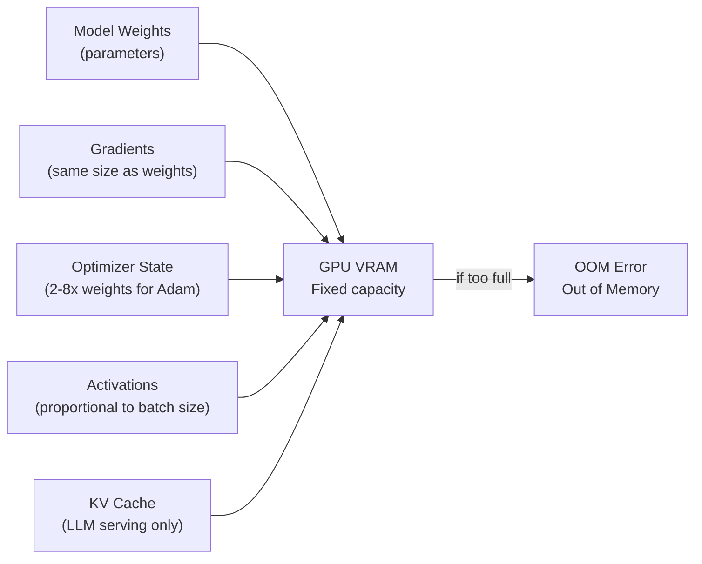

# GPU Infrastructure & Cost Optimization

Managing compute resources for training and serving ML models at scale.

---

## The Big Picture

> **Plain English:** GPUs are the engines of modern ML. A single H100 GPU costs ~$30,000 to buy or ~$3/hour to rent — and training a large model might need hundreds of them for weeks. GPU infrastructure is about getting the most out of expensive hardware: maximizing utilization, avoiding waste, and scaling efficiently. The difference between a well-tuned and poorly-tuned ML infrastructure can be a 10x difference in cost.

**Why GPUs and not CPUs?**

A modern CPU has ~32 fast cores optimized for sequential tasks. A GPU has thousands of smaller cores optimized for doing the same operation on thousands of data points simultaneously — exactly what matrix multiplications in neural networks need. Training a GPT-2 sized model on CPU would take weeks; on an H100 it takes hours.

**The GPU memory bottleneck:**



**Rule of thumb for training memory:**
- Model parameters: `num_params × 4 bytes` (FP32) or `× 2 bytes` (BF16)
- Gradients: same as parameters
- Adam optimizer state: `2× parameters` (momentum + variance)
- **Total: ~16 bytes per parameter in FP32, ~6 bytes in BF16 with mixed precision**

Example: 7B parameter model in BF16 = 7B × 6 bytes ≈ **42 GB** — barely fits on one H100 80GB.

---

## GPU Landscape

### NVIDIA GPU Generations

| GPU | VRAM | Memory BW | FP16 TFLOPs | NVLink BW | Best For |
|-----|------|-----------|-------------|-----------|----------|
| **A100 40GB** | 40 GB HBM2e | 1.6 TB/s | 312 | 600 GB/s | Training, large inference |
| **A100 80GB** | 80 GB HBM2e | 2.0 TB/s | 312 | 600 GB/s | Large models, multi-GPU |
| **H100 SXM** | 80 GB HBM3 | 3.35 TB/s | 989 | 900 GB/s | LLM training, state-of-art |
| **H200** | 141 GB HBM3e | 4.8 TB/s | 989 | 900 GB/s | Largest models, inference |
| **B200** | 192 GB HBM3e | 8.0 TB/s | ~4500 | 1.8 TB/s | Next-gen, FP4 support |
| **L4** | 24 GB GDDR6 | 300 GB/s | 121 | — | Cost-efficient inference |
| **L40S** | 48 GB GDDR6 | 864 GB/s | 362 | — | Mid-range inference |
| **RTX 4090** | 24 GB GDDR6X | 1 TB/s | 165 | — | Dev / small training |

### Cloud Instance Types

| Provider | Instance | GPUs | GPU Type | On-demand $/hr | Use Case |
|----------|----------|------|----------|----------------|----------|
| **AWS** | p4d.24xlarge | 8x | A100 40GB | ~$32 | Large training |
| **AWS** | p5.48xlarge | 8x | H100 80GB | ~$98 | State-of-art training |
| **AWS** | g5.xlarge | 1x | A10G 24GB | ~$1 | Inference |
| **AWS** | inf2.xlarge | 1x | Inferentia2 | ~$0.76 | Cost-efficient inference |
| **GCP** | a3-highgpu-8g | 8x | H100 80GB | ~$95 | Large training |
| **GCP** | a2-highgpu-1g | 1x | A100 40GB | ~$3.67 | Moderate training |
| **Azure** | ND H100 v5 | 8x | H100 80GB | ~$98 | Large training |
| **Lambda** | 8x H100 | 8x | H100 80GB | ~$28 | Training (cheaper) |

---

## Distributed Training

### Data Parallelism (DDP / FSDP)

> **Plain English:** Data parallelism is the simplest way to use multiple GPUs. Each GPU gets an exact copy of the model, but processes a different batch of data. After each batch, the GPUs communicate to average their gradients, then all update their model copy identically. It's like having 8 chefs cook from the same recipe simultaneously — faster cooking, same dish.

```python
# PyTorch DDP — standard for models that fit on one GPU
import os
import torch
import torch.distributed as dist
from torch.nn.parallel import DistributedDataParallel as DDP

def setup(rank, world_size):
    os.environ["MASTER_ADDR"] = "localhost"
    os.environ["MASTER_PORT"] = "12355"
    dist.init_process_group("nccl", rank=rank, world_size=world_size)
    torch.cuda.set_device(rank)

def cleanup():
    dist.destroy_process_group()

def train(rank, world_size, model_fn, dataset):
    setup(rank, world_size)

    model = model_fn().to(rank)
    model = DDP(model, device_ids=[rank], find_unused_parameters=False)

    sampler = torch.utils.data.distributed.DistributedSampler(
        dataset, num_replicas=world_size, rank=rank, shuffle=True
    )
    loader = torch.utils.data.DataLoader(
        dataset, batch_size=32, sampler=sampler, num_workers=4, pin_memory=True
    )

    optimizer = torch.optim.AdamW(model.parameters(), lr=1e-4, weight_decay=0.01)
    scaler = torch.cuda.amp.GradScaler()   # mixed precision

    for epoch in range(10):
        sampler.set_epoch(epoch)
        for batch in loader:
            with torch.cuda.amp.autocast(dtype=torch.bfloat16):
                loss = model(batch["input"].to(rank), batch["label"].to(rank))
            scaler.scale(loss).backward()
            scaler.unscale_(optimizer)
            torch.nn.utils.clip_grad_norm_(model.parameters(), 1.0)
            scaler.step(optimizer)
            scaler.update()
            optimizer.zero_grad(set_to_none=True)

        if rank == 0:
            torch.save(model.module.state_dict(), f"checkpoint_epoch{epoch}.pt")

    cleanup()

# Launch: torchrun --nproc_per_node=8 train.py
```

### FSDP — Fully Sharded Data Parallel

> **Plain English:** FSDP solves the problem when a model is too large to fit on even one GPU. Instead of each GPU having a full model copy, FSDP shards (splits) the model parameters across all GPUs. Each GPU only stores 1/N of the parameters at rest. When a layer needs to run, FSDP briefly gathers the full parameters from all GPUs, runs the computation, then discards them again. It's like a team where each member holds one page of the recipe — they pass pages around as needed.

```python
from torch.distributed.fsdp import (
    FullyShardedDataParallel as FSDP,
    MixedPrecision,
    BackwardPrefetch,
    ShardingStrategy,
)
from torch.distributed.fsdp.wrap import transformer_auto_wrap_policy
from transformers.models.llama.modeling_llama import LlamaDecoderLayer
import functools

# Mixed precision policy
mp_policy = MixedPrecision(
    param_dtype=torch.bfloat16,
    reduce_dtype=torch.float32,    # full precision for gradient reduction
    buffer_dtype=torch.bfloat16,
)

# Auto-wrap: shard at transformer layer boundaries
auto_wrap_policy = functools.partial(
    transformer_auto_wrap_policy,
    transformer_layer_cls={LlamaDecoderLayer},
)

model = FSDP(
    model,
    sharding_strategy=ShardingStrategy.FULL_SHARD,     # ZeRO-3 equivalent
    mixed_precision=mp_policy,
    auto_wrap_policy=auto_wrap_policy,
    backward_prefetch=BackwardPrefetch.BACKWARD_PRE,   # overlap comms with compute
    device_id=torch.cuda.current_device(),
)

# FSDP memory savings: each GPU holds only (total_params / world_size) parameters
```

### DeepSpeed ZeRO

> **Plain English:** ZeRO (Zero Redundancy Optimizer) progressively eliminates redundancy across GPU memory. Stage 1 shards optimizer states, Stage 2 adds gradient sharding, Stage 3 shards everything including parameters. Each stage reduces memory further at the cost of more communication overhead.

```python
# DeepSpeed config (ds_config.json)
{
    "train_batch_size": 256,
    "gradient_accumulation_steps": 4,
    "fp16": {"enabled": false},
    "bf16": {"enabled": true},
    "zero_optimization": {
        "stage": 3,                           # full sharding
        "allgather_partitions": true,
        "reduce_scatter": true,
        "allgather_bucket_size": 5e8,
        "overlap_comm": true,
        "contiguous_gradients": true,
        "offload_optimizer": {                # offload optimizer state to CPU RAM
            "device": "cpu",
            "pin_memory": true
        },
        "offload_param": {                    # offload parameters to CPU RAM
            "device": "cpu",
            "pin_memory": true
        }
    },
    "gradient_clipping": 1.0,
    "optimizer": {
        "type": "AdamW",
        "params": {"lr": 1e-4, "weight_decay": 0.01}
    },
    "scheduler": {
        "type": "WarmupDecayLR",
        "params": {"warmup_num_steps": 100, "total_num_steps": 10000}
    }
}
```

```python
# Using DeepSpeed with Hugging Face Trainer
from transformers import TrainingArguments, Trainer

training_args = TrainingArguments(
    output_dir="./output",
    per_device_train_batch_size=4,
    gradient_accumulation_steps=4,
    bf16=True,
    deepspeed="ds_config.json",    # ← enables DeepSpeed
    learning_rate=1e-4,
    num_train_epochs=3,
    save_steps=500,
    logging_steps=10,
)

trainer = Trainer(model=model, args=training_args, train_dataset=dataset)
trainer.train()
```

**ZeRO stages comparison:**

| Stage | Shards | Memory Reduction | Communication Overhead |
|-------|--------|-----------------|----------------------|
| **Stage 1** | Optimizer states | 4x (for Adam) | Minimal |
| **Stage 2** | + Gradients | 8x | Moderate |
| **Stage 3** | + Parameters | 64x (for 64 GPUs) | Significant |
| **ZeRO-Infinity** | + CPU/NVMe offload | Near unlimited | High (I/O bound) |

---

## Mixed Precision Training

> **Plain English:** Float32 uses 4 bytes per number. BFloat16 uses 2 bytes — half the memory, roughly 2x faster on modern GPUs. The risk is numerical instability (underflows, overflows). Mixed precision trains in BF16 but keeps a FP32 "master copy" of weights for the optimizer — best of both worlds.

```python
# Automatic Mixed Precision (AMP) with BF16
from torch.cuda.amp import autocast, GradScaler

# BF16: preferred on A100/H100 — no loss scaling needed
model = model.to(torch.bfloat16)

for batch in dataloader:
    with autocast(dtype=torch.bfloat16):
        output = model(batch["input"])
        loss = criterion(output, batch["label"])

    loss.backward()
    torch.nn.utils.clip_grad_norm_(model.parameters(), 1.0)
    optimizer.step()
    optimizer.zero_grad()

# FP16: older GPUs, requires loss scaling to prevent underflow
scaler = GradScaler()

for batch in dataloader:
    with autocast(dtype=torch.float16):
        output = model(batch["input"])
        loss = criterion(output, batch["label"])

    scaler.scale(loss).backward()
    scaler.unscale_(optimizer)
    torch.nn.utils.clip_grad_norm_(model.parameters(), 1.0)
    scaler.step(optimizer)
    scaler.update()
    optimizer.zero_grad()
```

---

## GPU Serving Optimization

### GPU Sharing

> **Plain English:** GPUs are expensive. A model that uses only 30% of a GPU's compute leaves 70% idle — that's wasted money. GPU sharing strategies let multiple workloads share one physical GPU.

| Strategy | How | When |
|----------|-----|------|
| **Time-slicing** | GPU runs one context at a time, switches between them | Simple sharing, small models, dev environments |
| **MPS (Multi-Process Service)** | True concurrent kernel execution from multiple processes | Low-latency inference, multiple small models |
| **MIG (Multi-Instance GPU)** | Hardware-level GPU partitioning (A100/H100 only) | Strong isolation, different SLAs per slice |

```bash
# MIG: create 7 GPU instances on an A100 80GB
nvidia-smi mig -cgi 19,19,19,19,19,19,19 -C
# Each instance gets ~10GB VRAM and isolated SM cores

# List GPU instances
nvidia-smi mig -lgi

# Deploy different models on different instances
# Instance 0: fraud model (latency-critical)
# Instance 1-3: recommendation models (throughput)
# Instance 4-6: batch scoring
```

### KV-Cache and PagedAttention

> **Plain English:** In LLM serving, the KV-cache stores the attention keys and values for all tokens generated so far, so the model doesn't have to recompute them. Without cache management, you'd need to pre-allocate enough memory for the maximum possible sequence length for every concurrent request — most of it wasted. PagedAttention (vLLM's innovation) manages KV-cache like virtual memory: allocate physical "pages" only as tokens are actually generated.

```python
# vLLM with custom configuration
from vllm import LLM, SamplingParams
from vllm.config import EngineArgs

engine_args = EngineArgs(
    model="meta-llama/Llama-3-8B-Instruct",
    tensor_parallel_size=2,         # split model across 2 GPUs
    gpu_memory_utilization=0.90,    # reserve 10% for overhead
    max_num_batched_tokens=8192,    # max tokens in one forward pass
    max_num_seqs=256,               # max concurrent sequences
    block_size=16,                  # KV-cache page size in tokens
    swap_space=4,                   # GB of CPU RAM for cache overflow
    quantization="awq",             # 4-bit quantization
)

llm = LLM(**vars(engine_args))

# vLLM's scheduler continuously batches requests
# PagedAttention ensures near-zero KV-cache waste
```

### Speculative Decoding

> **Plain English:** LLM generation is sequential — you can only generate one token at a time. Speculative decoding cheats this by using a tiny "draft" model to quickly generate 4-5 candidate tokens, then having the large model verify all of them in one parallel pass. Since the large model can verify much faster than it can generate, and the draft model is usually right, you get 2-4x speedup with zero quality loss.

```python
# Speculative decoding with Hugging Face
from transformers import AutoModelForCausalLM, AutoTokenizer

# Large "target" model
target_model = AutoModelForCausalLM.from_pretrained(
    "meta-llama/Llama-3-70B-Instruct",
    torch_dtype=torch.bfloat16,
    device_map="auto",
)

# Small "draft" model (same tokenizer family)
draft_model = AutoModelForCausalLM.from_pretrained(
    "meta-llama/Llama-3-8B-Instruct",
    torch_dtype=torch.bfloat16,
    device_map="auto",
)

tokenizer = AutoTokenizer.from_pretrained("meta-llama/Llama-3-70B-Instruct")

inputs = tokenizer("Explain transformer attention in simple terms:", return_tensors="pt")

# Speculative decoding: draft model proposes, target model accepts/rejects
outputs = target_model.generate(
    **inputs,
    assistant_model=draft_model,    # ← enables speculative decoding
    max_new_tokens=512,
    do_sample=False,
)
```

---

## Cost Optimization

### Spot/Preemptible Instances

> **Plain English:** Cloud providers sell unused GPU capacity at 60-90% discount as "spot" (AWS) or "preemptible" (GCP) instances. The catch: they can be taken away with 2 minutes' notice. For training, handle this with frequent checkpointing — if your instance dies, restart from the last checkpoint rather than from scratch.

```python
# Checkpoint-aware training loop for spot instances
import signal
import sys

class SpotInstanceSafeTrainer:
    def __init__(self, model, checkpoint_dir: str, checkpoint_every_steps: int = 100):
        self.model = model
        self.checkpoint_dir = checkpoint_dir
        self.checkpoint_every = checkpoint_every_steps
        self.global_step = 0

        # Handle SIGTERM (spot instance termination signal)
        signal.signal(signal.SIGTERM, self._handle_termination)

    def _handle_termination(self, signum, frame):
        """Save checkpoint immediately when spot instance is being reclaimed."""
        print("SIGTERM received — saving emergency checkpoint before shutdown")
        self.save_checkpoint(emergency=True)
        sys.exit(0)

    def save_checkpoint(self, emergency: bool = False):
        prefix = "emergency" if emergency else f"step_{self.global_step}"
        path = f"{self.checkpoint_dir}/{prefix}"
        torch.save({
            "global_step": self.global_step,
            "model_state_dict": self.model.state_dict(),
            "optimizer_state_dict": self.optimizer.state_dict(),
            "scheduler_state_dict": self.scheduler.state_dict(),
            "scaler_state_dict": self.scaler.state_dict(),
        }, f"{path}.pt")
        print(f"Checkpoint saved: {path}")

    def load_checkpoint(self) -> int:
        """Resume from latest checkpoint. Returns the global step."""
        import glob
        checkpoints = sorted(glob.glob(f"{self.checkpoint_dir}/step_*.pt"))
        if not checkpoints:
            return 0
        ckpt = torch.load(checkpoints[-1])
        self.model.load_state_dict(ckpt["model_state_dict"])
        self.optimizer.load_state_dict(ckpt["optimizer_state_dict"])
        return ckpt["global_step"]

    def train_step(self, batch):
        loss = self.model(batch).loss
        loss.backward()
        self.optimizer.step()
        self.optimizer.zero_grad()
        self.global_step += 1

        if self.global_step % self.checkpoint_every == 0:
            self.save_checkpoint()

        return loss.item()
```

### GPU Memory Profiling

```python
# Profile GPU memory to find optimization opportunities
import torch
from torch.profiler import profile, record_function, ProfilerActivity

def profile_training_step(model, batch):
    with profile(
        activities=[ProfilerActivity.CPU, ProfilerActivity.CUDA],
        record_shapes=True,
        with_stack=True,
        profile_memory=True,
    ) as prof:
        with record_function("forward"):
            loss = model(batch).loss
        with record_function("backward"):
            loss.backward()

    # Print memory breakdown
    print(prof.key_averages().table(
        sort_by="cuda_memory_usage", row_limit=20
    ))

    return prof

# Real-time memory monitoring
def print_gpu_memory_usage():
    for i in range(torch.cuda.device_count()):
        allocated  = torch.cuda.memory_allocated(i) / 1e9
        reserved   = torch.cuda.memory_reserved(i) / 1e9
        total      = torch.cuda.get_device_properties(i).total_memory / 1e9
        print(f"GPU {i}: {allocated:.1f}GB allocated / {reserved:.1f}GB reserved / {total:.0f}GB total")

# nvidia-smi equivalent in Python
import subprocess
result = subprocess.run(
    ["nvidia-smi", "--query-gpu=gpu_name,memory.used,memory.total,utilization.gpu,temperature.gpu",
     "--format=csv,noheader,nounits"],
    capture_output=True, text=True,
)
for line in result.stdout.strip().split("\n"):
    name, mem_used, mem_total, util, temp = [x.strip() for x in line.split(",")]
    print(f"{name}: {mem_used}/{mem_total} MB | {util}% util | {temp}°C")
```

### Cost Optimization Strategies

```mermaid
flowchart TD
    Cost["Reduce GPU Cost"] --> Train["Training Optimizations"]
    Cost --> Serve["Serving Optimizations"]
    Cost --> Proc["Procurement"]

    Train --> T1["Mixed precision BF16<br/>~2x throughput same GPU"]
    Train --> T2["Gradient checkpointing<br/>trade compute for memory"]
    Train --> T3["Spot instances + checkpointing<br/>60-90% cost reduction"]
    Train --> T4["Gradient accumulation<br/>larger effective batch, fewer GPUs"]

    Serve --> S1["Quantization INT8/INT4<br/>2-4x throughput per GPU"]
    Serve --> S2["Continuous batching vLLM<br/>2-5x GPU utilization"]
    Serve --> S3["Semantic caching<br/>20-40% fewer model calls"]
    Serve --> S4["Scale to zero<br/>zero cost when idle"]
    Serve --> S5["Distillation<br/>smaller model, same quality"]

    Proc --> P1["Reserved instances<br/>30-60% discount vs on-demand"]
    Proc --> P2["Right-sizing<br/>profile before scaling"]
    Proc --> P3["Spot for batch jobs<br/>60-90% discount"]
```



```python
# Gradient checkpointing: trade compute for memory
# Re-computes activations during backward pass instead of storing them
# ~33% slower training but ~60% less activation memory
from torch.utils.checkpoint import checkpoint

class MemoryEfficientTransformer(torch.nn.Module):
    def __init__(self, layers):
        super().__init__()
        self.layers = torch.nn.ModuleList(layers)

    def forward(self, x):
        for layer in self.layers:
            # checkpoint re-runs the layer during backward instead of storing activations
            x = checkpoint(layer, x, use_reentrant=False)
        return x

# Gradient accumulation: simulate larger batch size without extra memory
EFFECTIVE_BATCH = 256
MICRO_BATCH = 8
ACCUMULATION_STEPS = EFFECTIVE_BATCH // MICRO_BATCH  # = 32

optimizer.zero_grad()
for step, batch in enumerate(dataloader):
    loss = model(batch).loss / ACCUMULATION_STEPS   # normalize loss
    loss.backward()

    if (step + 1) % ACCUMULATION_STEPS == 0:
        torch.nn.utils.clip_grad_norm_(model.parameters(), 1.0)
        optimizer.step()
        optimizer.zero_grad()
```

---

## Profiling and Identifying Bottlenecks

> **Plain English:** GPU training can be slow for three reasons: the GPU isn't doing enough work (low utilization), data isn't getting to the GPU fast enough (I/O bound), or the GPU has to wait for communication between GPUs (communication bound). Profiling tells you which is the problem.

```python
# PyTorch Profiler — find where time is spent
from torch.profiler import profile, ProfilerActivity, tensorboard_trace_handler

with profile(
    activities=[ProfilerActivity.CPU, ProfilerActivity.CUDA],
    schedule=torch.profiler.schedule(wait=1, warmup=1, active=5),
    on_trace_ready=tensorboard_trace_handler("./profiler_logs"),
    record_shapes=True,
    with_stack=False,
    profile_memory=True,
) as prof:
    for step, batch in enumerate(train_loader):
        train_step(model, optimizer, batch)
        prof.step()
        if step >= 8:
            break

# Key signals:
# GPU utilization < 80%: compute bottleneck (batch too small, poor kernel efficiency)
# DataLoader workers exhausted: I/O bound (increase num_workers, use faster storage)
# NCCL ops dominating: communication bound (reduce AllReduce frequency, use gradient compression)
# Excessive host↔device transfers: pin_memory + non_blocking transfers needed

# Quick check: is GPU compute-bound or memory-bound?
# Arithmetic Intensity = FLOPs / bytes moved
# If AI < GPU's "roofline" threshold → memory-bound
# If AI > threshold → compute-bound
```

---

## Common Interview Questions

**Q1: Explain data parallelism vs model parallelism — when to use each.**
Data parallelism replicates the model on every GPU, splits the data across GPUs, and averages gradients after each step (DDP/FSDP). Use it when the model fits on a single GPU — it's simpler, scales near-linearly with GPU count, and has lower communication overhead. The limitation: if the model itself doesn't fit in one GPU's VRAM, you can't use pure data parallelism. Model parallelism splits the model's layers across GPUs — each GPU holds a portion of the network and passes activations to the next GPU. Use it when the model is too large for one GPU (e.g., 70B+ parameter LLMs). Pipeline parallelism is a variant that staggers micro-batches through the pipeline to reduce GPU idle time (bubble overhead). In practice, large LLM training uses hybrid parallelism: data parallelism across nodes × tensor parallelism within a node × pipeline parallelism across node groups.

**Q2: What is ZeRO optimization and how does it reduce memory usage?**
ZeRO (Zero Redundancy Optimizer) eliminates memory redundancy in distributed training. In vanilla DDP, every GPU stores a full copy of model parameters, gradients, and optimizer states — if you have 8 GPUs, you're storing 8 identical copies. ZeRO shards these across GPUs so each GPU holds only 1/N of each. Stage 1 shards optimizer states (Adam's momentum and variance = 2x parameter memory) — reduces optimizer memory 8x on 8 GPUs. Stage 2 also shards gradients — each GPU only accumulates gradients for its shard. Stage 3 shards model parameters as well — the full parameter only materializes briefly during forward/backward. ZeRO-Infinity extends this to CPU RAM and NVMe, enabling models larger than GPU memory. The tradeoff is additional AllGather communication to reconstruct shards during computation, which adds overhead (typically 10-20% slower than DDP at the same model size).

**Q3: How do you handle spot instance preemption during multi-day training runs?**
Three-part strategy: (1) **Checkpointing** — save the full training state (model weights, optimizer state, scheduler state, gradient scaler state, global step) every 100-500 steps to persistent storage (S3, GCS). Choose checkpoint frequency based on how much work you're willing to lose vs the I/O overhead; (2) **Termination signal handling** — cloud providers give 2 minutes warning before reclaiming spot instances via SIGTERM. Register a SIGTERM handler that immediately saves an emergency checkpoint and exits cleanly; (3) **Automated restart** — use your orchestrator (Kubernetes with restart policy, SageMaker with managed spot training, AWS Batch) to automatically relaunch the job on spot interruption. The job detects the latest checkpoint at startup and resumes from it. With 15-30 minute checkpoints, you lose at most that much work per interruption, while saving 60-90% on compute cost vs on-demand.

**Q4: How do you profile and optimize GPU utilization?**
Start with a high-level view: `nvidia-smi dmon` to see real-time GPU utilization, memory usage, and temperature. If utilization is low (<80%), drill down with PyTorch Profiler to see where time is spent. Common bottlenecks and fixes: (1) **I/O bound** — DataLoader can't keep up with GPU; fix by increasing `num_workers`, using `pin_memory=True` and `non_blocking=True`, or moving to faster storage (NVMe vs HDD); (2) **Small batch size** — GPU not doing enough work per step; fix by increasing batch size or using gradient accumulation; (3) **Memory bound** — operations spend more time moving data than computing; fix by fusing operations (torch.compile, Flash Attention), using BF16, and minimizing host↔device transfers; (4) **Communication bound** (multi-GPU) — AllReduce takes too long; fix by using gradient compression, reducing AllReduce frequency via gradient accumulation, or switching from DDP to FSDP to overlap communication with computation.

**Q5: Walk through how you'd reduce the cost of serving a 7B parameter LLM.**
Start with a baseline: a 7B model in FP16 needs ~14GB VRAM, runs on one A100, and serves ~20 requests/sec at $3/hr. Cost optimization stack: (1) **Quantization** — convert to AWQ INT4 (~3.5GB VRAM), now you can serve on an L4 GPU at $0.80/hr instead of A100 at $3/hr; 4x cheaper hardware + 2x throughput from quantization = ~8x cost reduction; (2) **Continuous batching** — switch from static batching to vLLM, which achieves 80-90% GPU utilization vs 40-60% for naive serving; 2x more requests served per dollar; (3) **Speculative decoding** — add a 1B draft model to achieve 2-3x generation speedup at similar quality; (4) **Semantic caching** — cache responses for common/repeated queries; if 20% of queries are cache hits, reduce model calls by 20%; (5) **Scale to zero** — for bursty traffic, use Kubernetes + KEDA to scale replicas to zero during off-peak hours. Combined: the same workload that cost $3/hr on a single A100 might now cost $0.20-0.40/hr on L4 instances with vLLM + INT4.
