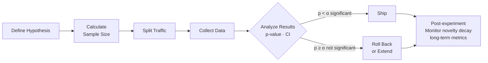
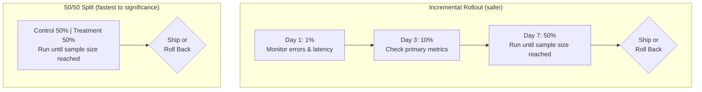
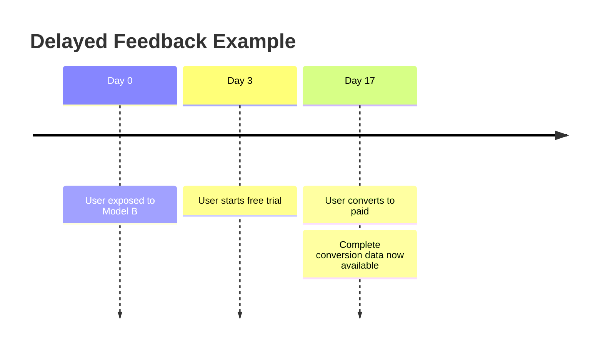
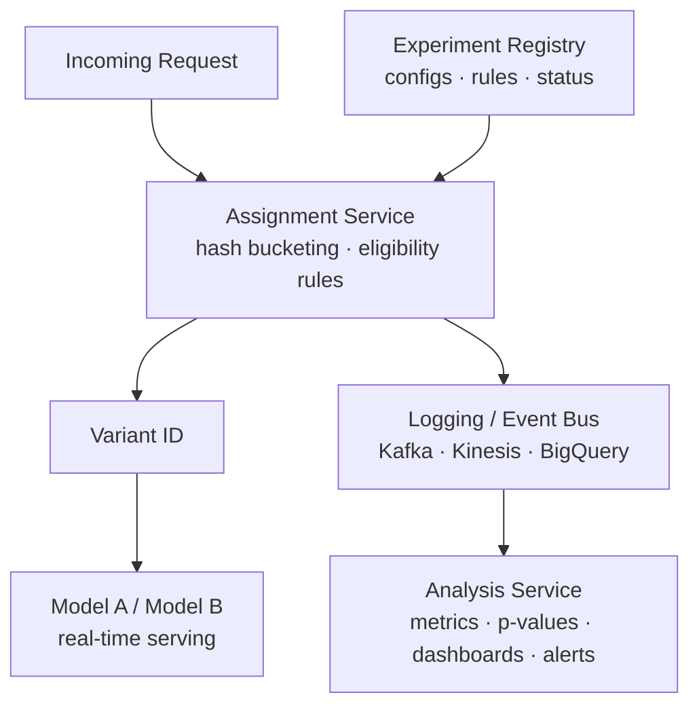

# A/B Testing for ML

Rigorous experimentation for comparing model versions in production — hypothesis testing, metrics, and deployment strategies.

---

## The Big Picture

> **Plain English:** A/B testing is how you answer the question "is my new model actually better, or did I just get lucky?" without trusting gut instinct or running the new model for everyone at once. You split your traffic, show version A to half your users and version B to the other half, collect data, and use statistics to decide if any difference you see is real or just random noise.

**Why you can't skip the statistics:**

Imagine you roll out a new recommendation model and conversion rate goes from 4.0% to 4.2%. Is that real? You had 10,000 users. Sounds convincing — but with that sample size and the natural variance in user behavior, a 0.2% lift could easily happen by pure chance even if the models were identical. Statistics tells you whether to trust it.

**The three things you need before running any experiment:**

1. **A clear metric** — what are you optimizing? (conversion, revenue, engagement — pick one primary)
2. **A sample size** — calculated *before* the experiment from the effect size you care about
3. **A decision rule** — under what conditions will you ship, roll back, or extend the test?

**The A/B testing lifecycle:**



---

## Statistical Foundations

> **Plain English:** The statistics behind A/B testing answer one question: "If both models were actually identical, how often would we see a difference this large just by chance?" That probability is the p-value. If it's below 5% (p < 0.05), we declare the result "statistically significant" and trust the difference is real.

### Hypothesis Testing

| Term | Definition | Example |
|------|-----------|---------|
| **Null hypothesis (H₀)** | No difference between A and B | "The new model doesn't change conversion rate" |
| **Alternative hypothesis (H₁)** | B is different (or better) than A | "The new model increases conversion rate" |
| **p-value** | Probability of seeing this result if H₀ were true | p = 0.03 means 3% chance the result is random |
| **α (significance level)** | Threshold for rejecting H₀, typically 0.05 | If p < 0.05, reject H₀ |
| **Confidence interval** | Range that contains the true effect 95% of the time | "Lift is +0.5% ± 0.2%" |

### Type I and Type II Errors

```
                     H₀ is True        H₀ is False
                  ┌─────────────────┬─────────────────┐
 Test says        │  Correct        │  Type II Error  │
 "no difference"  │  (True Neg.)    │  (False Neg.)   │
                  │                 │  β = miss rate  │
                  ├─────────────────┼─────────────────┤
 Test says        │  Type I Error   │  Correct        │
 "significant"    │  (False Pos.)   │  (True Pos.)    │
                  │  α = 0.05       │  Power = 1 - β  │
                  └─────────────────┴─────────────────┘
```

- **Type I error (α):** You declare a winner when there isn't one — you ship a bad model. Controlled by your significance threshold.
- **Type II error (β):** You miss a real improvement — you don't ship a good model. Controlled by your sample size.
- **Statistical power (1 − β):** Probability of detecting a true effect. Typically target 80% or 80%.

### Power Analysis — Sample Size Calculation

> **Plain English:** Sample size is calculated *before* the experiment. You need to specify three things: how big a difference you care about (minimum detectable effect), how confident you want to be (significance level), and how often you want to catch a real effect (power). The smaller the effect you want to detect, the more traffic you need.

**Formula for comparing two proportions (e.g., conversion rates):**

$$n = \frac{2 \cdot (z_{\alpha/2} + z_\beta)^2 \cdot p(1-p)}{\delta^2}$$

Where:
- $p$ = baseline conversion rate
- $\delta$ = minimum detectable effect (MDE) — the smallest lift you care about
- $z_{\alpha/2}$ = 1.96 for α = 0.05 (two-tailed)
- $z_\beta$ = 0.84 for 80% power

```python
import numpy as np
from scipy import stats

def sample_size_for_proportions(
    baseline_rate: float,
    mde: float,          # minimum detectable effect (absolute)
    alpha: float = 0.05,
    power: float = 0.80,
) -> int:
    """Calculate required sample size per variant."""
    p1 = baseline_rate
    p2 = baseline_rate + mde

    # Pooled proportion under H0
    p_pool = (p1 + p2) / 2

    z_alpha = stats.norm.ppf(1 - alpha / 2)   # two-tailed
    z_beta  = stats.norm.ppf(power)

    # Standard formula
    n = (z_alpha + z_beta)**2 * (p1*(1-p1) + p2*(1-p2)) / (mde**2)
    return int(np.ceil(n))

# Example: baseline conversion 4%, want to detect +0.5% lift
n = sample_size_for_proportions(baseline_rate=0.04, mde=0.005)
print(f"Required per variant: {n:,}")   # ~24,000 per variant

# Sensitivity: effect of reducing MDE
for mde in [0.010, 0.005, 0.002, 0.001]:
    n = sample_size_for_proportions(0.04, mde)
    print(f"MDE={mde:.3f} -> {n:,} per variant")
# MDE=0.010 ->  6,024
# MDE=0.005 -> 24,096
# MDE=0.002 -> 150,600
# MDE=0.001 -> 602,400
```

**Key insight:** Sample size scales with $1/\delta^2$ — halving the MDE you care about *quadruples* the required traffic.

### Statistical Tests

| Scenario | Test | Python |
|----------|------|--------|
| Binary metric (conversion) | Two-proportion z-test | `statsmodels.stats.proportion.proportions_ztest` |
| Continuous metric (revenue) | Two-sample t-test | `scipy.stats.ttest_ind` |
| Non-normal distribution | Mann-Whitney U | `scipy.stats.mannwhitneyu` |
| Multiple variants | ANOVA / pairwise with correction | `scipy.stats.f_oneway` + Bonferroni |
| Sequential testing | Sequential probability ratio test | `sequential` library or custom |

```python
from scipy import stats
import numpy as np

# Two-proportion z-test for conversion rates
def ab_test_proportions(n_control, conversions_control,
                         n_treatment, conversions_treatment,
                         alpha=0.05):
    from statsmodels.stats.proportion import proportions_ztest

    count = np.array([conversions_treatment, conversions_control])
    nobs  = np.array([n_treatment, n_control])

    stat, p_value = proportions_ztest(count, nobs)

    rate_control   = conversions_control / n_control
    rate_treatment = conversions_treatment / n_treatment
    lift = (rate_treatment - rate_control) / rate_control

    print(f"Control:   {rate_control:.4f} ({conversions_control}/{n_control})")
    print(f"Treatment: {rate_treatment:.4f} ({conversions_treatment}/{n_treatment})")
    print(f"Relative lift: {lift:+.1%}")
    print(f"p-value: {p_value:.4f}")
    print(f"Significant: {p_value < alpha}")

    return p_value < alpha

# Example
ab_test_proportions(
    n_control=25000,    conversions_control=1000,
    n_treatment=25000,  conversions_treatment=1100,
)
# Control:   0.0400
# Treatment: 0.0440
# Relative lift: +10.0%
# p-value: 0.0023
# Significant: True


# Two-sample t-test for continuous metric (e.g. revenue per user)
control_revenue   = np.random.lognormal(2.0, 1.5, 25000)
treatment_revenue = np.random.lognormal(2.1, 1.5, 25000)

t_stat, p_value = stats.ttest_ind(treatment_revenue, control_revenue)
print(f"p-value: {p_value:.4f}")

# Confidence interval for the difference in means
diff = treatment_revenue.mean() - control_revenue.mean()
se   = np.sqrt(treatment_revenue.var()/len(treatment_revenue)
               + control_revenue.var()/len(control_revenue))
ci_low  = diff - 1.96 * se
ci_high = diff + 1.96 * se
print(f"Mean diff: {diff:.2f} [{ci_low:.2f}, {ci_high:.2f}]")
```

---

## Experiment Design

### Randomization Unit

> **Plain English:** The randomization unit is the "thing" you randomly assign to A or B. You want users to consistently see the same variant across sessions, and you want the unit to match the metric you're measuring.

| Unit | When to Use | Pitfall |
|------|------------|---------|
| **User ID** | Most common; consistent experience per user | Requires login; new users not tracked |
| **Session** | When sessions are independent | Same user may see both variants |
| **Device ID** | Works for logged-out users | Hard to track across devices |
| **Request** | Only for purely independent, stateless decisions | Users get inconsistent experiences |
| **Geo / time segment** | When user-level randomization isn't possible (e.g., feeds affecting all users) | Coarser, needs careful analysis |

**Hashing for deterministic assignment:**

```python
import hashlib

def get_variant(user_id: str, experiment_id: str, num_variants: int = 2) -> int:
    """Deterministic, stable assignment using hash bucketing."""
    key = f"{experiment_id}:{user_id}"
    bucket = int(hashlib.md5(key.encode()).hexdigest(), 16) % 100
    # Variant 0 (control): buckets 0-49
    # Variant 1 (treatment): buckets 50-99
    variant = bucket * num_variants // 100
    return variant

# Same user always gets the same variant for the same experiment
print(get_variant("user_123", "exp_recommender_v2"))  # stable across calls
```

### Traffic Splitting Strategies



### Holdout Groups

A **holdout group** is a small fraction of users (e.g., 5%) permanently excluded from all experiments. They see the baseline forever. Use holdouts to measure the **cumulative long-term effect** of all shipped improvements — the difference between holdout and the rest of your users is the total compound lift from your experimentation program.

### Guardrail Metrics

Always define guardrail metrics *before* the experiment. If any guardrail regresses, the experiment is an automatic failure regardless of primary metric gains.

| Guardrail | Typical Threshold | Why It Matters |
|-----------|------------------|----------------|
| Latency P99 | < 20ms regression | New model shouldn't slow down the product |
| Error rate | < 0.1% increase | Crashes and errors erode trust |
| Crash rate | < 0.05% increase | Hard user impact |
| Revenue per user | No regression | Primary metric lift shouldn't come from cannibalizing revenue |

---

## ML-Specific Challenges

### Novelty Effect

Users engage more with anything new — regardless of quality. A new UI or new model gets inflated engagement for the first days/weeks until users adapt.

**Mitigation:** Run experiments for at least 2 weeks; analyze time series of the metric to check if it's decaying back to baseline.

```python
import pandas as pd
import matplotlib.pyplot as plt

def plot_daily_metric(experiment_data: pd.DataFrame):
    """Visualize metric over time to detect novelty effect."""
    daily = experiment_data.groupby(['date', 'variant'])['metric'].mean().unstack()
    daily.plot(title="Daily metric by variant — check for novelty decay")
    plt.axhline(daily['control'].mean(), linestyle='--', label='control avg')
    plt.xlabel("Day")
    plt.ylabel("Metric")
    plt.legend()
```

### Multiple Comparisons Problem

Testing many metrics or many variants simultaneously inflates the false positive rate. If you test 20 independent metrics at α = 0.05, you expect *one* to appear significant by chance even if nothing is real.

```python
from statsmodels.stats.multitest import multipletests

p_values = [0.03, 0.08, 0.001, 0.04, 0.20, 0.015]

# Bonferroni correction: most conservative
reject_bonf, p_adj_bonf, _, _ = multipletests(p_values, method='bonferroni')

# Benjamini-Hochberg: controls false discovery rate (less conservative)
reject_bh, p_adj_bh, _, _ = multipletests(p_values, method='fdr_bh')

for i, (pv, rb, rh) in enumerate(zip(p_values, reject_bonf, reject_bh)):
    print(f"Metric {i}: p={pv:.3f} | Bonferroni={rb} | BH={rh}")
```

**Rule of thumb:** Designate one **primary metric** before the experiment. Apply corrections only when you have multiple primary metrics. Secondary metrics are for interpretation, not decision-making.

### Network Effects / Interference

In social or marketplace products, one user's treatment can affect another's outcome — violating the stable unit treatment value assumption (SUTVA).

**Example:** A ranking model experiment in a marketplace — if treatment sellers get more visibility, control sellers get less. The control group is contaminated.

**Mitigations:**

| Approach | How | When |
|----------|-----|------|
| **Geo-based splits** | Different regions get different variants | When users don't cross regions |
| **Graph clustering** | Split social graphs to minimize inter-cluster edges | Social networks |
| **Time-based splits** | Alternate treatment by day | Sequential, can't run in parallel |
| **Ego-network analysis** | Analyze by network neighborhood, not individual | Research-grade, complex |

### Delayed Feedback

Metrics like subscription conversion, LTV, or churn may take days or weeks to materialize.



**Proxies:** Use early indicators correlated with the delayed metric — e.g., "started checkout" as a proxy for "completed purchase within 30 days." Validate the proxy-to-actual correlation on historical data.

---

## Deployment Strategies

> **Plain English:** Before running a full A/B test, you often want to validate that your new model doesn't break anything. The strategies below form a risk ladder from safest (shadow mode — no user impact at all) to fastest (50/50 split — maximum data collection speed).

### Shadow Mode

The new model runs in parallel but its output is **never shown to users**. Both models' outputs are logged for offline comparison.

```python
import asyncio

async def shadow_serving(request, control_model, shadow_model):
    """Run shadow model in parallel, only return control output."""
    # Both run in parallel
    control_task = asyncio.create_task(control_model.predict(request))
    shadow_task  = asyncio.create_task(shadow_model.predict(request))

    control_result = await control_task
    shadow_result  = await shadow_task  # result discarded, but logged

    # Log both for offline comparison
    log_shadow_comparison(
        request_id=request.id,
        control_output=control_result,
        shadow_output=shadow_result,
    )
    return control_result  # only serve control
```

**Use when:** Validating a new model's outputs/latency before any live exposure. Zero user risk.

### Canary Deployment

Route a small percentage of traffic (1-5%) to the new model and monitor before expanding.

```python
import random

class CanaryRouter:
    def __init__(self, canary_fraction: float = 0.01):
        self.canary_fraction = canary_fraction  # 1%

    def route(self, request) -> str:
        if random.random() < self.canary_fraction:
            return "new_model"
        return "control_model"

    def update_fraction(self, new_fraction: float):
        """Gradually increase canary traffic."""
        self.canary_fraction = new_fraction
```

### Interleaving (Search / Recommendations)

Instead of showing users either A or B, interleave results from both models in a single response. The model whose items are clicked more wins. Needs much less traffic than traditional A/B (10-100x more sensitive).

```
User sees a ranked list:
  Position 1: Model A result
  Position 2: Model B result
  Position 3: Model A result
  Position 4: Model B result
  ...

Track: which model's items received more clicks?
```

**Use case:** Search engines, recommendation feeds — anywhere the response is a ranked list.

### Multi-Armed Bandit

Adaptively allocate traffic toward the winning variant instead of a fixed split. Reduces the cost of experimenting with a bad variant.

```python
import numpy as np

class ThompsonSamplingBandit:
    """Beta-Bernoulli Thompson Sampling for A/B/n experiments."""

    def __init__(self, n_variants: int):
        # Start with uniform prior: Beta(1, 1) = Uniform(0, 1)
        self.alpha = np.ones(n_variants)   # successes + 1
        self.beta  = np.ones(n_variants)   # failures + 1

    def select_variant(self) -> int:
        """Sample from each variant's posterior, pick highest."""
        samples = np.random.beta(self.alpha, self.beta)
        return int(np.argmax(samples))

    def update(self, variant: int, reward: int):
        """reward = 1 for success (conversion), 0 for failure."""
        self.alpha[variant] += reward
        self.beta[variant]  += (1 - reward)

    @property
    def expected_rates(self) -> np.ndarray:
        return self.alpha / (self.alpha + self.beta)


# Simulation
bandit = ThompsonSamplingBandit(n_variants=2)
true_rates = [0.04, 0.045]  # control and treatment true conversion rates

for step in range(10000):
    variant = bandit.select_variant()
    reward  = int(np.random.random() < true_rates[variant])
    bandit.update(variant, reward)

print(f"Traffic allocation: {bandit.alpha + bandit.beta - 2}")
# Treatment (variant 1) will have received more traffic as it proved better
```

| Strategy | Use Case | Tradeoff |
|----------|----------|----------|
| **Shadow mode** | Pre-launch validation | No learning, zero risk |
| **Canary** | Gradual rollout with abort option | Slow to full significance |
| **50/50 A/B** | Controlled experiment, fastest to significance | Fixed, wastes traffic on loser |
| **Interleaving** | Search/ranking, ultra-sensitive comparison | Complex analysis, needs ranked lists |
| **Multi-armed bandit** | Optimizing while learning (MAB) | Biased estimates, hard to analyze |

---

## Production Experimentation Platform

### Architecture



### Analysis Automation

```python
import pandas as pd
from scipy import stats
from dataclasses import dataclass
from typing import Dict

@dataclass
class ExperimentResult:
    metric: str
    control_mean: float
    treatment_mean: float
    relative_lift: float
    p_value: float
    significant: bool
    ci_low: float
    ci_high: float

def analyze_experiment(
    df: pd.DataFrame,
    metric_col: str,
    variant_col: str = "variant",
    alpha: float = 0.05,
) -> ExperimentResult:
    """Analyze a single metric for a two-variant experiment."""
    control   = df[df[variant_col] == "control"][metric_col].dropna()
    treatment = df[df[variant_col] == "treatment"][metric_col].dropna()

    t_stat, p_value = stats.ttest_ind(treatment, control)

    diff    = treatment.mean() - control.mean()
    se      = np.sqrt(treatment.var()/len(treatment) + control.var()/len(control))
    ci_low  = diff - 1.96 * se
    ci_high = diff + 1.96 * se

    return ExperimentResult(
        metric=metric_col,
        control_mean=control.mean(),
        treatment_mean=treatment.mean(),
        relative_lift=diff / control.mean(),
        p_value=p_value,
        significant=p_value < alpha,
        ci_low=ci_low,
        ci_high=ci_high,
    )
```

---

## Common Interview Questions

**Q1: How do you determine sample size for an A/B test?**
You need three inputs before calculating: (1) the baseline metric value (e.g., current conversion rate = 4%), (2) the minimum detectable effect — the smallest lift you care about (e.g., +0.5pp), and (3) your desired statistical power (typically 80%) and significance level (α = 0.05). Use the two-proportion z-test formula: $n = 2(z_{\alpha/2} + z_\beta)^2 p(1-p) / \delta^2$. Critically, you commit to this sample size *before* peeking at results — looking early and stopping when you see significance inflates the false positive rate (peeking problem). Use sequential testing (SPRT) if you need to check early.

**Q2: What's the difference between A/B testing and multi-armed bandit?**
A/B testing is a controlled experiment: fix a 50/50 split, collect until the pre-calculated sample size, then make a ship/no-ship decision. It gives unbiased estimates and clear statistical guarantees, but wastes traffic on the losing variant. Multi-armed bandit (e.g., Thompson Sampling, UCB) adaptively shifts traffic toward the winning variant as it accumulates evidence — minimizing regret during the experiment. The tradeoff: bandit estimates are biased (they oversample the winner), making causal inference harder. Use A/B for high-stakes decisions where you need unbiased estimates; use bandits for continuous optimization (e.g., ad bidding, content recommendations) where you can tolerate some bias in exchange for lower regret.

**Q3: How do you handle multiple comparisons in experimentation?**
Each additional metric you test at α = 0.05 adds a 5% chance of a false positive. With 20 metrics, you expect one spurious significant result. Solutions: (1) pre-register exactly one primary metric before the experiment — your decision is based solely on that; (2) apply Bonferroni correction (divide α by number of tests) for conservative control of family-wise error rate; (3) use Benjamini-Hochberg for false discovery rate control when you have many metrics but want more power than Bonferroni; (4) treat secondary metrics as directional signals, not decision-makers.

**Q4: Shadow deployment vs canary — when to use each for ML models?**
Shadow deployment runs the new model in parallel with zero user impact — its output is logged but never shown. Use it for: validating model output correctness, checking latency at scale, catching obvious failures (null outputs, crashes) before any user exposure. Canary exposes 1-5% of users to the new model for real outcome measurement. Use canary after shadow validates basic correctness, when you want early signals on live metrics (conversion, engagement) before committing to a full experiment. The sequence is: shadow → canary → A/B test → full rollout.

**Q5: How would you design an experiment for a recommendation model where users influence each other (network effects)?**
Standard user-level randomization violates SUTVA because treatment users' recommendations affect control users' feed. Approaches: (1) **geo-based randomization** — assign cities or regions to treatment/control and treat them as independent units; works when cross-region interaction is minimal; (2) **graph clustering** — use community detection to partition the social graph into clusters with minimal cross-cluster edges, then assign clusters; (3) **time-based** — alternating days as treatment/control; loses parallel comparison but avoids network interference; (4) **interleaving** — show each user results from both models in one response; network effects are symmetric so they cancel out. For most recommendation systems at scale, geo-based or graph-cluster randomization is the practical choice.

**Q6: How do you detect and handle the novelty effect in an ML experiment?**
The novelty effect causes inflated treatment metrics in the first days of an experiment because users engage more with anything new. Detection: plot the daily metric for treatment vs control separately — if the lift is decaying over time (high on day 1-3, shrinking by day 10), that's a novelty effect signal. Handling: (1) run experiments for at least 2 full weeks so the effect stabilizes; (2) analyze the last 7 days of a 14-day experiment separately — if the lift holds in the second week, it's real; (3) for major UI changes, consider a minimum 4-week run; (4) holdout groups that were never exposed to the change give a clean long-term baseline.
